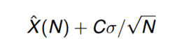

# Game AI Overview

### Main Objectives

- Aiding human players by delegating cumbersome tasks to AI system.
- Create challenging adversaries and collaborators

### Scripted AI

Advantages:

- Low load on CPU
- Ability to mimic Expert play

Disadvantages:

- Predictable
- Cannot handle unscripted events

---

# Path/Map Representations

### Goal of Path Planning Algorithms:

- Find (nearly) optimal path
- Obey constraints
- Trade off between search space complexity and path quality
- Handle dynamic obstacles

### Map Representations:

- Main approach - discretize continuous height field to create search graph
- Objects move on 2d surface, so mapping height field to plane is sufficient


### Grid-Based Methods:

- Advantages
    - Conceptually simple representation
    - Local changes have only local effects
    - Exact paths easy to determine for cell-sized objects
        
        
        
    
- Disadvantages
    - Imprecise representation
    - Increased precision in one are increases complexity everywhere
    - Awkward for objects that are not cell-sized
    - Requires post-processing paths for arbitrary motion angles
        
        
        
    

### Geometric Representations:


- Represent obstacles as **polygons**
- Find path between two points that does not cross constraints
- Advantages
    - Handles arbitrary polygon obstacles, and motion angles
    - Memory efficient
    - Topological abstractions
- Disadvantages
    - Complex to program
    - Robustness issues
    - Point localization no longer constant time
    

### Visibility Graphs:

- Place edges between nodes that can "see" each other
- Find path from *A* to *B*:
    - Add these nodes to graph, connecting visible nodes
    - Run pathfinding algorithm on resulting graph
- Resulting path provably optimal
- **Issues:**
    1. Changes in the world can be expensive as graph can be dense
    2. If every node can "see" every other node, will result in quadratic space and time requirements
    3. Corner-corner visibility test isn't cheap

### Free-Space Decomposition:

- Decompose empty areas into simple convex shapes.
- Create way point graph by placing nodes on unconstrained edges and in the face interior, if needed
- Connect nodes according to direct reach-ability
- Find Path from *A* to *B:*
    - Locate faces in which *A, B* reside
    - Connect *A, B* to all face nodes
    - Find path, smooth path

### Graphs:

- An (undirected) graph G=(V,E) is a discrete mathematical object comprised of a set of vertices V and a set of edges E.
- An undirected edge is a set of at most two vertices {u,v}.   *u - - - - v*
- A directed edge from u to v is an ordered pair (u,v).    *u ———> v*

---

# Path Planning

## Step 1 - Reachability

- **Task:**
    - Given a graph *G*, consisting of vertex set *V* and edge set *E* and two vertices *s* (start) and *g* (goal). Determine whether *g* is reachable from *s*
    - Or more generally - compute all nodes in *V* reachable from *s*

### Asymptotic Growth Rate:

- *f(n) ∈ O(g(n))* means:
    - There exists *c>0, m ∈ N* such that for all *n ≥ m : **| f(n) | ≤ c · | g(n) |***
    - We say *g* is an asymptotic upper bound for *f*

### Breath-First Search:

- Example
    
    
    
- For *G =* *(V, E)* the runtime of BFS is *Θ*(|*V*|+|*E*|)
    - In the worst case every node is visited once, and all edges are visited twice
- BFS uses *Θ*(|*V*|) space

---

## Step 2: Find Shortest Path to All Other Vertices

### Dijkstra's Algorithm:

- Dijkstra’s algorithm maintains current distances for every node, using array *d*
- In iteration *i* it expands the set of visited nodes *S(i)* by the closest node *u* that is reachable in one step (i.e., it picks *u* with minimal *d[u]* value)
- It then updates distances of the neighbours of *u* into *S(i+1)*, which may have decreased when considering paths through *u*
    
    
    
- Visiting the neighbours utilizes the similar traversal as **BFS**
- A shortest path tree can be constructed using the *p* array which stores the parent for each vertex
- **Runtime:**
    - By using a Priority Queue the worst-case runtime becomes *O*(|*E*| log|*E*|)
    - For sparse graphs (i.e., |*E*| *∈ O*(|*V*|)) this leads to runtime *O*(|*V*| log|V|)

## Step 3: Finding Shortest Paths Between Two Vertices

## A* & Heuristic Search

- For node *n* which represents a partial solution (or search state as opposed to problem state), we define:

$$
f(n)=g(n) \ + \ h(n)
$$

- Where:
    - *g(n)* - is the cost of the path to node *n* so far. Just like Dijkstra
    - ***h(n)*** - is the heuristic estimate of the cost of reaching the goal from node *n*

<aside>
💡 This makes A → a **best-first search** algorithm

</aside>

- Data Structures:
    - State - Object that describes the current problem state
    - Node - Object that encodes a partial problem solution
    - OPEN - Container of nodes at the search fringe that will be considered next
    - CLOSED - Container of nodes that have been fully expanded
    - OPEN + CLOSED - Nodes we have seen so far
- Main loop
    1. Pop the lowest *f*-cost (lowest g+h) node *n* from OPEN
        1. *n* is goal? yes ⇒ stop
    2. add *n* to CLOSED
    3. expand *n*: consider its children
        1. check if state seen before in OPEN or CLOSED
        2. if state seen with ≥ *g*-cost, pass
        3. else, remove child state from OPEN and CLOSED, and add corresponding node to OPEN for future consideration.
    4. for now we are done with *n*, but it can be re-opened later.

### Admissible Heuristics:

- A heuristic *h* is called admissible iff
    
    for all node *n*
    
    $$
    h(n) \le \ h^*(n)
    $$
    

## A* Correctness

- AI-Part 1, Slides 57-63

## Consistent Heuristics

- *h* is consistent iff
    1. *h(G)*=0 for all goal states *G* and
    2. *h(n) ≤ cost(n,s) + h(s)* for all *n* and their successors *s* (also known as triangle inequality)
- If *h(n)* is consistent, then *f(n)* is non-decreasing along any path A* considers

<aside>
💡 ***h* consistent ⇒ *h* admissible**

</aside>

- A* with consistent *h(n)* expands nodes in non-decreasing *f(n)* order
- Using a consistent heuristic A* only expands nodes it has found an optimal path to and it therefore never re-expands nodes

## Data Structure Optimizations

- If we use a consistent heuristic, A* can be simplified, because no better paths to nodes will be found by subsequent search. I.e., once closed,nodes will never be re-opened
- CLOSED can be implemented as state-to-node map as before (either based on binary search trees or hash tables (later))
- OPEN can be simplified by using a priority queue for nodes based on *f* values

---

# Abstracted Path Planning

- Abstractions results in sub-optimal path finding.
- Compromising path finding optimality for lessening CPU & Memory load is the goal.


## Hierarchical Pathfinding A*


- **Pre-processing:**
    1. Superimpose sectors on top of tile grid 
    2. Build graph - one or more nodes per sector entrance, intra-sector edges, inter-sector edges
    3. Compute intra-sector distances (inter-sector distances = 1)
- Find path in abstracted graph
- Smooth path (post-processing)

### Performance:

- Fast without smoothing
- ~10 times faster than A* on 512x512 maps
- But smoothing slows down that speed a lot
- After smoothing, path length is within 3% of optimal on average.

### Improvements:

- Using Dijkstra's algorithm (or UCS) for intra-sector distances
- On demand intra-sector computations (laziness pays off in dynamic environments)
- Faster smoothing

### Evaluation:

- Advantages
    1. Suitable for dynamic worlds - local changes trigger distance computation within small number of sectors
    2. Simple implementation
    3. Can add multiple level of abstractions
- Disadvantages
    1. Connecting *s* and *g* to the abstract graph can be time consuming
    2. Without smoothing, the path quality is often 20%+ less optimal.

## Path Refinement A*

- Build abstraction hierarchy
- We used "clique abstraction" on octile base-level grids
- Clique ⇒ maximally connected subgraph
- **Pre-processing:**
    1. Scan for cliques of sizes 4, 3, 2 (left to right, top to bottom)
    2. Replace these cliques with single nodes
    3. Connect singled nodes with their abstracted neighbors
- Results in a collection of pyramids describing connected components of the original map

### **Path Finding in PRA***

1. Pick an abstraction level L (halfway level is empirically good)
2. In there, find abstract nodes *s'* and *g'* corresponding to *s, g*
3. Perform A* search from *s'* to *g'* in this level L.
    
    
    

### **Path Refinement**


1. If base level not reached
2. Project the found path down a level (also consider neighbors)
3. Find optimal path in this corridor using A*
4. Go to step 1

### Performance

- Similarly to HRA*, PRA* is also ~10 times faster than A* on 512x512 maps
- Produces high-quality paths, 95% of the paths found are off by less than 3% from the optimal
- Total amount of work bigger, but initial path planning operation very fast
    - Minimizes latency induced by planning operation
    - Saves time when object gets different move order, which happens often in video games

---

# Triangulations

### Issues with Grids:

1. Potentially crude approximation.
    
    ex. Circular objects?
    
2. Objects occupy whole tiles
    
    ex. What about bigger objects?
    
3. Octile topology 
    
    ex. What about any-angle shortcuts?
    

### Basic Concept

1. Decompose area around obstacles (free-space) into convex shapes
2. For path planning, first locate *s* and *g,* then hop from area to area
3. Smooth resulting path

### Triangulating Process

- Starting with an area, and a collection of points
- Add edges between the points, without crossing other edges
- Continue until no more such edges can be added
    
    
    

### Quality

- For a given set of points, many triangulations exist

- We want to avoid sliver-like (small inner angles) triangles which decrease locality, and the quality of distance heuristics


## Delaunay Triangulations

### Basic Concept

- Triangulations in which the minimum interior angle of all triangles is maximized
- Makes “nice” triangulation:tends to avoid thin, sliver-like triangles
- Done locally by **edge flipping** diagonals across quadrilaterals
    
    
    
- A triangulation maximizes the minimal angle iff for each quadrangle the circumcircle of each triangle does not contain the fourth point
- Randomized algorithm. Expected runtime ⇒ *Θ*(*n* log *n*)

### Computing Delaunay Triangulations

1. Initialize triangulation *T* with a "big enough" helper bounding triangle that contains all points of *P*
2. Randomly select a point *p* from *P*
3. Find the triangle that *p* lies in
4. Subdivide that triangle into smaller triangles that have *p* as a vertex
5. Flip edges until all edges are legal
6. Repeat steps 2-5 till all points have been added to *T*
    
    
    

---

## Point Localization in Triangulations

- Triangles are given as a vector. They store point coordinates and indexes of neighboring triangles.
- Basic solutions
    1. Brute Force - check every triangle ⇒ *Θ*(*n*)
    2. Decision Tree - maintain the tree while constructing the triangulation ⇒ *Θ*(log *n*)

## Jump and Walk Algorithm

- A simpler approach
- Steps:
    1. Start with a random triangle
    2. Walk towards *(x,y)* by crossing edges that intersect with the line between triangle midpoint and *(x,y)*
- There can be cycles. But these can be broken with memorizing triangles that have been encountered. Also, such cycles do not occur in Delaunay triangulations
- Average case runtime ⇒ *Θ*(√*n*) in homogeneous triangulations

### Improved Jump and Walk

- Sample *k* triangles, and pick the closest to *(x,y)* as starting point
- Expected runtime ⇒ time for sampling + time for walking
    
    Minimal when both are asymptotically equal ⇒ *Θ(∛n)*
    

## Constrained Triangulations

- Triangulations where certain (constrained) edges are required to be in the triangulation
- Then other (unconstrained) edges are added as before
- Constrained Delaunay Triangulations maximize the minimum angle while keeping constrained edges
    
    
    
- **Dynamic Constrained Delaunay Triangulations (DCDT):**
    - Repairs a triangulation dynamically when constraints change

## Triangulation-Based Path Planning

- Using a constrained triangulation with barriers represented as constraints
- Process:
    1. Find which triangle the *s,g* points are in 
    2. Search adjacent triangles across unconstrained edges
    3. Find a channel of triangles inside which we can easily determine the shortest path
        
        
        
- Advantages
    1. Remedies grid-based methods' deficiency with off-axis barriers
    2. Representing detailed areas better, while not complicating free-space
    3. Triangulations have much fewer cells, and are more accurate than grids
- Disadvantages
    1. Curved obstacles must be approximated
    2. Path cannot be formulated till goal is found. Which can lead to sub-optimal or multiple paths

## Funnel Algorithm

- To find the exact path through a channel of triangles, we use the funnel algorithm
- Finds the shortest path in the simple polygon in time linear in the number of triangles in it
- Maintains a funnel which contains the shortest path to the channel endpoints so far.
- Funnel gets updated for each new vertex in the channel
    
    
    
- **Modified Funnel Algorithm**
    - For circular objects with non-zero radius
    - Conceptually attaches circles of equal radius around each vertex of the channel
        
        
        

## Naive Search in Triangulations

- Assume, while searching,that we know the exact path through the triangles
- Use this to prune search states
- For example, assume straight-segment paths be-tween edge midpoints
- Pros:
    1. Considers each triangle once, and has fairly good distance measures
    2. Finds path quickly
- Cons:
    1. May result in sub-optimal path, as seen below
    
    
    

## Finding Optimal Paths

1. (Under)estimate the distance traveled so far
2. Allow multiple paths to any triangle
3. When a channel is found to the goal, compute the length of the shortest path in this channel using the modified funnel algorithm
4. If path found is the shortest so far, keep it. Else reject it (anytime algorithm)
5. When the lower bound on the distance traveled so far for the paths yet to be searched exceeds the length of the shortest path, the algorithm ends and we have found an optimal path

## Triangulation A*

- Search running on the base triangulation
- Uses a triangle for a search state, and the adjacent triangles across unconstrained edges as neighbors
- Using anytime algorithm and considering multiple paths to a triangle as described earlier
- For *h-*cost, take the Euclidean distance between the goal and closest point on the triangle’s entry edge
- Calculate an underestimate for the distance- traveled-so-far (*g*-cost)
- Only considers triangles once until the first path is found
- Continue searching until time runs out or lower bound meets or exceeds current shortest distance

## Triangulation Reduction

- Want to reduce the triangulation without losing its topological structure
- Determine triangles as being decision points, on corridors,or in dead ends
- Map a triangle to a degree-*n* node when it has exactly *n* triangles adjacent across unconstrained edges
- After mapping, collapse degree-2 corridors
    - After corridor compression the resulting search graph has size linear in the number of islands!
    - Path planning in tree components (degree-1, empty squares) and corridors(degree-2, solid squares) is easy
    - **Reduction Example:**
    - The only real choice points are degree-3 triangles (solid circles)
        
        
        
        
        

## Triangulation Reduction A*

- TA* running on the abstraction we just described
- First check for a number of “special cases” in which no actual search needs to be done
- Move from the start and goal to their adjacent degree-3 nodes
- Use degree-3 nodes as search states and generate their children as the degree-3 nodes adjacent across corridors
- As with TA*, use an anytime algorithm, allowing multiple paths to a node, and use the same *g*- and *h*-costs

## Path Planning Conclusions


- Triangulations can accurately and efficiently represent polygonal environments
- Triangulation-based path planning finds paths very quickly and can also find optimal paths given a bit more time
- Our abstraction technique identifies useful structures in the environment: dead-ends, corridors, and decision points
- TA* is used in StarCraft 2!

---

# Path Planning Odds and Ends

## Multi-Agent Path Planning

- Naive approach: every unit finds path individually
- For squads even simpler: one unit finds path, the others follow
- Myopic self-centered view creates serious problems in confined areas
- Worst-case: multi agent pathfinding problem turns into sliding tile puzzle
- Therefore, finding the shortest solution is NP-hard in general

### Handling Collisions

- Simple approach: assume world is static, plan paths with A∗, and re-plan if something changes
- But this can fail miserably. Doesn’t take into account moving obstacles

### Space-Time Collisions

- We must avoid collisions in space-time, i.e. prevent objects to be at the same location at the same time
    
    
    
- Pairwise collision test is expensive *n* moving objects ~ Θ(n^2) collision tests

### Efficient Collision Resolution

- The following collision resolution algorithm computes all collision times first
- Beginning with the earliest it
    1. advances all objects to that point in time
    2. stops the colliding objects
    3. re-computes nearby objects’ collision times
    4. and continues
- If n objects are spread out well, this algorithm runs in *O*(*n*log *n*) time

---

# Adversarial Search

## Game Theory

- **Zero-sum:**
    
    A game is a zero-sum game iff the payoff vector entries add up to 0 in each terminal state
    
    the amount one player gains at the end of a move sequence the other one loses, i.e. payoffs add up to 0I win/you lose, I lose/you win, draw-draw ... sum=0
    

### Deterministic vs. Stochastic Games:

- **Stochasticity**:
    
    there is a state where the environment (a special player) makes a random move (e.g., dice roll, card shuffle). The move probability distribution is usually known (e.g., Backgammon,Yahtzee)
    
- **Deterministic**:
    
    not stochastic (e.g., Chess)
    

### Game Strategies

- **Strategy:**
    
    describes how a player acts in any situation in which he is to move
    
- **Pure strategy:**
    
    in each non-terminal state a player chooses a fixed move
    
- **Mixed strategy:**
    
    a player chooses moves according to probability distributions
    
- **Nash-equilibrium strategy profile:**
    
    players selecting their strategies so that no one has an incentive to change his strategy unilaterally
    
    ex. Alice and Bob are in Nash equilibrium if Alice is making the best decision she can, taking into account Bob's decision while his decision remains unchanged, and Bob is making the best decision he can, taking into account Alice's decision while her decision remains unchanged
    

### Perfect vs. Imperfect Information

- **Information set:**
    
    set of possible game states which the player to move cannot distinguish; determined by the player’s private knowledge about the game state, and the game history up to this point
    
- **Perfect information:**
    
    all information sets have size 1, i.e., every player knows the state the game is in (e.g., Chess, Checkers, Go)
    
- **Imperfect information:**
    
    there exists an information set with size>1(e.g., Poker, Contract Bridge right after the initial deal)
    
    Mixed strategies are often required for playing imperfect information games well 
    

## MinMax Algorithm

- Determines the value of a state in view of player MAX assuming optimal play by recursively generating all move sequences, evaluating reached terminal states, and backing up values using the minimax rule.
    
    
    
- Our implementation stops searching after a certain number of steps(“height”), at which it approximates the state value. This is because interesting games are usually too big to be searched completely. **MiniMax is a depth-first-search algorithm**

```cpp
// returns value of state s at height h in view of MAX
int MiniMax(State s, height){
  if (height == 0 || terminal(s)) { 
    // base case: value of state s in
    // view of MAX; returns exact state
    // value in leaves; approx. otherw.
    return Value(s, MAX)          
  }   
                            
  if (toMove(s) == MAX) {
    score ← -∞
    // smaller than any state evaluation
    // compute move with maximum value for MAX
    for (i←0; i < numChildren(s); ++i) {
      value←MiniMax(child(s, i), height-1)
      if (value > score) { score ← value } 
      // found better move
    }
  } else {
    score ← ∞
    // bigger than any state evaluation
    // compute move with minimum value for MAX
    for (i←0; i < numChildren(s); ++i) {
      value ← MiniMax(child(s, i), height-1)
      if (value < score) { score ← value } 
      // found better move
    }
  }

  return score
}
```

- MiniMax(s, height) returns best approximate value achievable by MAX within height moves
- MiniMax(s,∞) returns exact value of s
- Player distinction is awkward — it leads to code duplication which is error prone

## NegaMax Algorithm

- NegaMax formulation : always evaluate states in view of player to move

```cpp
// return value of state s in view of player to move
int NegaMax(State s, height){
  if (height == 0 || terminal(s)) { 
    // base cases
    return Value(s, toMove(s))       
    // value in view of player to move
    // approximation if not leaf
  }                                  
  score ← -∞
  for (i←0; i < numChildren(s); ++i) {
    // this assumes players alternate moves
    value ← - NegaMax(child(s, i), height-1)
    if (value > score) { score ← value }
  }
  return score
}
```

- Assume fixed uniform branching factor *b* and search depth *d*
- Number of visited leaves is *b^d*
- Can we do better? Yes, some nodes in the search can be proved to be irrelevant to the search result
    
    
    
- The value of subtrees rooted at C and C′ is irrelevant. Thus, those parts do not have to be searched.

## Alpha-Beta Algorithm

- The Alpha-Beta algorithm maintains two bounds:
    1. **alpha**: lower bound on what player to move can achieve
    2. **beta**: upper bound on what player to move can achieve
    
    
    
- Whenever alpha ≥ beta, this node’s exact value is irrelevant to move decision at the root, and thus its subtree can be pruned
- Again, we’ll use the NegaMax formulation which means that:
    1. When descending, we negate search bounds
    2. When ascending, we negate the return value

```cpp
// Input: s: state, height: steps to go, alpha/beta bounds
// For V = (heuristic) value of s: (see return value theorem)
//  If V ∈ (alpha, beta)  returns val = V
//  If V ≤ alpha          returns val with V ≤ val ≤ alpha
//  If V ≥ beta           returns val with beta ≤ val ≤ V 
int AlphaBeta(State s, height, alpha, beta){
  if (height == 0 || terminal(s)) { 
    // base cases
    // value in view of player to move
    return Value(s, toMove(s))       
  }                                  
  score ← -∞    // current best value
  for (i←0; i < numChildren(s); ++i) {
    // assuming players alternate moves: v∈(x, y) <=> -v∈(-y, -x)
    value ← - AlphaBeta(child(s, i), height-1, -beta, -alpha)
    if (value > score) { 
      score ← value 
      if (score ≥ alpha) { alpha ← score }
      if (score ≥ beta) { break }  // beta cut
    }
  }
  return score
}
```

### Alpha-Beta Analysis

- **Alpha-Beta Return Value Theorem:**
    - Let *V(s)* be the true NegaMax value of states and *h* the height of *s* (maximal distance from leaf). Let *L* = AlphaBeta(*s*, *h*, α, β)
    - Then:
        1. *L ≤* α *⇒ V(s) ≤ L <+* α
        2. α *< L <* β *⇒ V(s) = L*
        3. *L ≥* β *⇒* β *≤ L ≤ V(s)*
        4. AlphaBeta(*s, h, −∞, ∞) = V(s)*
- Consider two cases
    
    
    
- Alpha-Beta’s performance depends on getting cut-offs as quickly as possible
- At node where cut-off is possible, we ideally want to search one of the best moves first, and cut-off immediately

### Minimal Number of Leaves Visited by Alpha-Beta

- **Theorem:**
    
    In homogeneous game trees with branching factor *b* and depth *d* Alpha-Beta search visits
    
    $$
    b^{\lceil d/2 \rceil} \ + b^{\lfloor d/2 \rfloor} \ - \ 1
    $$
    
    leaves if it considers the best move first in each node, i.e. Alpha-Beta search in this case is runtime optimal
    
    
    

### Cycles

- A path from the root to the current node can contain a repeated position
- Often, searching repeated nodes is unproductive and can be eliminated
- **Detection**
    - Use a stack of states: make move → push, undo move → pop
    - Before pushing, check whether state already exists on stack

### Transpositions

- It may be possible to reach the same state via two different paths
- We want to detect this and eliminate redundant search
- For this we need to keep the history of previously visited nodes, not just along the current search path. Also, payoffs must not depend on history

### Transposition Table (TT)

- Cache of recently visited states and their exact values (or value bounds) and previously computed best moves
- Usually implemented as hash table (fast!)
- When visiting a node
    1. Check TT if state already encountered at a height ≥ current height. If so, try to reuse stored value (or bound) Possibly resulting in immediate backtrack by producing a cut. E.g.,if the TT entry indicates that the value is ≥5 and beta = 4
    2. Otherwise, search subtree starting with the previous best move
    3. Save result in TT (exact value or bound, height, best move)
- Information Cached
    1. **Best previously found move *m:***
        
        In case we need to search again, *m* should be tried first. It is likely that this move will also be best during the next search, leading to considerable savings in AlphaBeta search
        
    2. **Search result *v*:**
        
        According to the Alpha-Beta Return Value Theorem, the previous result is either exact, a lower bound for the true state value, or an upper bound. To decide what to do when we reach the state a second time,we need to store *v* and a flag *f* that indicates the type of *v*
        
    3. **Search height h:**
        
        If the game tree cannot be traversed completely, heuristic state evaluations need to be used, and deeper search can overcome their deficiencies
        
        If *h* it is equal or lower, we can use the stored *v*, *f* values. If not, we do not trust the stored value and have to search again
        

### Iterative Deepening

```cpp
h = 1
while (have time) {
  //using TT for storing values and best moves
  v = AlphaBeta(s,h,*−∞,∞)
  ++h*
}
```

- What looks like a waste of time, is in fact often faster than going to the maximum height right away because best moves in the previous iteration are likely good in the next. So we can store them in the TT and try them first next time. This improves the performance of Alpha-Beta search considerably
- Iterative deepening also turns Alpha-Beta search into an anytime algorithm, which is good, because the maximum depth that can be reached given a certain time budget is hard to predict upfront

## Evaluation Functions

- Evaluation functions assign values to non-terminal leaf nodes when the search algorithm decides to backtrack
- We need to assign a heuristic value to the node. Heuristic values must be correlated with the true state value. The stronger the correlation, the more useful the heuristic

### Typical Evaluation Function

- To evaluate a state we can simply add up weighted feature values:

$$
Eval(s) =\sum^n_{i=1}{w_i} \ · \ f_i(s)
$$

- Where *w* are real valued constant weights and features *f* measure some properties deemed important indicators for the final outcome of the game
- In a chess game:
    1. *f1:* material balance
    2. *f2:* piece development
    3. *f3:* king safety balance
    4. *f4:* pawn structure balance
    
    
    
- Usually, for the material balance different piece types are considered which are weighted by the empirical piece strength
    
    
    

### Determining Weights

- **Supervised learning:**
    - produce/observe *m* training positions *s* with game result label *v*
    - fit weights *w* of parameterized evaluation function *Vw(s)* so that sum of squared errors is minimized
    - Find vector *w* such that the error (or “loss”) function is minimized w.r.t vector *w*
    
    $$
    e(w) = \sum^m_{i=1}{(v_i \ - \ V_w(s_i))^2}
    $$
    
- **Linear Regression**
    - If *Vw* is a linear function, this is called linear regression
        
        
        
    - Optimal *w* vectors can be found directly by inverting a matrix for low-dimensional vectors *w*, or using gradient descent if the number of parameters are large or *Vw* is non-linear

### Generalizing Linear Regression

- Linear regression can be generalized in various ways
- **Logistic Regression:**
    - modelling class membership probabilities
        
        $$
        Prob(player\ to\ move\ wins\ |\ s) = \frac{1}{1+exp(-\sum_i{w_i·f_i(s))}} 
        $$
        
    - This is called a generalized linear model because the evaluation core is linear and it is mapped using a so-called link or activation function,which is non-linear
        
        
        

### Artificial Neural Networks

- Non-linear function approximators composed of layers of hidden computation nodes that receive their inputs from previous layers, compute simple functions (like(∗)), and propagate the output to subsequent layers
    
    
    
    ### Deep Networks
    
    - The power of Deep Networks can be illustrated by computing the parity function on *n* bits:
        
        $$
        parity(x1,...,xn) = (\sum^n_{i=1}{x_i}) \ mod 2
        $$
        
    - Result is 1 iff the number of 1 bits among *x* odd
    - Networks with one hidden layer require an exponential number of weights to approximate the parity function well, whereas *n* or even *log2(n)* layers can accomplish it with a linear number of weights by chaining *XOR(x,y)* gate approximations
        
        
        
    
    ### Unsupervised Learning
    
    - E.g. Reinforcement Learning
    - Have the program automatically interact with the environment (e.g.,play games against other programs or itself)
    - After each episode, modify model weights using gradient descent:change weights so that the evaluation becomes a better predictor of what actually happened

---

# Sampling-Based Search

### Alternative to Traditional Search

- Sample from the space of possibilities
- If you get “enough” samples, then you may have a good approximation of the true move values

### Sampling-Based Decision Making

1. For each move choice at the root node
    - Gather samples
    - Compute performance metric (e.g. average score achieved)
    - Repeat until resources are exhausted (usually time)
2. Choose move with the best statistical outcome

### Selective Sampling

- We don’t want uniform random sequences
- All scenarios are not equal; use all available information to bias the sampling towards likely scenarios

### Advantages of Sampling

- Conceptually a simple search algorithm
- Can realize complex behaviours with no explicit knowledge
- Prefers robust positions with many winning continuations

### Disadvantages of Sampling

- Problems in tactical situations
- Narrow lines of play are hard to find by randomized search
- May not converge to a winning move at all – if one exists. Or may not converge to a clear ’winner’
- Doesn’t approximate mixed strategies out of the box (i.e., compute move probabilities)
- Opponent modeling is a hard problem!

## Monte Carlo Tree Search (MCTS)

- MCTS is an iterative search framework based on Monte Carlo sampling
- It maintains a tree of visited game states and result statistics that determine the next move sequence to consider
    
    
    

### Iteration Phases

- **Selection:**
    
    start from root *R* and select successive child nodes down to a leaf (or leaf predecessor) node *L*, choosing nodes that lets the game tree expand towards most promising regions
    
- **Expansion**
    
    unless *L* ends the game with a win/loss for either player, either create one or more child nodes and choose from them node *C*
    
- **Sampling**
    
    starting in *C* finish the game (semi)-randomly (“rollout”)
    
- **Backpropagation**
    
    use the rollout result to update information in the nodes on the path from *C* to *R*
    

## Upper-Confidence Bound for Trees (UCT)

- Sampling based method for game tree search
- UCT is based on the Upper Confident Bound (UCB) algorithm for solving multi-armed bandit problems

### UCB Algorithm

- UCB solves the so-called exploration/exploitation problem for the bandit problem
    
    <aside>
    💡 “I know something about the machines already.  **Should I continue exploiting this knowledge or should I search for something better?”**
    
    </aside>
    
    
    
- Iterate until time runs out:
    1. If an arm has not been pulled yet, pull it and observe reward
    2. Otherwise, pull an arm that maximizes
        
        
        
        and observe reward
        
- C>0 is the so-called exploration constant. The higher it is, the more UCB will explore less frequently visited choices
- UCB is optimistic: it selects the arm which it currently thinks can have the highest *potential* reward

### UCB Motivation: Central Limit Theorem

- For random variable *X* with mean value *μ* and standard deviation *σ<∞*
    
    $$
    \hat{X}(N) := (X1+X2+...+Xn)/N
    $$
    
    is approximately normally distributed with mean *μ* and variance *σ²/N*
    
- Thus, the more we sample, the better *Xˆ(N)* approximates *μ*, because *σ²/N→0* for *N→∞*
- The estimator’s standard deviation (=*√Variance=σ/√N*) measures the estimation uncertainty
    
    <aside>
    💡 Therefore **the smaller the standard deviation, the less uncertain, and more accurate our estimation becomes**
    
    </aside>
    
- **Claim:** The variance of any random variable *X*∈[0,1] is ≤1/4
    
    
    
- We can control the level of optimism when selecting an action to explore next. The move value
    
    
    
    represents an optimistic estimate forμwhich we might achieve or exceed with a probability depending only on C>0.C=1, for example,leads to a 16% confidence that we will reach this value or exceed it.
    
- The additional *√logT* factor used in step 2 of the UCB rule ensures that UCB never stops pulling any particular arm. If it stops, *C√logT/Ti* will eventually exceed the values of the pulled arms, which is a contradiction
- In the limit, UCB “finds” an arm with highest expected reward in the sense that it chooses the best arms exponentially more often than others with smaller reward
- UCB’s expected regret in the worst case is *Θ(logT)*, which can be proven to be optimal and much better than the worst case *Θ(T)* “achieved” by the random arm selection procedure

### UCT Search

- Applying UCB to game tree search: UCT = UCB on trees
- UCT is a MCTS method which regards the game tree as collection of bandit problems — one for each node
- It builds a tree close to root node and finishes games in a semi-random fashion
- **Selection and Expansion:**
    
    In in-tree nodes, use UCB to select the next child. When reaching a node in which not all children have been visited, create the next child and append it to tree
    
- **Sampling:**
    
    Finish game using a (semi-)random rollout policy
    
- **Backpropagation:**
    
    Update value statistics for all visited tree moves
    
- Using this algorithm node values converge to the minimax value
- When time runs out, we pick a move with the highest average score

### UCT Improvements

In recent years the original UCT search framework has been improved in various ways by using game-specific heuristics such as:

- **RAVE (Rapid Action Value Estimation)**
    
    In games with transpositions it is often the case that values of moves played now or a bit later are highly correlated. UCT can take advantage of this by maintaining statistics for unseen moves based on their performance in subtrees
    
- **Prior Knowledge**
    
    The original UCB rule requires us to pull each arm at least once. This can be wasteful in games, especially if the chance of visiting a node again is low. Instead, modern MCTS Go programs create all children and evaluate them using a fast evaluation function —pretending they have run a simulation for each child — and then pick the best child for running an actual simulation
