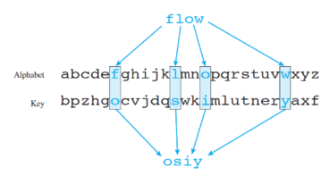

## Transposition Ciphers

- The transposition cipher is simply rearranging the message’s symbols.
- Each key creates a new ordering of letters.
- A common way of doing this shifting is the **Columnar Transposition** algorithm  —>
- In ancient Greece, a tool called the  was used to perform a transposition cipher. A message is written on a strip of parchment, which is then wound around a cylinder.
- Anagrams are a type of Transposition.
- Since Transposition involves only changing the ordering of the letters of a word, it is limited.


---

## Substitution Ciphers

- Substitution ciphers involve completely changing each letter in a plaintext to a different letter in the alphabet using the key.
- Due to the fact that a letter can be changed to any other letter simply according o the key, there many subsets of ciphers that fall under the umbrella of Substitution ciphers.



<aside>
💡 **Kerckhoffs’ Principle**: The security of a cipher should depend only on keeping secret the key

</aside>

### Shifting Ciphers

- A simple shifting cipher involves shifting each letter in the plaintext to another letter in the alphabet according to shift key. e.g. C(2) + 4 = F(6)
- Most famous of all shifting ciphers is the renown Caesar's cipher.
- Each ciphertext letter is “the sum” of the plaintext letter and the shift value:

$$
C_i = M_i + K \mod 26
$$

### Affine Ciphers

- A different version of the shifting cipher is the multiplicative cipher. The multiplicative cipher is like Caesar but uses multiplication instead of addition.
- The affine cipher combines the multiplicative cipher and the Caesar cipher.
- An important mathematical function to understand for affine cipher is modular arithmetic.
- **Modular Arithmetic**
    - Modular arithmetic -  aka **clock arithmetic** - is a system of arithmetic for integers, where numbers "wrap around" upon reaching a certain value—the modulus. e.g. 17 % 12 = 5
- **Greatest Common Divisor**
    - The greatest common divisor (GCD) of two integers is their largest posi<ve integer that divides each of the integers.
    - For example, the GCD of 24 and 30 is 6 because their common factors are: 1, 2, 3, 6.
    - Prime numbers have only two factors: 1 and n
    - Two numbers are called relatively prime (or coprime) if their GCD equals 1.
    - Euclid’s algorithm for GCD
        
        ```jsx
        def gcd(a, b):      
          while a != 0 
            a, b = b % a, a       
          return b
        ```
        
        
        
- **Valid Keys**
    - Not all numbers will work as a key for multiplicative ciphers.
    - The **Key** and the alphabet size must be **coprime.**
        
        $$
        C_i = M_i * K \mod 26
        $$
        

<aside>
➡️ In other words, for English the **K** and 26 must have a **GCD** of 1

</aside>

- **Encrypting Affine Cipher**
    - The affine cipher has two keys: **A**, and **B**
    
    $$
    C_i = (M_i*A)+B \mod 26
    $$
    
- **Decrypting Affine Cipher**
    - Reversing an affine cipher requires the usage of a *modular inverse*
        
        $$
        M_i= [(C_i-B)* modInv(A)] \mod 26
        $$
        
    - A modular inverse of A modulo N is X such that:
        
        $$
        (X * A) \mod N = 1 
        $$
        
    - To fine a modular inverse, use Euclid’s extended algorithm.
    - Note: because **A and N cannot be co-prime**, the number of different keys is less than N
    - Example: Suppose that you found out that S→I and K→M
        
        $$
        (8*A+B)\mod 26 = 18 \\  (12*A+B) \mod 26 = 10 \\  (8-12)A + (B-B) \mod 26 = 8 \\ -4A \mod 26 = 8 \\ A \mod 26 = -2 \\ A = 24 \\ (8*A+B) \mod 26 = 18 \\ 192 + B \mod 26 = 18 \\ B \mod 26 = -174(+104[26*4]) \\ B \mod 26 = -70 (+78[26*3]) \\ B = 8 \\
        $$
        
    
    ---
    
    ### Mono-alphabetic Substitution Ciphers
    
    - The number of possible keys in a substitution cipher is:
    
    $$
    26! = 4.00*10^{10}
    $$
    
    - Impossibly long time to brute force. But is suspect to **frequency analysis**
        
        
        
    - **Cryptanalysing**
        - Match relative letter frequencies in ciphertext to those in a large plain text
        - letter doubles: *ss ee tt ff ll mm oo*
        - Frequent bigrams: *th er he*
        - Trial and error with guess words
    - **Pattern equivalence**
        - Word substrings are **pattern-equivalent** if there exists a monoalphabetic substitution that transforms one into the other. e.g. 'will' is p-equivalent to 'jazz' but not 'said'
    
    ---
    
    ## Vigenere Cipher
    
    - The idea of the Vigenere Cipher is to use a different key for each letter of the message.
    - Unlike substitution cipher, the Vigenere cipher cannot be easily broken by frequency analysis.
    - The Vigenere cipher is like Caesar cipher, but with multiple keys/shifts
        
        
        
    
    $$
    C_i = (M_i + K_i) \mod 26 
    $$
    
    ### Cracking Vigenere
    
    - **Babbage/Kasiski/Sweigart**
        - Find key length with repeated n-gram offsets
            
            $$
            \textbf{THE}DOGAND\textbf{THE}CAT \ \ (plaintext)\\ ABCDEFGHIABCDEF  (key) \\ \textbf{TIG}GSLGUL\textbf{TIG}FEY (ciphertext)
            $$
            
            - **Kasiski Examination** looks at the repetition of those n-grams and distance between the recurrence of said n-grams
                
                
                
        - —For each substring, find shift by calculating the match score (or visually)
            
            
            
    - **William Friedman**
        - Find key length with Index of Coincidence —
        - For each substring, find shift with **Index of Mutual Coincidence (IMC)**
        - **Index of Coincidence:**
            - It is the probability that two randomly selected letters from a ciphertext will be the same
            
            $$
            IC = \frac{\sum_{i=A}^{i=Z}c_i(c_i -1)}{N(N-1)}
            $$
            
            - It measures the “flatness” of the frequency distribution
            - IC does not change if you apply a substitution cipher!
        - **Index of Mutual Coincidence:**
            - The probability that two randomly selected letters from two texts x and y will be the same.
                
                $$
                IC = \frac{\sum_{i=A}^{i=Z}c_i^x . c_i^y}{N_x . N_y} = \sum_{i=A}^{i=Z}f_i^x . f_i^y \\ where \ f_i^x = c_i^x/N_x
                $$
                

# Public key & RSA

### DHM

- DHM is based on the idea of one-way function
- Alice and Bob first publicly agree on a **modulus** *p* ****and **base** *g*
    
    
    

### Fermat’s Little Theorem

- If *p* is prime, then for any *a, (a^p) - a* is a multiple of *p*:
    
    $$
    a^p \ mod(p) = a, \ (i.e. \ a^{p-1}\ mod(p)=1)
    $$
    
- This theorem is used for Fermat’s primality test
    1. We want to test if *p* is prime
    2. Pick a random *a* in the range [2, *p*-1]
    3. Does a^p mod p = a, hold?
        1. If it does, then *p* is probably prime
        2. Else, *p* is a composite

### RSA (Rivest–Shamir–Adleman)

- To convert text into integer, consider
    - T ⇒ text to be enciphered
    - S ⇒ list of symbols

$$
M = \sum_{i=0}^{i=len(T)}{S(T_i)*len(S)^i} 
$$

- To convert back each letter
    
    $$
    T_{i}=\frac{M_i}{len(S)^i} \\ M_{i+1}=M_imod(len(S)^i)
    $$
    


### ***Why We Can’t Hack the Public Key Cipher***

All the different types of cryptographic attacks we’ve used in this book are useless against the public key cipher when it’s implemented correctly. Here are a few reasons why:

1. The brute-force attack won’t work because there are too many possible keys to check.
2. A dictionary attack won’t work because the keys are based on numbers, not words.
3. A word pattern attack won’t work because the same plaintext word can be encrypted
differently depending on where in the block it appears.
4. Frequency analysis won’t work because a single encrypted block represents several
characters; we can’t get a frequency count of the individual characters.

---

# Quantum Cryptography

- Stephen Wiesner’s idea of measuring photon polarization with Polaroid filters
    
    
    

---

# Assignments Review

## Assignment 1
