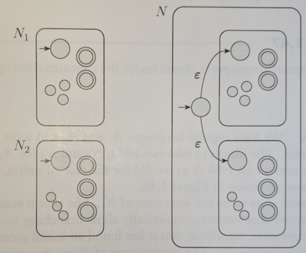

# 1. Regular Languages & Tokenization

Textbook: [https://web.stanford.edu/~jurafsky/slp3/2.pdf](https://web.stanford.edu/~jurafsky/slp3/2.pdf)

## 1.1 Regular Expressions

Cheat sheet: [https://media.cheatography.com/storage/thumb/mutanclan_python-regular-expression-regex.750.jpg](https://media.cheatography.com/storage/thumb/mutanclan_python-regular-expression-regex.750.jpg)

Lookahead/Lookbehind: [https://www.rexegg.com/regex-lookarounds.html](https://www.rexegg.com/regex-lookarounds.html)

Regex 101: [https://regex101.com/](https://regex101.com/)

- Main uses in NLP:
    1. Pattern matching
    2. Substitution
- Basic operations in regular expressions include
    1. Concatenation of symbols 
    2. Disjunction of symbols ([],|, and.)
    3. Counters (*,+, and{n,m}) 
    4. Anchors(ˆ,$)
    5. Precedence operators ((,)).

## 1.2 Text Normalization

- **Three common processing tasks**
    1. Tokenization of words → segment into words
    2. Normalization of word formats → standardizing the format, removing noise, etc.
    3. Segmenting sentences → break text down into sentences

### 1.2.1 Tokenization

- **Tokenization** → the task of segmenting running text into words
- **Clitic expansion →** expansion of clitic contractions e.g. "what're" → "what are"
- **Name entity detection** → the task of detecting names, dates, and organizations
- **Penn Treebank tokenization standard** → Clitic expansion, keep hyphenated words together, separate out all punctuation using "_" replacement for whitespace.
- **Word segmentation**
- Since tokenization needs to be run before any other language processing, it needs to be very fast. The standard method for tokenization is therefore to use deterministic algorithms based on regular expressions compiled into very efficient finite state automata.

## 1.2.2 Word Normalization, Lemmatization & Stemming

- **Normalization** → the task of putting words/tokens in a standard format, e.g. "USA, US" → "US"
- **Case folding** → Mapping everything to lower case, e.g. "Woodchuck" → "woodchuck"
- **Lemmatization →** the task of determining if two words have the same base word, e.g. "deciding" → "decide"
- **Morphemes →** smaller units of a word that is meaning-bearing
- **Stem** → central morpheme of the word (root)
- **Affix →** additional meaning of various kinds
- **Stemming →** chopping off the final affixes of words, e.g. "deciding" → "decid"

### 1.2.3 Sentence Segmentation

- The most useful cues for segmenting a text into sentences are punctuation, like periods, question marks, and exclamation points.
- Question marks and exclamation points are relatively unambiguous markers of sentence boundaries.
- Periods, on the other hand, are more ambiguous. The period character “.” is ambiguous between a sentence boundary marker and a marker of abbreviations like "Mr." or "Inc."

## 1.3 Edit Distance

- **Coreference →** the task of deciding whether two strings refer to the same entity
- **Edit distance →** quantifying similarity between strings
- **Minimum edit distance →** the minimum number of editing operations (insertion, deletion, substitution) needed to transform a string into another.
- **Alignment →** the correspondence between substrings of two sequences
    
    
    

---

# 2. Fine-State Automata

## 2.1 Finite Automaton

- **Finite Automaton/Finite State Machine →** a model for computational devices with limited memory (used for recognizing strings in NLP)
- Defining a finite automaton → A 5-tuple $(Q,Σ,δ, q_0, F)$ where:
    1. $*Q$* is a finite set called *states*
    2. $Σ$ is a finite set called the *alphabet*
    3. $δ: Q \times Σ \rightarrow Q$ is the transition function
    4. $q_0 \in Q$ is the *start* state
    5. $F ⊆ Q$ is the set of *accept* states
- Example automaton
    
    
    
    - $Q = \{ q_0, q_1, q_2 \}; \ Σ = \{ 0,1 \}; \ q_0=q_0; \ F=\{ q_1 \}$
    - δ is as follows:
        
        
        

## 2.2 Accepting Strings

- The set of strings accepted by a finite automaton is called a regular language.
- Given a finite automaton *F* and a string *s*, we simulate *F* from the start state, transitioning states according to the characters in *s*. The automaton is said to *accept* the string iff the state it is in after processing all characters in *s* is an *accepting state:$δ(···δ(δ(δ(q0, s0), s1), s2),··· ), sn)∈ F$*

## 2.3 Non-determinism


- **Non-deterministic finite automaton (NFA) →** a finite automaton in which multiple transitions exist for a given state & input.
- There always exists a deterministic finite automaton (DFA) that is equivalent to any given NFA. Therefore, NFAs also accept regular languages.
- The formal difference between an NFA and a DFA is in the transition function:
    
    $$
    δ: Q \times Σ_\epsilon \rightarrow P(Q)
    $$
    
    Where *P(Q)* is the power set of *Q*
    

## 2.4 Regular Operations

- Let $A_1, A_2$ be the set of strings accepted by NFAs $N_1, N_2$
- **Union: $A_1 \cup A_2 = \{ x|x \in A_1 \ or \  x \in A_2 \}$**
    
    
    
- **Concatenation: $A_1 \circ A_2 = \{ xy|x \in A_1 \ and \ y \in A_2 \}$**
    
    
    
- **Star: $A* = \{ x_1,x_2...x_k|k≥0 \ and \ each \ x_i \in A\}$**
    
    
    

## 2.5 Equivalence of Regular Expressions & Finite Automata

- One can use a machine (FA) to model the expressive power of a declarative language (regex).
- Computational cost of evaluating any expression in the declarative language in terms of the cost of simulating the machine.
- Translating arbitrary regular expressions into automata and vice-versa.
    
    Resource: [https://www.tutorialspoint.com/automata_theory/constructing_fa_from_re.htm](https://www.tutorialspoint.com/automata_theory/constructing_fa_from_re.htm)
    
    
    

---

# 3. Parts of Speech

## 3.1 Basics & Sub-types

- **Parts of Speech of English**
    1. **Nouns** are used to represent a person, place, or thing.
    2. **Pronouns** are used to replace nouns.
    3. **Adjectives** are descriptive and are used to modify nouns.
    4. **Verbs** represent actions, processes, or ongoing states.
    5. **Adverbs** are descriptive and are used to modify verbs, adjectives, or other adverbs.
    6. **Prepositions** show the relationship between an object (usually a noun) and another word.
    They are typically used to indicate where something or someone is or the relative timing of something.
    7. **Determiners** provide information about nouns and noun phrases.
    8. **Coordinating Conjunctions** are used to join phrases
    9. **Particles** are function words that add meaning to another word or phrase when the two
    are associated. They can also be used to connect two things or limit a
    relation
- **Sub-types**
    
    Most of parts of speech have sub-types.
    
    **Nouns** are an open-class word, with new nouns created regularly. For example, the word iPhone did not exist before 2007. All nouns can be either **singular** (e.g., dog) or **plural** (e.g., cats). Those that represent names are called **proper nouns** (e.g., Carrie, Minghao, Bukola, IBM, Edmonton).
    
    In contrast to nouns, **pronouns** are generally considered a closed class. There are two types of pronouns. **Wh-pronouns** are used to ask questions about who or what did something. **Personal pronouns** are used to refer to people (e.g., they, she, he, zim, ver) or objects (e.g., she, he, it).
     While not all of the exemplar pronouns are widely used, this class of 
    pronouns is growing in response to social movements that address 
    inclusion and equity issues. For example, many dictionaries have 
    recently recognized the use of they as a singular pronoun.
    
    **Adjectives**
     are an open class. These words are used to identify the properties or 
    qualities of nouns and pronouns. Adjectives can detail any attribute of a
     noun or pronoun, including is size (e.g., large, teeny), colour (e.g., blue, puce), or age (e.g., old, younger, teen-aged). We will pay attention to three types of adjective: **basic** (e.g., red, tall), **comparative** (e.g., redder, taller), and **superlative** (e.g., reddest, tallest).
    
    The **verb** class has many sub-types that relate to what the specific form of that verb is meant to communicate. The un-conjugated, **base or infinitive** form is the version that you most commonly see as a dictionary entry (e.g., eat). The **to**
     form is essentially the extension of this that includes the function 
    word "to", which is used to indicate that a verb is in its infinitive 
    form (e.g., to eat). The **past tense** form indicates that something happened in the past (e.g., ate). The **past participle**
     of a verb often ends in 'ed' and is used to indicate when a previous 
    action has been completed. Past participles also serve the same function
     as an adjective or adverb (e.g., boiled carrots). If we continue
     our example of eating, the past participle is eaten. Another verb form 
    modification, the gerund, is a transformation of the original verb that 
    allows it to be used in the same way as a noun. In English, this is 
    typically achieved by adding 'ing' to the end of the verb (e.g., eating 
    poison is dangerous). Verbs in the **singular present tense** are divided based on the subject of the verb. If the subject is in the **3rd-person singular** (e.g., he eats) it receives a different designation and is conjugated differently than when the subject is in the first or **second-person singular form** (e.g., I eat, you eat). The final sub-class of verbs that we will cover here is the **modal**,
     which is one of the closed-classes of words. Modals are a special type 
    of verb that give additional information about the function of the verb 
    that follows them. Modals do not adjust their form and are always 
    followed by the to form of a verb. Some examples of modals include can, could, might, will, and shall.
    
    **Adverbs**
     are a type of open-class word. Instead of describing nouns, they are 
    used to modify verbs, adjectives, and even other adverbs. They can 
    indicate direction or location (e.g., here, downhill) and temporal qualities (e.g., tomorrow). Adverbs can also indicate the degree to which something has been done (e.g., very, somewhat) or the manner in which it has been done (e.g., slyly, delicately, harshly). Like with adjectives, we will pay attention to three types: **basic** (e.g., quickly), **comparative** (e.g., quicker), and **superlative** (e.g., quickest).
    
    The
     remaining parts of speech are all members of the broader closed class 
    category of words. By the nature of the class being closed, all of its 
    members can be enumerated, which makes these types of words relatively 
    easy to process in most cases.
    
    One of these closed-classes are **prepositions**. Prepositions help you to locate concepts in place (e.g., beside, in) or time (e.g., during). They are also used to indicate relationships between concepts (e.g., for as in that spoon is for stirring).
    
    **Determiners** come in two forms: **basic** and **wh-determiner**. Basic determiners introduce a noun and give us information about its number and specificity (e.g., the, a, an).
     In English, singular nouns will be accompanied by a determiner. Plural 
    nouns can be accompanied by a determiner, but they do not require one. 
    Wh-determiners give us information about which objects or concepts are 
    being referred to (e.g., which as in which book, that as in that puppy).
    
    **Coordinating conjunctions** are used to join units of thought that can be presented independently (e.g., and, or, but). For example, "The cat and the dog ran up the stairs" or "The cat loved being out in the rain, but the dog hated the rain".
    
    **Particles** are typically short words that have little meaning on their own (e.g., up as in put up with or off as in took off from).
     They obtain their meaning based on how they are used in combination 
    with other words. It can be hard to distinguish when some words are 
    being used as a particle or a preposition. Consider the use of "up" in 
    the below sentences.
    
    **Example:**
    
    S1: George eats up his dinner
    
    S2: George eats his dinner up.
    
    In S2, "up" is a particle because it only has meaning when combined dinner. There is also a grammatical indicator that "up" is a particle in S2: prepositions take objects and there is no phrase or object (noun) that follows up. To contrast this, "up" is followed by "his dinner" in S1 so "up" is being used as a preposition in this context.
    

## 3.2 Parts of Speech Tagging

- **PoS Tagging →** the process of assigning a part-of-speech or lexical class marker to each word in a corpus. Useful for syntactic parsing, text-to-speech, word sense disambiguation.
- **Applications for PoS Tagging**
    - Parsing: e.g. "Time flies like an arrow", is "flies" a Noun or a Verb?
    - Word prediction:
        - Possessive pronouns (my, your, her) are likely to be followed by nouns.
        - Personal pronouns (I, you, he) are likely to be followed by verbs.
    - Machine translation
- Penn Treebank PoS Tagset
    
    
    

## 3.3 Ambiguity

- Words often have more than one PoS. e.g. "Like" can be a verb or a preposition.
- Furthermore this creates many possible assignments for entire sentences, i.e.
    
    
    
- About 55-67% of word tokens in Brown and WSJ using Treebank tagging are **ambiguous** (2+ tags).
- How do we disambiguate PoS?
    - Many words have only one PoS tag, e.g. "Mary", "is", etc.
    - Others have a single most likely tag (e.g. "a", "dog")
    - Tags also tend to co-occur regularly with other tags, (e.g., Det, N)

---

# 4. Constituency Grammars

## 4.1 Context-Free Grammars

- **Constituency →** groups of words behave as a single unit, or constituents.
- **Generative grammar →** use of formal languages to model natural languages & generate set of possible sentences.
- **Start symbol →** each grammar must have one designated start symbol, commonly *S*.
- **Terminal symbols →** symbols that correspond to words in the language, on the right side.
- **Non-terminal symbols →** symbols that express abstractions over terminals, on left side & right side.
- A context-free grammar consists of a set of *productions rules*, each of which expressing the way that symbols of the language can be grouped and ordered, and a lexicon of words & symbols.
- For example the following expresses the composition of NP or noun phrase
    
    $$
    NP \rightarrow Det \ Nominal \\
    NP \rightarrow ProperNoun \\
    Nominal \rightarrow Noun \ | \ Nominal \ Noun
    $$
    
- A parse tree is commonly used to represent derivations (sequence of rule expansions)
    
    
    

## 4.2 Formal Definition of Context-Free Grammar

- A context-free grammar *G* is defined by a 4-tuple: $N,Σ,R,S$
    1. $*N$ →*  a set of non-terminal symbols
    2. $Σ$ → a set of terminal symbols
    3. $*R$ →* a set of production rules, each of the form $\alpha \in N,\ \beta \in Σ,\ \alpha \rightarrow \beta$
    4.  $S$ → a designated start symbol and a member of $N$

## 4.3 Treebanks

- **Treebank →** a syntactically annotated corpus using parse tree for each sentence
- The sentences in a treebank implicitly constitute a grammar of the language represented by the corpus being annotated.
- Penn Treebank III *Wall Street Journal* corpus, which contains about 1 million words, also has about 1 million non-lexical rule tokens, consisting of about 17,500 distinct rule types.

## 4.4 Grammar Equivalence

- A formal language is defined as a (possibly infinite) set of strings of words. This suggests that we could ask if two grammars are equivalent by asking if they generate the same set of strings. In fact, it is possible to have two distinct context-free grammars generate the same language.
- **Weak Equivalence →** Two grammars are weakly equivalent if they generate the same set of strings but do not assign the same phrase structure to each sentence
- **Strong Equivalence →** Two grammars are strongly equivalent if they generate the same set of strings and if they assign the same phrase structure to each sentence(allowing merely for renaming of the non-terminal symbols).
- **Chomsky Normal Form (CNF) →** CFG is CNF if it is ε-free (null-free) and if in addition each production is either of the form A→B C or A→a. That is, the right-hand side of each rule either has two non-terminal symbols or one terminal symbol. Chomsky normal form grammars are binary branching, that is they have binary trees (down to the pre-lexical nodes).
    
    
    
- **Chomsky-adjunction:** The generation of a symbol A with a potentially infinite sequence of symbols B with a rule of the form A→A B

---

# 5. Constituency Parsing

- **Syntactic parsing →** the task of recognizing a sentence and assigning a syntactic structure to it.

## 5.1 Parsing Ambiguity

- **Structural ambiguity →** ambiguity that arises when the grammar can assign more than one parse to a sentence.
- **Attachment ambiguity →** if a particular constituent can be attached to the parse tree at more than one place.
- **Coordination ambiguity →** different sets of phrases can be conjoined by a conjunction like "and". e.g. "old men and women" → can refer to "old men" and "old women" or just "old men" and "women.
- **Syntactic disambiguation →** process of selecting a single correct parse from the multitude of possible parses

## 5.2 CKY Parsing

- **Unit productions →** rules with a single non-terminal on the right
- Converting a CFG to CNF
    1. Copy all conforming rules to the new grammar unchanged
    2. Convert terminals within rules to dummy non-terminals
    3. Convert unit productions (rewrite the right-hand side of the original rules with the right-hand side of all the non-unit production rules that they ultimately lead to)
    4. Make all rules binary and add them to new grammar
- Example parsing
    
    
    
- CKY algorithm pseudocode
    
    ```python
    def CKY-PARSE(words, grammar) 
    	for j from 1 to LENGTH(words) do 
    		for all{A|A is words[j] ∈ grammar }
    			table[j−1,j] ← table[j−1,j] ∪ A 
    			for i from j−2 down to 0 do 
    				for k from i+1 to j−1 do 
    					for all{A|A is BC in grammar and B in table[i,k] and C in table[k,j]}
    						table[i,j] ← table[i,j] ∪ A
    	return table
    ```
    

## 5.3 Dependency Parsing

Online parser: [https://demo.allennlp.org/dependency-parsing](https://demo.allennlp.org/dependency-parsing)

- Dependency grammars focuses on the relations between words, rather than between constituents.
- **Head →** the central organizing word (primary noun in a noun phrase, or verb in a verb phrase)
- **Dependent →** the remaining words once the head is excluded
- **Projectivity →** An arc from a head to a dependent is said to be projective if there is a path from the head to every word that lies between the head and the dependent in the sentence. And a dependency tree is then said to be projective if all the arcs that make it up are projective.
- Dependency Relations
    
    
    
- Examples
    
    
    
- Vertices in dependency trees represent words, while the arcs capture the relationships between words.
    
    
    
- Advantages of dependency parsing:
    - Explicit relations between words
    - Ability to handle languages with free word order
    - Similarity to semantic parsing
- Labels indicate the types of dependency relations.
- Dependency treebanks exist for many languages.
- **Evaluation**
    - **Labeled attachment →** refers to the proper assignment of a word to its head along with the correct dependency relation.
    - **Unlabeled attachment →** simply looks at the correctness of the assigned head, ignoring the dependency relation.
    - Metrics are usually referred to as the labeled attachment score (LAS) and unlabeled attachment score (UAS). Finally, we can make use of a label accuracy score (LS), the percentage of tokens with correct labels, ignoring where the relations are coming from.
        
        
        

---

# 6. N-gram Language Models

- **Language Models →** models that assign probabilities to sequences of words

## 6.1 N-Grams

- **N-gram →** a sequence of *N* words
- **Maximum likelihood estimation (MLE) →** estimate the parameters of an n-gram model by getting counts from the corpus, and normalizing the counts to lie between 0 and 1.
- **Relative frequency →** estimate the n-gram probability by dividing the observed frequency by the observed frequency of a prefix.
- The intuition of the n-gram model is that instead of computing the probability of a word given its entire history, we can approximate the history by just the  *N* words.
- To avoid numerical underflow (numbers getting to small). we compute language model probabilities in log format as log probabilities.

## 6.2 Evaluating Language Models

### 6.2.1 Methods of Evaluation

- **Extrinsic evaluation →** embed the language model in an application and measure the performance of the application. e.g. comparing the performance of two speech recognition models.
- **Intrinsic evaluation →** measures the quality of a model independent of any application, using a test dataset.

### 6.2.2 Perplexity

- **Perplexity →** inverse probability of the test dataset, normalized by the number of words

$$
PP(W) =P(w_1w_2...w_N)^{-1/N}
$$

- Minimizing perplexity is equivalent to maximizing the test set probability according to the language model.
- The perplexity of two language models is only comparable if they use identical vocabularies.
- An (intrinsic) improvement in perplexity does not guarantee an (extrinsic) improvement in the performance.

## 6.3 Generalization and Zeros

- **Sparsity →** in any corpus, some perfectly acceptable word sequence is bound to be missing
- **Zeros →** sequences that never occur in the training set but occur in the test set
- While both Shakespeare & Wall Street Journal models generate “English-like sentences”, there is clearly no overlap in generated sentences, and little overlap even in small phrases.
- Statistical models are likely to be pretty useless as predictors if the training sets and the test sets are as different.

### 6.3.1 Unknown Words

- **Unknown or out of vocabulary words (OOV) →** words that a model has never seen before
- **Closed vocabulary system →** a system in which the test set only contains words from preset lexicon
- **Open vocabulary system →** a system that handles unknown words by adding pseudo-word called <UNK>  ****
- There are two common ways to train the probabilities of the unknown word model<UNK>
    1. Turn the problem back into a closed vocabulary one by choosing a fixed vocabulary in advance and the converting OOV words to <UNK> then estimating probabilities for <UNK> like regular word
    2. In situations where we don’t have a prior vocabulary in advance, we create such a vocabulary implicitly, replacing words in the training data by<UNK>based on their frequency.

## 6.4 Smoothing

- **Smoothing →** transferring a bit of probability of frequent events to never seen events

### 6.4.1 Laplace Smoothing

- **Laplace smoothing →** incrementing all counts with +1

$$
P(w_i) = \frac{c_i}{N} \rightarrow \ P_{Laplace}(w_i) = \frac{c_i+1}{N+V}
$$

- **Discounting →** lowering some non-zero counts in order to get the probability mass that will be assigned to zero counts.

### 6.4.2 Add-k smoothing

- **Add-k smoothing →** Instead of adding 1 to each count, we add a fractional count *k* (.5? .05? .01?).
- Add-k smoothing requires that we have a method for choosing *k*; this can be done, for example, by optimizing on a dev dataset.
- Although add-k is useful for some tasks (including text classification), it turns out that it still doesn’t work well for language modeling, generating counts with poor variances and often inappropriate discounts.

### 6.4.3 Backoff and Interpolation

- **Backoff →** if the n-gram we need has zero counts, we approximate it by backing off to the (N-1)-gram. We continue backing off until we reach a history that has some counts.
- In other words, sometimes using less context is a good thing, helping to generalize more for contexts that the model hasn’t learned much about.
- **Interpolation →** always mixes the probability estimates for all the n-gram estimators, weighing & combining trigram, bigram and unigram counts.
    
    Simple Linear Interpolation
    
    
    
    such that $\sum_i \lambda_i = 1$
    
- Both the simple interpolation and conditional interpolation λs are learned from a held-out corpus, by choosing the λ values that maximize the likelihood of the held-out corpus.
- **Katz backoff**
    - In order for a backoff model to give a correct probability distribution, we have to discount the higher-order n-grams to save some probability mass for the lower order n-grams. As such we’ll need a function α to distribute this probability mass to the lower order n-grams.
    - In Katz backoff we rely on a discounted probability P* if we’ve seen this n-gram before (i.e., if we have non-zero counts). Otherwise, we recursively back off to the Katz probability for the shorter-history (N-1)-gram.
        
        
        
- **Kenser-Ney algorithm**
    - One of the most commonly used and best performing n-gram smoothing methods.
    - Kneser-Ney has its roots in a method called absolute discounting.
    - $P_{CONTINUATION}$ answers the question “How likely is *w* to appear as a novel continuation?”.
    - The Kneser-Ney intuition is to base our estimate of $P_{CONTINUATION}$ on the number of different contexts word w has appeared in. Every n-gram type was a novel continuation the first time it was seen.
    - The final equation for Interpolated Kneser-Ney smoothing for bigrams is then
        
        
        
        
        
        where $ε$ is empty string
        

### 6.4.4 The Web & Stupid Backoff

- By using text from the web, it is possible to build extremely large language models. Efficiency considerations are important when building language models that use such large sets of n-grams.
- **Stupid backoff**
    - Gives up the idea of trying to make the language model a true probability distribution.
    - There is no discounting of the higher-order probabilities. If a higher-order n-gram has a zero count, we simply backoff to a lower order n-gram, weighed by a fixed (context-independent) weight.
        
        
        
    - Brants et al. (2007) find that a value of 0.4 worked well for λ

---

# 7. Learning-based PoS Tagging

## 7.1 Brill Tagger

- **Brill-tagging →** combines rule-based & stochastic tagging. It is similar to rule-based approaches because it uses rules to specify tags in a specific environment. It is also like stochastic approaches because a tagged corpus is used to find the best performing rules: the rules are learned from the data.
- **Training**
    
    Input ← a tagged corpus and a dictionary with the most frequent tags as input
    
    1. Label every word with the most likely tag (from a dictionary)
    2. Check every possible transformation and select the one which most improves tag accuracy: rules are created using templates (e.g., if word-1 is an X and word-3 is a Y then change the tag to Z)
    3. Re-tag the corpus applying this rule, and add the rule to the end of the rule set
    4. Repeat steps 2-3 until some stopping criterion is reached
- Once training is complete, an ordered set of transformation rules will be available. These rules can be applied to new data.
- Example
    - Let's use "is expected to race tomorrow" as an example.
    - After labelling every word with it's most common tag, you would have "is/VBZ expected/VBN to/TO race/NN tomorrow/NN".
    - If the Brill tagger then applies the “Change NN to VB when previous tag is TO” rule, the phrase tags are changed to "is/VBZ expected/VBN to/TO race/VB tomorrow/NN".
- **Disadvantages**
    - It could keep applying (new) transformations ad infinitum
    - Rules are learned in an ordered sequence.
    - Rules may interact.
- **Advantages**
    - Rules are compact and can be inspected by humans

## 7.2 Hidden Markov Model Tagging

- **Sequence model →** a model whose job is to assign a label to each unit in a sequence, thus mapping a sequence of observations to a sequence of labels
- **Hidden Markov Model →** a probabilistic sequence model, which given a sequence of units, computes the a probability distribution over possible sequence of labels, then chooses the best label sequence.

### 7.2.1 Markov Chains

- **Markov chain →** a model that tells us something about the probabilities of sequences of random variables, states, each of which can take on values from some set.
- **Markov assumption →** assumption that if we want to predict the future in the sequence, all that matters is the current state.
    
    $$
    Markov\ Assumption: P(q_i|q_1...q_{i−1}) =P(q_i|q_{i−1})
    $$
    
- **Formal definition**
    
    
    

### 7.2.2 The Hidden Markov Model

- A Markov chain is useful when we need to compute a probability for a sequence of observable events. In many cases, however, the events we are interested in are **hidden:** we don’t observe them directly.
- For example we don’t normally observe part-of-speech tags in a text. Rather, we see words, and must infer the tags from the word sequence. We call the tags hidden because they are not observed.
- **Formal definition**
    
    
    
- A first-order hidden Markov model instantiates two simplifying assumptions.
    1. Markov assumption → the probability of a particular state depends only on the previous state
    2. **Output Independence** → the probability of an output observation $o_i$ depends only on the state that produced the observation $q_i$ and not on any other states or any other observations

### 7.2.3 The components of an HMM tagger

- An HMM has two components, the $A$ and $B$ probabilities
- $A$ matrix
    - $P(t_i|t_{i-1})$ → the tag transition probabilities
    - Represents the probability of a tag occurring given the previous tag.
    - The MLE of this transition probability is computed by counting, out of the times we see the first tag in a labeled corpus, how often the first tag is followed by the second
    
    $$
    P(t_i|t_{i−1}) = \frac{C(t_{i−1},t_i)}{C(t_{i−1})}
    $$
    
    - Example: in the WSJ corpus, for example, MD occurs 13124 times of which it is followed by VB 10471, for an MLE estimate of
        
        $$
        P(VB|MD) = \frac{C(MD, VB)}{C(MD)} =  \frac{10471}{13124} = .80
        $$
        
    
- $B$ emission probabilities
    - $P(w_i|t_i)$ → the probability, given a tag (say MD), that it will be associated with a given word (say "will").
    - The MLE of the emission probability is
        
        $$
        P(w_i|t_i) = \frac{C(t_i,w_i)}{C(t_i)}
        $$
        
    - Example: of the 13124 occurrences of MD in the WSJ corpus, it is associated with "will" 4046 times
        
        $$
        P(will|MD) = \frac{C(MD,will)}{C(MD)} = \frac{4046}{13124} = .31
        $$
        

### 7.2.4 HMM tagging as decoding

- **Decoding →** the task of deter-mining the hidden variables sequence corresponding to the sequence of observations, or more formally
    
    
    
- For part-of-speech tagging, the goal of HMM decoding is to choose the tag sequence that is most probable given the observation sequence.
- HMM taggers maker two simplifying assumptions
    1. The probability of a word appearing depends only on its own tag and is independent of neighboring words and tag.
    2. The bigram assumption, is that the probability of a tag is dependent only on the previous tag, rather than the entire tag sequence
- Simplified equation
    
    
    

### 7.2.5 The Viterbi Algorithm

- The decoding algorithm for HMMs is the Viterbi algorithm
- Pseudocode
    
    
    
- For a given state $q_j$ at time *t*, the value $v_t(j)$ is computed as
    
    $$
    v_t(j) = max^N_{i=1}\ v_{t−1}(i)\ a_{ij} b_j(o_t)
    $$
    
    Where 
    
    
    
- The Viterbi algorithm first sets up a probability matrix or lattice, with one column for each observation $o_t$ and one row for each state in the state graph. Each column thus has a cell for each state $q_i$ in the single combined automaton.
- The below shows an intuition of this lattice for the sentence "Janet will back the bill"
    
    
    

### 7.2.6 Extending to Trigrams & Deletion Interpolation

- A problem with trigram taggers is data sparsity. Any particular sequence of tags $t_{i−2},t_{i−1},t_i$ that occurs in the test set may simply never have occurred in the training set.
- The standard approach to solving this problem is the use of interpolation.
- **Deleted interpolation →** successively delete each trigram from the training corpus and choose the λs so as to maximize the likelihood of the rest of the corpus.
- The deletion helps to set the λs in such a way as to generalize to unseen data and not overfit.

## 7.3 Maximum Entropy Markov Models

- **Maximum Entropy Markov Model (MEMM) →** applying logistic regression to a discriminative sequence model to incorporate more arbitrary features.
- Maximum entropy model = an outdated name for logistic regression
- Features for known words, are computed for every word seen in the training set.
- MEMMs are computed with posterior (tags conditioned on observation words), while HMMs are computed with likelihood (observation word conditioned on tags).
    
    
    
- **Decoding**
    - The most likely sequence of tags is then computed by combining these features of the input word, its neighbors words, and the previous *k* tags.
        
        
        
    - **Greedy decoding →** greedily choose the best tag for each word
    - The problem with the greedy algorithm is that by making a hard decision on each word before moving on to the next word, the classifier can’t use evidence from future decisions.
    - Instead we decode an MEMM with the Viterbi algorithm just as with the HMM.
- Learning in MEMMs relies on the same supervised learning algorithms for logistic regression. Given a sequence of observations, feature functions, and corresponding hidden states, we use gradient descent to train the weights to maximize the log-likelihood of the training corpus.

## 7.4 Bidirectionality

- The one problem with the MEMM and HMM models as presented is that they are exclusively run left-to-right.
- MEMMs have a theoretical weakness, referred to alternatively as the *label bias* or *observation bias* problem. Which are situations when one source of information is ignored because it is explained away by another source.

---

# 8. Probabilistic CFGs

## 8.1 Basic Definition

- Reference the definition of CFG [here](Intro_to_Natural_Language_Processing.md)
- Given a context-free grammar *G*, we will use the following definitions:
- $T_G$ is the set of all possible left-most derivations (parse trees) under the grammar *G*. When the grammar *G* is clear from context we will often write this as simply *T*.
- $T_G(s)$ is the set of possible parse trees for *s*.
    - We say that a sentence *s* is ambiguous if it has more than one parse tree, i.e., $|T_G(s)|>1$
    - We say that a sentence *s* is grammatical if it has more than one parse tree, i.e., $|T_G(s)|>0$
- The key idea in probabilistic context-free grammars is to extend our definition to give a probability distribution over possible derivations. For any $t \in T_G$

$$
p(t) \geq 0
$$

- **Formal definition**
    1. A context-free grammar $G= (N,Σ, S, R)$.
    2. A parameter $q(\alpha \rightarrow \beta)$ that can be interpreted as the conditional probability of choosing $\alpha \rightarrow \beta$ in a left-most derivation, given that the non-terminal being expanded is $\alpha$.
    3. Given a parse-tree $t∈T_G$ containing rules $α_1→β_1, α_2→β_2, . . . , α_n→β_n$ ,the probability of *t* under the PCFG is 
    
    $$
    p(t) = ∏^n_{i=1} q(α_i→β_i)
    $$
    
- Example
    
    
    

## 8.2 Deriving a PCFG from a Corpus

- The maximum-likelihood parameter estimates are
    
    $$
    q_{ML}(α→β) = \frac{Count(α→β)}{Count(α)}
    $$
    
- Example: if the rule VP→Vt NP is seen 105 times in our corpus, and the non-terminal VP is seen 1000 times, then
    
    $$
    q_{ML}(VP→Vt NP) = \frac{105}{1000}
    $$
    
- Parse tree example
    
    
    

## 8.3 Parsing with PCFGs & CKY

- find the highest scoring parse tree for *s*, or more explicitly, find

$$
arg_{t∈T(s)} max\ p(t)
$$

- For this, we use the CKY algorithm which requires the grammar to be in Chomsky normal form (CNF). But it is possible to convert any PCFG into an equivalent grammar in CNF.
- CKY algorithm key definition
    
    
    
    - Thus $π(i, j, X)$ is the highest score for any parse tree that dominates words $x_i...x_j$, and has non-terminal *X* as its root.
    - The base non recursive definition is
        
        
        
- Pseudocode of CKY algorithm
    
    
    

## 8.4 Problems with PCFGs

- **Poor independence assumptions →** CFG rules impose an independence assumption on probabilities that leads to poor modeling of structural dependencies across the parse tree.
- **Lack of lexical conditioning →** CFG rules don't model syntactic facts about specific words, leading to problems with subcategorization, ambiguities, preposition attachment, and coordinate structure ambiguities.

---

# 9. Information Retrieval & Classification

- **Information retrieval (IR) →** the activity of obtaining information system resources that are relevant to an information need from a collection of those resources.
- **Classification →** assigning a category to an input
- **Text categorization →** the task of assigning a label or category to an entire text or document.
- **Probabilistic classifier →** additionally will tell us the probability of the observation being in the class.
- **Generative classifiers →** builds a model of how a class could generate some input data, i.e. Naive Bayes.
- **Discriminative classifiers →** like logistic regression instead learn what features from the input are most useful to discriminate between the different possible classes, i.e. logistic regression.

## 9.1 Information Retrieval

- An IR system stores a large corpus $D = {d_1, d_2, ..., d_N}$  of documents, and accepts queries from users describing their information needs. The task for the system is to return documents satisfying those needs.
- The earliest IR systems used a Boolean notion of satisfying an information need in which the corpus is represented by a matrix A in which a cell $A_{i,j}$ is 1 if the i-th word appears in the j-th document, or 0 otherwise
- **Boolean IR →** information needs are logical expressions involving words, like (Anthony ∧ mercy) ∨ ¬ Caesar, which can be answered through bitwise operations on the rows of the matrix corresponding to the words in the query.
    - Boolean retrieval is brittle: All documents that satisfy the query are equally "good" and all documents that do not are equally "bad".
- **Ranked IR →** IR with the goal is to compute a score that reflects how relevant a document is to a query that is typically given as a list of words (a.k.a., keyword search).
- **Vector Space Model**
    - Starts by casting the matrix A as an n-dimensional vector space, in which each of the N words is treated as a dimension.
    - Documents (i.e., columns of A) are viewed as vectors. User queries are also viewed as vectors with non-zero values in the dimensions corresponding to the words in the query.
    - The score between a query vector and a document vector can be defined as the dot product of the vectors or the cosine of the angle between them.
- **Term frequency (TF) →** In its simplest form, it is just the raw count of times the word appears in the document. In practice, it is often best to take the logarithm of raw counts (adding 1), to avoid distortions based on words being repeated multiple times by accident or maliciously.
- **Inverse document frequency (IDF) →** measures how common the term is in the corpus itself. If a word appears in all documents, its idf will be very low. If it appears in just a few, its idf will be high.
    
    
    

## 9.2 Naive Bayes Classifiers

- **Naive Bayes** → a Bayesian classifier that makes a simplifying (naive) assumption about how the features interact.
- Naive Bayes is a probabilistic classifier, meaning that for a document *d*, out of all classes $c \in C$ the classifier returns the class $\hat{c}$ which has the maximum posterior probability given the document.
    
    
    
- **Bag-of-words →** an unordered set of words with their position ignored, keeping only their frequency in the document.
    
    
    
- **Two main assumptions**
    1. Bag of words assumption → we assume position doesn’t matter
    2. naive Bayes assumption → conditional independence assumption that the probabilities $P(f_i|c)$ are independent given the class *c* and hence can be ‘naively’ multiplied as follows:
        
        $$
        P(f_1,f_2,....,f_n|c) =P(f_1|c)·P(f_2|c)·...·P(f_n|c)
        $$
        

## 9.3 Training the Naive Bayes Classifier

- **Stop words →** very frequent words like *the* and *a*.
- For unknown words, the solution is simply to ignore them-remove them from the test document and not include any probability for them at all.
- **Binary Naive Bayes →** for sentiment classification and a number of other text classification tasks, whether a word occurs or not seems to matter more than its frequency. Thus it often improves performance to clip the word counts in each document at 1

## 9.4 Evaluation: Precision, Recall, F-Measure

- **False positives →** strings that we incorrectly matched
- **False negatives →** strings that we incorrectly missed
- **Precision →** the percentage of items that the system correctly predicted as +

$$
Precision = \frac{true\ positives}{true\ positives+false\ positives}
$$

- **Recall →** the percentage of items actually present in the input that were correctly identified (+ or -)
- Increasing precision → minimizing false positives
- Increasing recall → minimizing false negatives
- Precision and Recall, unlike accuracy, emphasize true positives: finding the things that we are supposed to be looking for.

$$
Recall = \frac{true\ positives}{true\ positives+false\ negatives}
$$

- **F-Measure**
    
    $$
    F_\beta = \frac{(\beta^2 + 1)PR}{\beta^2P+R}
    $$
    
    $$
    F1 = \frac{2PR}{P+R}
    $$
    
- Contingency table
    
    
    
- **Multinomial classification →** the classes are mutually exclusive and each document or item appears inexactly one class.
    
    
    
- **Macro-averaging →** compute the performance for each class, and then average over classes
- **Micro-averaging →** we collect the decisions for all classes into a single contingency table, and then compute precision and recall from that table
    
    
    
- **Cross-validation →** randomly choose a training and test set division of our data, train our classifier, and then compute the error rate on the test set.

---

# 10. Social NLP, Chatbots and Discourse

## 10.1 Conversational Agents

- **Task/Goal-based dialogue agents →** use conversation with users to help complete tasks. i.e. Siri.
- **Chatbots →** systems designed for extended conversations, set up to mimic the unstructured conversations or ‘chats’ characteristic of human-human interaction.

## 10.2 Properties of Human Conversation

### 10.2.1 Turns

- A dialogue is a sequence of turns (A1, B1, A2, and so on), each a single contribution to the dialogue.
- Turn structure has important implications for spoken dialogue. A system has to know when to stop talking.
- **Endpoint detection →** detecting whether a user is done speaking, as to process the utterance and respond.

### 10.2.2 Speech Acts

- Each utterance in a dialogue is a kind of action being performed by the speaker, referred to as **speech acts**.
- **Textbook**
    - **Constatives** → committing the speaker to something’s being the case (answering, claiming, confirming, denying, disagreeing, stating)
    - **Directives →** attempts by the speaker to get the addressee to do something (advising, asking, forbidding, inviting, ordering, requesting)
    - **Commissives →** committing the speaker to some future course of action (promising, planning, vowing, betting, opposing)
    - **Acknowledgments →** express the speaker’s attitude regarding the hearer with respect to some social action (apologizing, greeting, thanking, accepting an acknowledgment)
- **Class Slides**
    - Analysis of acts
        - **Locutionary act** → what is said based on the words used?
        - **Illocutionary force →** what is being done with those words (intention)?
        - **Perlocutionary effect →** what is the effect/result of these words on the listener?
        
    - **Declarations →** words expressions that change the world because they’ve been said
    - **Representatives →** statements that represent speaker beliefs that can describe, claim, hypothesize, insist, predict something, etc.
    - **Commissives →** words that commit the speaker to something (future action) that can include promising, offering, etc.
    - **Expressives →** words that state what the speaker feels that include apologizing, praising, congratulating, deploring, regretting, etc.
    - **Directives →** words that try to make the hearer do something that can include voluntelling, commanding, requesting, etc.
- **Felicity conditions**
    1. Everyone has the right intentions
    2. Everyone understands & recognize the roles of participants
    3. The actions must be completed
    4. Searle’s additions
        - Everyone (listeners) must receive the full act and understand the language
        - The transmitter (speaker) must be sincere (no pretending)
- **Indirect speech acts →** when the act is meant to communicate something different from the surface meaning of the words.
- **Gricean cooperative principles (maxims) of communication**
    - Interlocutors (participants) cooperate
    - Speaker:
        - Quantity: be as informative as required
        - Quality: be sincere and truthful
        - Relation: be relevant
        - Manner: be brief, be orderly, avoid obscurity and ambiguity
    - Listener:
        - Makes inferences from what the speaker says
        - Conversational implicature
    - **Flouting the maxims**
        - Irony, Sarcasm, and Banter (quality): require a relationship or additional cues to interpret properly
        - Metaphors (quality)
        - Hyperbole (quality)
        - Withholding information to save face (quantity)
        - Requiring listeners to understand underlying meaning (relation)
        - Increasing obscurity to create an in-group (limit some people from understanding)

### 10.2.3 Grounding

- A dialogue is not just a series of independent speech acts, but rather a collective act performed by the speaker and the hearer. It’s important for the participants to establish what they both agree on, called the common ground.
- Speakers do this by grounding each other’s utterances. Grounding means acknowledging that the hearer has understood the speaker.
- Humans constantly ground each other’s utterances. We can ground by explicitly saying “OK”.

### 10.2.4 Subdialogues

- **Adjacency pairs →** QUESTIONS set up an expectation for an ANSWER. PROPOSALS are followed by ACCEPTANCE (or REJECTION).
- Dialogue acts aren’t always following their adjacency pair immediately. A common side sequence is *clarification* questions , which can form a subdialogue between a REQUEST and a RESPONSE.

### 10.2.5 Initiative

- Sometimes a conversation is completely controlled by one participant, said participant is said to have the conversational **initiative**.
- However, it’s more common for initiative to shift back and forth between the participants, this is referred to as **mixed initiative.**
- **User-initiative systems →** the user specifies a query, and the systems responds.
- **System-initiative systems →** dialogue system that asks a question and gives you no opportunity to do anything until you answer it.

### 10.2.6 Inference & Implicature

- Sometimes, a speaker expect the listener to draw certain inferences; in other words, the speaker is communicating more information than seems to be present in the uttered words.
- **Implicature** → a particular class of licensed inferences
- Grice proposes the maxim of relevance which says that speakers attempt to be relevant, they don’t just utter random speech acts.

## 10.3 Discourse

- **Discourse** → collocated, related, coherent groups of sentences.
- **Coherence →** a text must have meaningful connections (coherent relations) between phrases/utterances
- Intrinsic features of discourse
    - Position: sentence position (e.g., first, 5th, last)
    - Order: I yelled and he covered his ears vs. he covered his ears and I yelled
    - Adjacency: it’s easier to contrast things or see similarities when two things are near each other
    - Context: the surrounding text influences the interpretation
- Annotation Types
    - **Explicit connectives** → can be seen in the text, i.e. "because"
    - **Implicit connectives →** are implied through other elements of the text
    - **NoRel →** no relationship holds between adjacent sentences within a paragraph
    - **AltLexand AltLexC(Alternative Lexicalizations) →** Implicit where insertion of connective would be redundant
    - **Hypophora →** question posed in Arg1 with its answer given in Arg2
    - **EntRel →** a relation holds between an entity mentioned in Arg1 and the contents of Arg2
