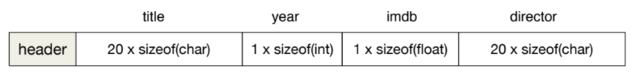

## Relational Algebra

- **Relation:**
    
    A relation is a collection of similar facts relevant to the application.
    
- **Schema:**
    
    The schemata of the relations plus(optionally) inter-relation constraints
    
    A database instance is legal if it satisfies all constraints in the schema.
    
- I**nstance:**
    
    The instances of the relations.
    
- **Cross Product (R × S):**
    
    Creates a new relation with the concatenation of every tuple in R with every tuple in S.
    
    
    
- **Join (R ⨝c S):**
    
    The join condition normally involves attributes from both relations.
    
    An **equijoin** is a join where all conditions are equalities
    
    
    
- **Outer Join (R ⟕ S):**
    
    Does a join, then keeps unmatched tuples in R with NULL values for the missing tuple in S.
    
    
    
- **Semi-join (R ⋉c S):**
    
    Produces a relation with tuples from R that have a matching tuple in S.
    

### **Set Operations**

- In the standard relational model and algebra,relations are sets and thus one can use the other set operators.
    
    
    

---

## Hardware & DBMS Applications

### Von Neumann Architecture

- Both the program and the data it uses are stored in memory
- Programs are executed by the CPU, one instruction at a time.
- The CPU and the memory communicated through the **BUS,** which can only be used for a **unidirectional transfer** between two components at a time.
- The CPU does not manipulate memory cells directly. Instead, it must move data from memory into registers and back.
- Every time the CPU needs data, it checks its cache first. The cache keeps data from RAM for quick access. A **cache miss** happens when the CPU needs data that is not in the cache.

### Memory & Storage

- **Volatile Memory:**
    
    Memory that needs continuous power to keep its contents.
    
    Ex. registers, caches, RAM
    
- **Persistent Memory (Storage):**
    
    Memory that keeps its contents even without continuous power.
    
    Ex. HDDs and SSDs  
    
- Storage is multiple folds slower compared to memory, because
    - **Error-correction:**
        
        To prevent data loss, storage check everything that has been read/written against error correction code.
        
    - **Synchronization:**
        
        Data can only be transferred between the device and memory when the data BUS is not in use.
        
- **Data Locality:**
    
    The seek time between *adjacent* tracks is very short.
    
- Data moves between memory and storage in **fixed-sized** chunks, called **blocks**
- The are two main costs when using storage:
    - **Access time:** setting the device to read/write the desired block
    - **Transfer time:** moving data between primary memory and the device's internal cache
- The Operating System abstracts all storage devices as a collection of blocks:
    - Each block has an address
    - Files(name) are associated with blocks by the OS

- **Memory Hierarchy**
    
    The closer to the CPU, the faster and more expensive the memory is.
    

### Virtual Memory

- Divide the RAM logically into fixed-size pages (e.g. 4kb)
- **Pagination and Memory Addresses:**
    
    Each memory cell address can be thought of as having two parts: 
    
    - Some bits identify the page
    - Other bits identify the cell within the page

- **Swapping:**
    
    When all pages in RAM are taken, the OS swaps out the page out to disk. And once the program needs the page once again, it is swapped in.
    
    
    
- **Implementation:**
    
    The OS keeps a **Page Table** mapping virtual pages to real pages;
    
    The CPU keeps a cache of the table in special hardware called **Translation Lookaside Buffer (TLB)**
    
    
    
- Virtual Memory is often much larger than physical memory
    
    
    

### DBMS Operating Constraints

- To preserve the data, the DBMS must make sure that it is safely stored in persistent storage
- Queries and updates are processed by the CPU! the data needs to reach
the registers
- **DBMS Persistent Storage:**
    - Option #1: via a File System
        
        Out sources the solution to the OS handling of file system.
        
    - Option #2: via its own I/O management
    
    
    

- **Buffer Manager:**
    - A dedicated module responsible for moving data between storage and memory. It splits main memory into logical units called **buffers,** which are the unit of data transfer.
    - Any buffer containing data not yet on the storage layer is said to be **Dirty**. Dirty data sits in volatile memory
    - The Buffer Manager must flush dirty buffers to the storage layer for
    the changes to become persistent.
    - To optimize I/O cost, DBMS buffers are multiples of a (storage) block, typically 1 or 2.
- **Database Representation:**
    - Tables are collections of records stored on "file".
    - Indexes help the DBMS find tuples through pointers
    - Database pointers are just like memory addresses, In DBMS terminology, we call them **tuple identifiers.**
    
    
    
    - **Symbolic addresses** are typically much larger than a memory address. Also, symbolic addresses must be resolved into virtual memory addresses!

---

## Access Methods

### Heap Files:

- The most common kind of DBMS file, are heap files. A chain of blocks, with each block containing several records.
- If length of all attributes in a tuple are defined in the schema, the DBMS can use **fixed-length records.**
    
    
    
- Very naive, as it cannot contain complex records.
- Instead of **variable-length** records are used. In which special codes are used as *field delimiters*
    
    
    
    
    

**Implementation and Access Cost**

- Similar to singly-linked lists, and thus are easy to maintain.
- All the DBMS needs to record is a pointer to the first block (head) in the file.
- **Inserting:** The cost of inserting into the front is *O(1)*
- **Searching:**
    
    
    
- **Deleting:** The cost of deleting is also *O(n)*

### Sequential Files

- Also similar to a singly-linked list, in which the records are sorted within block and also across blocks according to a specific attribute (usually the primary key)
- **Inserting:**
    1. Find the place where the new record goes, at cost *O(n)*
    2. Insert the record if there is room, otherwise rearrange the file by either
        1. Move existing records ⇒ *O(n)*
        2. Create a new empty block ⇒ *O(1) -* insert,  *O(n) -* find block to insert at
    
    
    

### Indexing Concepts

- An index is an **associative data structure**, that allows the DBMS to find tuples that satisfy a predicate defined over a subset of the attributes in the tuple.
- The index associates every index key with a pointer to the tuple in a table.
- Because the index records are smaller, each block of the index covers more keys than a block of the data file. This saves time querying data.
- **Flat Indexes**
    
    
    
    - **Hierarchical indexes** such as the B+tree are built on top of flat indexes.
    - Example:
        
        
        
    - 

- **Dense Index:**
    
    Has every index in the table ⇒ one pointer per tuple
    

- **Sparse Index:**
    
    Only some of the keys ⇒ fewer pointers than tuples
    

- **Primary Index:**
    - It is a dense index on a sequential file sorted by the same keys as the index
    - Primary indexes speed up enforcing primary key constraints.
    - Ex: The lowest level of a B+tree is a dense (and flat) index
- **Secondary index:**
    - Are always dense
    - the keys in the index file are not sorted in the same way as the records on the data file.
- **Multi-level indexes:**
    - Binary Search does not work on an index file on disk, because  Binary Search requires O(1) access time to any of the keys, which is not possible if the blocks of the index are on disk.
    - One way to reduce the number of I/Os to search for a key in an index is to **stack a sparse index over a dense index:**
        
        
        
    
- **B+trees :**
    - B+trees take the idea of multi-level indexing to the extreme, defining a self-balanced tree of index blocks in which:
        1. The root is a single-block sparse index
        2. The leaves form a dense flat index
        3. The levels in between are spare indexes
        
        
        
    - Every node holds *n* keys and *n+1* pointers
    - To avoid nodes becoming “too empty”, the minimum occupancy of a node should be:
        1. **Inner node ⇒** ⌈*n+1 /  2*⌉ *pointers*
        2. **Leaf node ⇒** ⌈*n+1 /  2*⌉ *+ 1 pointers*
    - In a B+ tree all leaves are at the same level. **
        
        
        
    - **Insertion:**
        - Very similar to insertions into binary search trees
            1. Find where the new key should go;  
            2. Add the new key
            3. Modify other nodes as needed.
        - Examples:
            
            
            
            
            
        - The tree always grows “up” by adding parents.
        - The worst case scenario of inserting into a tree *T* is bound by *O(height(T))*
    - **Deletion:**
        - Main concern is maintaining minimum occupancy.
            
            
            
            
            
            
            
    - **Costs:**
        - *h* is the height of the tree.
        - Insertion ⇒ *O(h)*
        - Searching ⇒ *O(h)*
        - Deleting ⇒ *O(h)*
    
    ### Hashing Files
    
    - A perfect has function must:
        1. Be fast to compute
        2. Avoid collisions
        3. Avoid clustering ⇒ values nicely spread out
        
        $$
        h(t) = f(t) \mod B \\  B: number \ of \ disk \ blocks
        $$
        
    - If *h(t)* is full, there are 2 options:
        1. Sequentially probing each block till an empty slot is found
        2. Grow the block with *overflow* blocks
        
        
        
    - In the best case scenario (one block per block and no collisions) the cost of all operations (insertion, search, and deletion) is *O(1)*
    - The average case cost (with some collisions) gives the same cost for both probing or using overflow chains: *O(log N)*
    - **Static Hashing:**
        - Works well so long as a fraction of the available block remain empty
        - If it gets too full, then *B* must be increased, leading to re-hashing every tuple.
    - **Dynamic Hashing:**
        - Aims to grow the hash file incrementally.
        - **Linear Hashing** grows the hash file one block at a time.

---

## Query Processing

- The query plan is executed iteratively
- Every call tosqlite3_step() fetches one new tuple of the answer,and stores it in the heap space of the application
- Iterators are stateful objects: they cannot return the same tuple more than once
- **Compiling basic SQL expressions:**
    - Cartesian Product ⇒ Selection ⇒ Projection

### Iterator Methods

- **Open():**
    - Create/requests the necessary data structures
    - Called recursively, top-down, from the root of the tree
    
    
    
- **GetNext():**
    - Produces the next tuple in the answer
    - Computes one more tuple and sends it to the operator “above”
    - Returns *<EOF>* when there are no more tuples to return.
- **Close():**
    
    Release the necessary data structures 
    

### Iterator Implementations

- **Selection:**
    
    
    
- **Projection:**
    
    
    
- **scan():**
    
    
    
- **Union (*R U S):***
    
    
    
- **Cross Product (R x S):**
    
    
    
- **Join (R ⨝ S):**
    
    
    

### I/O Cost:

- Let's look at the above Join algorithm for example, with 3 different cases for buffer usage:
    1. Case #1: One buffer for each scan
        - Memory Cost = 2 buffers
        - I/O Cost = *O(|R| · |S|)* block reads
    2. Case #2: We have *M* buffers, and |S| < M - 1
        - use one buffer to scan for *R*, and to load all blocks of *S* to buffers in RAM beforehand
        - Memory Cost = |S| + 1
        - I/O Cost = |R| + |S|
    3. Case #2: We have *M* buffers, and M < |S| ≤ |R|
        - Now the best way is to break the inner table into chunks of *M−1* blocks, and make multiple passes on *R* using a single buffer
            
            
            
        - Memory Cost = *M* buffers
        - I/O Cost =
        
        $$
        ⌈\frac{|S|}{M−1}⌉ \ .\ (|R|) +|S| \ \ block \ reads
        $$
        

### Sorting Algorithms (Lecture 5 pg. 47)

### Cost Estimation:

- The following are the simplest statistics (per relation *R* in the database) the DBMS can use to estimate the cost of a query plan.
    
    
    
- To estimate the size of a query *Q* we need to know *T(Q)* and *S(Q).*
    
    
    
- As such we need to estimate the *T(Q), S(Q)* and *V(Q, *)*
    
    
    
    $$
    T(Q) = \lceil \frac{1}{V(R,a_i)} \ . \ T(R) \rceil 
    $$
    

- Estimates for Set Operations
    
    
    
- **Histograms (Lecture 5 pg. 67)**
- **Predicate Selectivity:**
    - The selectivity of predicate of *Ci* is defined as
        
        
        
    - Using the above, as the probability that a tuple in *R* satisfies a condition, we have
        
        
