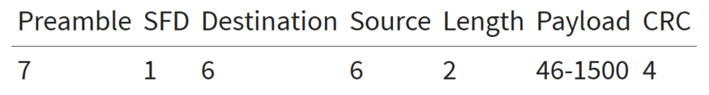
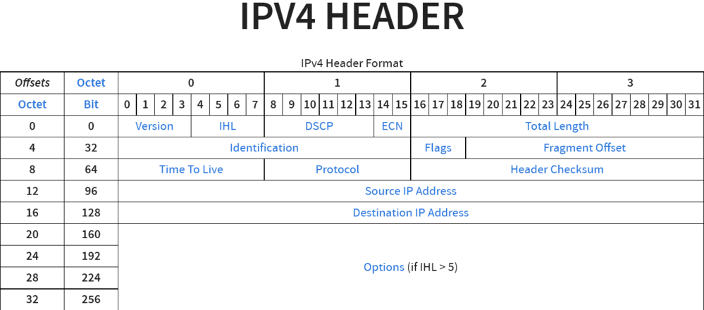
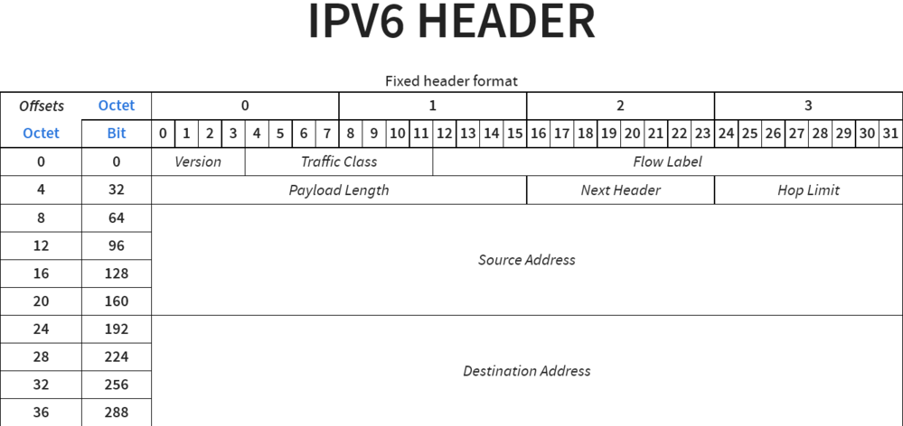
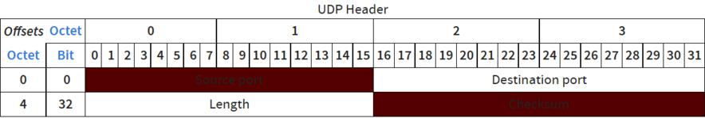
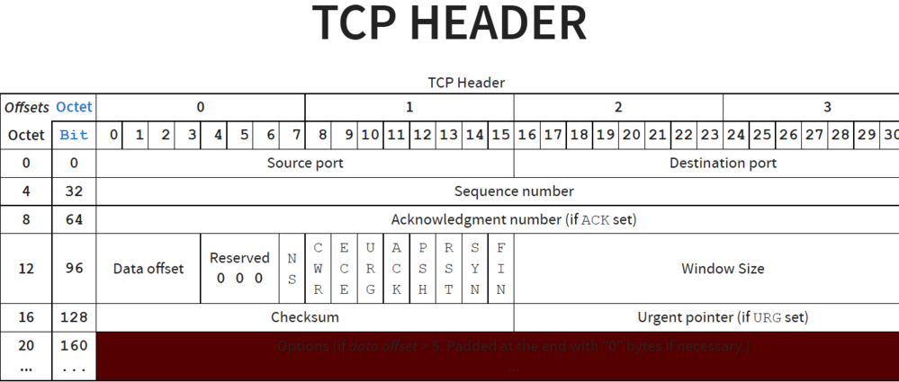
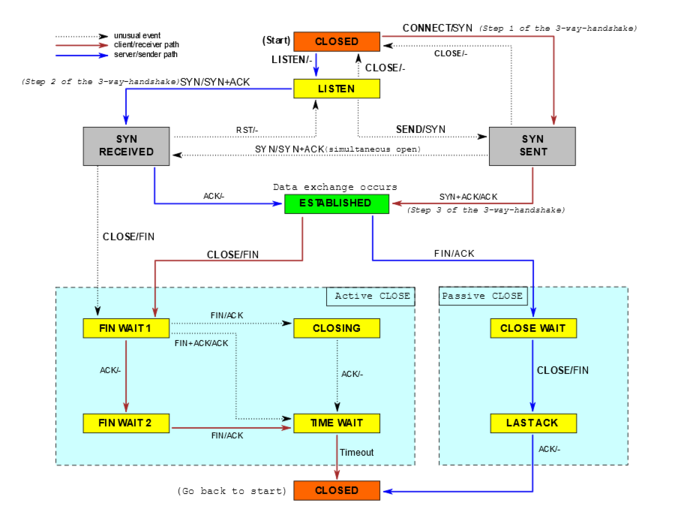

## Ethernet

- 1 Ethernet frame is 64 to 1526 bytes
    
    
    
- CRC means each frame has some error detection.
- SFD – Start Frame Delimiter
- Things to know when using Ethernet frames:
    - minimum packet sizes that can be sent
    - potential waste in a transmission
    - sizes that aren't fragmented or split
    - when you'll incur latency due to split packets/frames
    - Keep your message sizes smaller than 1.5kb

## IPV4

- Ethernet is not routable
- Need to communicate over large distances & to many computers

## IPV6

- Like IPV4 but more address space (32 → 128 bit)
- TCP can fit over top of it

## UDP (User Datagram Protocol)

- This header sits on top of IP

- User means that user-space applications can use it
- Provides (optional) checksums—some integrity
- Provides port numbers
- Stateless
- Lossy, not ordered
    - Sent: 0 1 2 3 4 5 6 7 8 9, Received: 0 1 2 4 3 5 6 9
- No connections
- No guarantees

## TCP(Transmission Control Protocol)

- 3-packet handshake
    
    
    
- Acknowledge receiving of handshake
- Maintains order
- Used by most internet applications & HTTP

## DNS (Domain Name Service)

- Allows us to bind a name to another name, IP, or set of IPs.
- A records point to an IP
- CNAME records point to another name
- Works on IPV6 and IPV4
