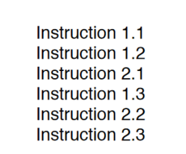

# 1. Intro & Overview

### 1.1 Top 3 Lessons of CMPUT 481

1. Granularity.
2. Optimize for the common case.
3. Do **not** copy data or block, if you can avoid it.

### 1.2 **Motivation**

- Uniprocessors are fast, but somebody always wants more!
    - Some problems require too much **computation**
    - Some problems use too much **data**
    - Aside: some problems have too many **parameters** to explore
- For example: weather simulations, scientific, and engineering simulations, machine learning, game-tree search, web servers, databases, code breaking.
- Needs:
    - good sequential algorithms
    - good parallel algorithms
    - good systems software
    - good parallel hardware

### 1.3 Parallel vs. Distributed Computing

Some hardware-centric terminology:

- Parallel Computing ⇒ shared memory
    - multiprocessors (nearly universal now; cores)
    - processes share logical address spaces
    - processes share physical memory
    - sometimes refers to the study of parallel algorithms
- Distributed Computing ⇒ distributed memory
    - clusters
    - processes do not share address spaces
    - processes do not share physical memory
    - sometimes refers to the study of theoretical distributed algorithms or neural networks

### 1.4 Parallel Algorithms: The Basics

- A parallel algorithm solves a specific problem by dividing the computation into smaller units of work that can be solved concurrently and then combined to form the final answer.
- The basic idea:
    1. Create work: partition, divide, embarrassingly parallel, granularity.
    2. Coordinate computation: IPC, synchronization, load balancing, synchronous/asynchronous communication, dependency.
    3. Combine results: termination detection
    4. Repeat for all "work"
- Granularity: the ration between computation and communication/synchronous/coordination

# 2. Memory

### 2.1 Shared Memory


- hardware-based shared memory with OS support
- synchronization with hardware and OS support, or
- synchronization via loads and stores
- Careful: Many hybrids and nuances.

### 2.2 Distributed Memory


- cannot directly and asynchronously read remote memories
- explicit sends and receives to share data (e.g. MPI, REST)
- fast network (e.g. InfiniBand, 100Gb/s+ Ethernet)

### 2.3 Flynn’s Taxonomy


- MIMD is the most general-purpose
    - multiple program multiple data (MPMD): client-server, etc.
    - single program multiple data (SPMD): our focus!

# 3. Speedup

## 3.1 Performance & Speedup

- How do we characterize or measure performance?
- Speedup S(p) for a problem fixed size *n* is defined as:
    
    $$
    S(p) = t_1/t_p
    $$
    
    - $t_1$: is the time to solve a problem sequentially
    - $t_p$: is the time to solve a problem in parallel

- $S(p) > p$: **super-linear** speedup. This is largely a fallacy.

### 3.1.1 Linear Speedup

- $S(p) = p$: **linear** speedup or unit-linear speedup or ideal speedup. This is rare!
- Embarrassingly parallel with low communications overheads
- Good use of computation and love overhead, aka coarse grain, good granularity

### 3.1.2 Sub-linear Speedup

- $S(p) < p$: **sub-linear** speedup. Common!
- $S(p+1) = S(p) + δ$: where δ<1: **diminishing returns**, especially if δ ≪1
- Idle time due to load imbalance, or synchronization
- Overhead due to communication, etc.
- Extra computation in parallel program
- And many more reasons.

### 3.1.3 Slowdown

- $S(p + 1) < S(p)$: **slowdown**
- Overheads are $O(p^2)$, $O(p\ log\ p)$ “but” work is $O(n)$
- Contention for a resource depends on p

## 3.2 Speedup Skepticism

- Do not rely on a single number to tell the full story.
    - Do not just look at accuracy, precision, or recall in machine learning.
- Is super-linear speedup (S(p) > p) possible? Yes and no.
    - Often, increasing p also increases the amount of cache memory (or even main memory), which is unfair to the sequential case.
    - For certain search algorithms, a cutoff or “eureka jump” can cause super-linear speedup.
    - If neither of these two explanations apply, ask some hard questions about the sequential algorithm.
    - But, pragmatically, we are happy to accept super-linear speedup if it happens.

## 3.3 Granularity

- Granularity is an informal concept with (at least) two main definitions:
    1. The amount of computation that typically occurs between communication or synchronization points.
    2. The ratio of computation to communication.
- Granularity can be changed by:
    - Improving the algorithm to require less or cheaper communication
    - Reducing the cost of communication
    - Reducing the amount of synchronization: reduce contention and reduce idle time
    - Increasing the size of the problem
    - What if the communication overheads are O(n2) but computation is O(n3)?

## 3.4 Amdahl's Law

### 3.4.1 Definition

- Amdahl argued that the inherently sequential portions of a parallel program will dominate its speedup performance:
    
    $$
    \lim_{p \rightarrow \infin}S(p) = \frac{1}{seq}
    $$
    
    where *p* is number of processors, and *seq* is the sequential portion.
    
- Amdahl’s Law can be seen as a “cautionary warning” based on the idea of a rate-limiting step, or bottleneck for speedup.

### 3.4.2 Derivation


- Let *seq* be the portion of a program’s execution time that is inherently sequential.
- Let *para* be the portion that is parallelizable.
- For simplicity, we normalize to get: total time = *seq* + *para* = 1
- In the ideal case, we can achieve unit-linear speedup for the parallel portion. Therefore:
    
    $$
    S(p) = \frac{t_1}{t_p} \newline
         = \frac{seq+para}{seq+\frac{para}{p}} \newline
         = \frac{1}{seq+\frac{para}{p}} \newline
    $$
    
- And therefore, by simplifying for *seq*, Amdahl’s Law says:
    
    $$
    \lim_{p \rightarrow \infin}S(p) = \frac{1}{seq}
    $$
    


- The sequential portion to parallel portion ratio provides us with an upper limit for expected performance boost.

# 4. Single Program Multiple Data (SPMD) Programming

- An algorithmic and program design strategy
- Single Program Multiple Data (SPMD)
    - Related to MIMD (client-server)
    - A best practice strategy, but not universal
    - Provides better granularity, and is easier to debug & program
- There are usually 3 main parts or phases to most SPMD programs
    1. Initialize data structures (and start threads)
    2. SPMD execution
    3. Cleanup & exit

## 4.1 Creating Threads

```cpp
struct ThreadControlBlockTCB[NUM_THREADS];
pthread_tThreadID[NUM_THREADS];
void * mySPMDMain(void * );

int main(int argc, char ** argv) {
  /* Initialize global data here */ /* Start threads */
  for (i = 1; i < NUM_THREADS; i++) {
    TCB[i].id = i; /* In parameter */
    pthread_create( & (ThreadID[i]), NULL, mySPMDMain, (void * ) & (TCB[i]));
  }
  TCB[0].id = 0;
  mySPMDMain((void * ) & (TCB[0])); /* Clean up and exit */
}
```

- Keep it simple
- TCB is like a thread-object or PID

## 4.2 Execution & Barriers

```cpp
#define MASTER if (myId == 0) 
#define BARRIERbarrier(myId, __LINE__);

void * mySPMDMain(void * arg) {
    struct ThreadControlBlock * myTCB;
    int myId;
    pthread_t * myThreadIdPtr; 

    /* (1) Actual parameter */
    myTCB = (struct ThreadControlBlock * ) arg; 

    /* (2) Other parameters passed in via global */
    myId = myTCB -> id; 

    /* Parallel array to TCB */
    myThreadIdPtr = & (ThreadID[myId]);
    
    BARRIER;
    startTiming();

    /* Phase 1 */
    BARRIER;

    /* Phase 2 */
    MASTER{
    }
    BARRIER;

    /* Phase 3 */
    BARRIER;

    /* Phase 4 */
    BARRIER;

    stopTiming();

} /* mySPMDMain*/
```

- We utilize local variables in (1), (2), because local variables are on the stack which is per-thread  and therefore we can have high confidence that they will be in a cache line without interference from other threads.
- The macros are used to set barriers such that the algorithm is executed sequentially, and to make sure certain sections are executed only once by the master block.
    
    
    

## 4.3 Non-Determinism

### 4.3.1 Threads & OS Non-Determinism

- Instructions will be interleaved in a pseudo-random order.
- Fine-grained synchronization likely too expensive.
- Timer interrupts (e.g., time quantum), I/O, cache coherence actions, contention for resources, other users, etc.can all cause non-determinism.
- The implications are:
    1. Bugs may be hard to reproduce.
    2. Slight variations in (real time) timings.
    3. Depending on the algorithm and datasets, you can get different answers on different runs (e.g., floating point computations).
- A related concept to non-determinism is a race condition.

### 4.3.2 Debugging with Non-Determinism

- As always, find the smallest problem that still has the (non-deterministic) bug
- Use assertions to detect error conditions
    - Use invariants to design algorithms and debug
- Temporarily, synchronize more
    - Temporarily, add barriers
    - SPMD programming, by phases, etc.
- Be careful of how all that impacts performance.

## 4.4 Programming with Shared Memory

### 4.4.1 Differences between Processes and Threads

- **Process -** "Heavyweight"
    - Completely separate program with its own variables, stack, and memory allocation.
        
        
        
- **Threads -** "Lightweight"
    - Shares the same memory space and global variables between routines.
        
        
        

### 4.4.2 Statement Execution Order

- Single processor: Processes/threads typically executed until blocked.
    
    
    
- Multiprocessor: Instructions of processes/threads interleaved in time.
    
    
    
- If two processes were to print messages, for example, the messages could appear in different orders depending upon the scheduling of processes calling the print routine.

### 4.4.3 Thread-Safe Routines

- **Thread-Safe:** can be called from multiple threads simultaneously and still always produce correct results.
- System routines that return time may not be thread safe.
- Routines that access shared data may require special care to be made thread safe.

### 4.4.4 Accessing Shared Data & Critical Section

- Accessing shared data needs careful control if said data maybe accessed by multiple threads.
    
    
    
- A mechanism for ensuring that only one process accesses a particular resource at a time is to establish sections of code involving the resource as so-called **critical sections** and arrange that only one such critical section is executed at a time. This mechanism is known as **mutual exclusion**.
- Often, a critical section is to be executed if a specific global condition exists; for example, if a certain value of a variable has been reached.

### 4.4.5 Locks & Deadlocks

- A lock is a 1-bit variable that is a 1 to indicate that a process has entered the critical section and a 0 to indicate that no process is in the critical section.
- Deadlocks can occur with two processes when one requires a resource held by the other, and this process requires a resource held by the first process.
    
    
    
- Deadlock can also occur in a circular fashion with several processes having a resource wanted by another.
    
    
    
- **OpenMP**
    - An accepted standard developed in the late 1990s by a group of industry specialists.
    - Consists of a small set of compiler directives, augmented with a small set of library routines and environment variables.
    - OpenMP directives are contained in *#pragma* statements. The OpenMP *#pragma* statements have the format: *#pragma omp directive_name ...* where *omp* is an OpenMP keyword.
    - OpenMP uses “fork-join” model but thread-based.
    - *parallel* directive creates a team of threads with a specified block of code executed by the multiple threads in parallel. The exact number of threads in the team determined by one of several ways.
    

## 4.5 Shared Memory Programming Performance Issues

### 4.5.1 Shared Data in Systems with Caches

- All modern computer systems have cache memory, high-speed memory closely attached to each processor for holding recently referenced data and code.
- Cache coherence protocols:
    - **Update policy** - copies of data in all caches are updated at the time one copy is altered.
    - **Invalidate policy** - when one copy of data is altered, the same data in any other cache is invalidated (by resetting a valid bit in the cache). These copies are only updated when the associated processor makes reference for it.

### 4.5.2 False Sharing

- Different parts of block required by different processors but not same bytes. If one processor writes to one part of the block, copies of the complete block in other caches must be updated or invalidated though the actual data is not shared.
    
    
    
- **Solution for False Sharing**
    - Compiler can alter the layout of the data stored in the main memory, separating data only altered by one processor into different blocks.

# 5. Message-Passing Interface (MPI)

## 5.1 Communicating with other processes

Data must be exchanged with other works through:

- **Cooperative -** all parties agree to transfer data
- **One sided -** one worker performs transfer of data

### 5.1.1 Cooperative Operations

- Message-passing is an approach that makes the exchange of data cooperative. Data must be both explicitly sent & received.
- An advantage is that any change in the receiver's memory is made with the receiver's participation.
    
    
    

### 5.1.2 One-sided Operations

- One-sided operations between parallel processes include remote memory reads & writes.
- An advantage is that data can be accessed without waiting for another process.
    
    
    

## 5.2 What is MPI?

- MPI is a:
    - Message-passing library specification
    - Message-passing model
    - Not a compiler specification
    - Not a specific product
- For parallel computers, clusters, and heterogeneous networks. Designed to permit the development of parallel software libraries.
- Designed to provide access to advanced parallel hardware for, end users, library writers, tool developers.

## 5.3 Features of MPI

- General:
    - Communicators combine context and group for message security
    - Thread safety
- Point-to-point communication:
    - Structured buffers and derived datatypes, heterogeneity
    - Modes: normal (blocking and non-blocking), synchronous, ready (to allow access to fast protocols), buffered
- Collective:
    - Both built-in and user-defined collective operations
    - Large numbers of data movement routines
    - Subgroups defined directly or by topology
- Application-oriented process topologies:
    - Built-in support for grids and graphs (uses groups)
- Profiling:
    - Hooks allow users to intercept MPI calls to install their own tools
- Environmental:
    - Inquiry & error control
- **Non-Features:**
    - Non-message-passing concepts not included:
        - Process management
        - Remote memory transfers
        - Active messages
        - Threads
        - Virtual shared memory
    - MPI does not address these issues, but has tried to remain compatible with these ideas (e.g. thread safety as a goal, intercommunicators)
- MPI's extensive functionality includes 125 functions. But many parallel programs can be written with just 6 basic functions. As such one can access flexibility when it is required.

## 5.4 MPI Communication

### 5.4.1 Sending & Receiving


- Need to know:
    - Who is sending?
    - Who is receiving?
    - What is being sent?
    - How is the receiver identifying the sent messages.

```cpp
# Blocking send
MPI_Send(start, count, datatype, dest, tag, comm);

# Receive
MPI_Recv(start, count, datatype, source, tag, comm, status);

## Collective Operations
MPI_Bcast(start, count, datatype, root, comm);
MPI_Reduce(start, result, count, datatype, operation, root, comm);
```

### 5.4.2 Current Message-Passing

- A typical blocking send looks like $send\ (dest,\ type,\ address,\ length)$
    - *dest:* is an integer identifier representing the process to receive the message
    - *type:* is a nonnegative integer that the destination can use to selectively screen messages.
    - *(address, length):* describes a contiguous area in memory containing the message to be sent.
- A typical global operation looks like $broadcast\ (type,\ address,\ length)$

### 5.4.3 Buffers

- Sending and receiving only a contiguous array of bytes
    - Hides the real data structure from hardware which might be able to handle it directly
    - Requires pre-packing dispersed data such as
        - Rows of a matrix stored columnwise
        - General collections of structures
- Prevents communications between machines with different representations (even lengths) for same data type.

### 5.4.4 Delimiting Scope of Communication

- Separate groups of processes working on subproblems
    - Merging of process name space interferes with modularity
    - "Local" process identifiers desirable
- Parallel invocation of parallel libraries
    - Messages from application kept separate from messages internal to library.
    - Knowledge of library message types interferes with modularity
    - Synchronizing before and after library calls is undesirable
- Generalizing the process identifier
    - Collective operations typically operated on all processes. This is too restrictive.
    - MPI provides groups of processes
        - Initial "all" group
        - Group management routines (build, delete, groups)
- All communications takes place in groups
- A group and a context are combined in communicator
- Source/destination in send/receive operations refer to *rank* in group associated with a given communicator. *MPI_ANY_SOURCE* permitted in a receive

## 5.5 Collective Operations

- Communication is coordinated among a group of processes.
- Groups can be constructed "by hand" with MPI group-manipulation or topology-definition routines.
- No non-blocking collective operations
- Three classes of collective operations:
    - Synchronization i.e. MPI_Barrier
    - Data movement
    - Collective computation
        
        
        
        
        

### 5.5.1 MPI Collective Routines

- Many routines:
    
    
    
- *All* versions deliver results to all participating processes.
- *V* versions allow the chunks to have different sizes.
- *Allreduce, Reduce, ReduceScatter,* and *Scan* take both built-in and user-defined combination functions.
