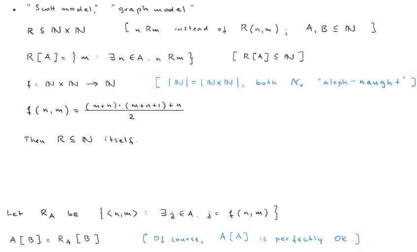

## History of Modern Computers

### Charles Babbage & Ada Lovelace

- Babbage proposed **Difference Engine**, a special-purpose digital computing machine for the automatic production of mathematical tables. It consisted of mechanical components - brass, gear wheels, etc.
- He later proposed **Analytical Engine**, a general-purpose mechanical digital computer. It was to have had a memory store and a CPU (or ‘mill’). Babbage emphasized the generality of the Analytical Engine.
- The behavior of the Analytical Engine would have been controlled by a program of instructions contained on punched cards connected together with ribbons (an idea that Babbage had adopted from the Jacquard weaving loom).
- Lovelace foresaw the possibility of using the Analytical Engine for non-numeric computation

### Analog computers

- In analog representation, properties of the representational medium ape (or reflect or model) properties of the represented state-of-affairs.
- James Thomson, and Lord Kelvin - made a tide predicting machine - constructed a device for computing the integral of the product of two given functions.

### Universal Turing Machine

- In 1936, Turing described an abstract digital computing machine consisting of a limitless memory and a scanner that moves back and forth through the memory, symbol by symbol, reading what it finds and writing further symbols. The actions of the scanner are dictated by a program of instructions that is stored in the memory (Turing's stored-program concept).

### Electromechanical vs Electronic Computation

- Early digital computing machines were electromechanical. That is to say, their basic components were small, electrically-driven, mechanical switches called ‘relays’ - which were too slow and unreliable a medium for large-scale general-purpose digital computation.
- It was the development of high-speed digital techniques using vacuum tubes that made the modern computer possible.
- Colossus was the world's first large-scale programmable electronic digital computer, made by Thomas Flowers in 1943.
- Colossus lacked two important features of modern computers. First, it had no internally stored programs. To set it up for a new task, the operator had to alter the machine's physical wiring, using plugs and switches. Second, Colossus was not a general-purpose machine.

### Turing's Automatic Computing Engine

- The first electronic stored-program digital computer to be proposed in the U.S. was the EDVAC, composed by von Neumann and contained little engineering detail.
- Turing's proposed Automatic Computing Engine (ACE), with detailed circuit designs and specifications of hardware units, specimen programs in machine code, and even an estimate of the cost of building the machine. ACE employed distributed processing, while EDVAC had a centralized structure.

### The Manchester Machine

- The earliest general-purpose stored-program electronic digital computer to work was built in Newman's Computing Machine Laboratory at Manchester University. The Manchester ‘Baby’, as it became known, was constructed by the engineers F.C. Williams and Tom Kilburn.

---

## Turing Machines

### Turing's Definition

- A machine capable of a finite set of configurations (the states of the machine, called m-configurations by Turing). It is supplied with a one-way infinite and one-dimensional tape divided into squares each capable of carrying exactly one symbol. At any moment, the machine is scanning the content of one square r which is either blank or contains a symbol.
- **Entscheidungsproblem:**
    
    The problem to decide for every statement in first-order logic (the so-called restricted functional calculus, see the entry on classical logic for an introduction) whether or not it is derivable in that logic.
    
- Given Gödel’s completeness theorem (Gödel 1929) proving that there is an effective procedure (or not) for derivability is also a solution to the problem in its validity form. In order to tackle this problem, one needs a formalized notion of “effective procedure” and Turing’s machines were intended to do exactly that.
- Turing machine is capable of three types of action:
    1. Print SiSi, move one square to the left (L) and go to state qjqj
    2. Print SiSi, move one square to the right (R) and go to state qjqj
    3. Print SiSi, do not move (N) and go to state qjqj
- The ‘program’ of a Turing machine can then be written as a
finite set of quintuples of the form:
    
    
    
- A transition table is commonly used to represent Turing machines
    
    
    
- There are two important concerns with this definition so far:
    1. The definition of the machine itself, namely that the machine’s tape is potentially infinite. This corresponds to an assumption that the memory of the machine is (potentially) infinite. 
    2. The definition of Turing computable, namely that a function will be Turing computable if there exists a set of instructions that will result in a Turing machine computing the function regardless of the amount of time it takes. This assumes infinite time to complete the computation.

### Post's Definition

- Main differences with Turing's definition
    1. Given a state, either prints or moves - does not have operation of moving and printing - producing the quadrable notation 
        
        
        
    2. Post’s Turing machine has only one kind of symbol and so does not rely on the Turing system of F and E-squares
    3. Post’s Turing machine has a two-way infinite tape.
    4. Post’s Turing machine halts when it reaches a state for which no actions are defined

### Formalization of the Definition

- Purely formally a Turing machine can be specified as a quadruple $T=(Q,Σ,s,δ)$  where:
    - Q is a finite set of states *q*
    - Σ is a finite set of symbols
    - s is the initial state *s*∈*Q*
    - *δ* is a transition function determining the next move:
        
        $δ:(Q×Σ)→(Σ×{L,R}×Q)$
        
    - The transition function for the machine T is a function from computation states to computation states. If $δ(q_i,S_j)=(S_{i,j},D,q_{i,j})$, then when the machine’s state is qj, reading the symbol Sj, T replaces Sj by Si,j, moves in direction D∈{L,R} and goes to state qi,j.

### Turing's Universal Machine

- It is implied that anything which can be “computed”, can also be computed by that one universal machine. Conversely, any problem that is not computable by the universal machine is considered to be uncomputable
- Turing’s approach is the construction of a machine U which is able to
    1. 'understand’ the program of any other machine $T_n$ and, based on that “understanding”, 
    2. ‘mimic’ the behavior of $T_n$. To this end, a method is needed which allows to treat the program and the behavior of $T_n$ interchangeably since both aspects are manipulated on the same tape and by the same machine.
- Turing needs a notational method which makes it possible to ‘capture’ two different aspects of a Turing machine on one and the same tape in such a way they can be treated *by the same machine*, viz.:
    1. its description in terms of *what it should do*—the quintuple notation
    2. its description in terms of *what it is doing*—the complete configuration notation

### Halting Problem & Entscheidungsproblem

<aside>
💡 **Entscheidungsproblem**: Is there a general (effective) process for determining whether a given formula A of the functional calculus is provable?

</aside>

- The purpose of Turing’s paper was to show that the Entscheidungsproblem for first-order logic is not computable.
- **Indirect proof:** take some problem which is already known to be uncomputable and show that the problem “reduces” to it.
- **Direct proof:** prove the uncomputability directly by assuming some version of the Church-Turing thesis.

<aside>
💡 **CIRC?** The problem to decide for every number n whether or not it is satisfactory

</aside>

- The proof of the uncomputability of **CIRC?** uses the construction of a hypothetical and circle-free machine *Tdecide* which computes the diagonal sequence of the set of all computable numbers computed by the circle-free machines.
- Hence, it relies for its construction on the universal Turing machine and a hypothetical machine that is able to decide **CIRC?** for each number n given to it. It is shown that the machine *Tdecide* becomes a circular machine when it is provided with its own description number, hence the assumption of a machine which is capable of solving **CIRC?** must be false.
- Finally, based on the uncomputability of **PRINT?** Turing shows that the Entscheidungsproblemis not decidable. This is achieved by showing:
    1. how for each Turing machine T, it is possible to construct a corresponding formula **T** in first-order logic and 
    2. if there is a general method for determining whether **T** is provable, then there is a general method for proving that T will ever print 0. This is the problem **PRINT?** and so cannot be decidable (provided we accept Turing’s thesis).
- It thus follows from the uncomputability of **PRINT?**, that the Entscheidungsproblem is not computable.

<aside>
💡 **HALT?** The problem to decide for every Turing machine T whether or not T will halt.

</aside>

- A popular proof of HALT? goes as follows. Assume that HALT? is computable. Then it should be possible to construct a Turing machine which decides, for each machine Ti and some input w for Ti whether or not Ti will halt on w. Let us call this machine TH. More particularly, we have:

$$
T_H(T_i,w) = \left\{ 
 \begin{array}{ll} 
 \textrm{HALT} & \textrm{if \(T_i\) halts on } w\\
 \textrm{LOOP} & \textrm{if \(T_i\) loops on } w
 \end{array} \right.
$$

- We now define a second machine *TD* which relies on the assumption that the machine *TH* can be constructed. More particularly, we have:

$$
T_D(T_i,D.N.~of~ T_i) = \left\{ 
\begin{array}{ll} 
 \textrm{HALT} & \textrm{if \(T_i\) does not halt on its own} \\
               & \qquad \textrm{description number}\\ 
\textrm{LOOP} & \textrm{if \(T_i\) halts on its own} \\
               & \qquad \textrm{description number}\\ 
 \end{array} 
\right.
$$

---

## The Church-Turing Thesis

### History & Formulation:

- **Effective Method:** A method, or procedure, M, for achieving some desired result is called ‘effective’ (or ‘systematic’ or ‘mechanical’) just in case:
    1. M is set out in terms of a finite number of exact instructions (each instruction being expressed by means of a finite number of symbols);
    2. M will, if carried out without error, produce the desired result in a finite number of steps;
    3. M can (in practice or in principle) be carried out by a human being unaided by any machinery except paper and pencil;
    4. M demands no insight, intuition, or ingenuity, on the part of the human being carrying out the method.
- Computability in the sense of “in the computation of a number”, means “in the computation of a number by a human being”, since that is what computation was in those days. Similarly “numbers which would naturally be regarded as computable” are numbers which would be regarded as computable by a human computer, a human being who is working solely in accordance with an effective method.

### Church's Thesis

<aside>
💡 **Church's Thesis:** A function of positive integers is effectively calculable only if lambda-definable (or, equivalently, recursive).

</aside>

- Church employed the concept of **lambda-definability**:
    
    A function is said to be lambda-definable if the values of the function can be obtained by a certain process of repeated substitution.
    
- In Church’s proposal, the words “λ-definable function of positive integers” (and equally the words “recursive function of positive integers”) can be replaced by “function of positive integers that is computable by Turing machine”.
- Restricted to functions of positive integers, Church’s thesis and Turing’s thesis are extensionally equivalent, meaning that the two theses are about one and the same class of functions
    
    
    

### Acceptance of Church-Turing Thesis

- Summary of evidence
    1. Every effectively calculable function that has been investigated in this respect has turned out to be computable by Turing machine
    2. All known methods or operations for obtaining new effectively calculable functions from given effectively calculable functions are paralleled by methods for constructing new Turing machines from given Turing machines.
    3. All attempts to give an exact analysis of the intuitive notion of an effectively calculable function have turned out to be equivalent, in the sense that each analysis offered has been proved to pick out the same class of functions, namely those that are computable by Turing machine.

<aside>
💡 **Turing’s provability theorem:** Every formula provable in Hilbert’s first-order predicate calculus can be proved by the universal Turing machine. (See Turing 1936: 77)

</aside>

### Misunderstanding of the Thesis

- A myth has arisen concerning Turing’s paper, that he there gave a treatment of the limits of mechanism, and established a fundamental result to the effect that the universal Turing machine can simulate the behavior of any machine.
- In reality Turing proved that his universal machine can compute any function that any Turing machine can compute, in other words any function that can be computed by means of effective methods.
- In summary, Turing and Church were talking about effective methods, not finitely realizable physical systems.

### Maximality Thesis

<aside>
💡 **Maximality Thesis:** All functions that can be generated by machines (working in accordance with a finite program of instructions) are computable by effective methods.

</aside>

- A function is said to be computable if and only if there is an effective method for obtaining its values.
- No possible computing machine can generate a function that the universal Turing machine cannot.
- The maximality thesis admits of two interpretations, according to whether the phrase “can be generated by machine”
    - Weaker form: Is taken in the this-worldly sense of “can be generated by a machine that conforms to the physical laws (if not perhaps to the resource constraints) of the actual world”.
    - Stronger form: in a sense that abstracts from whether or not the envisaged machine could exist in the actual world.
- The stronger-weaker terminology is intended to reflect the fact that the stronger form entails the weaker, but not vice versa.
- The stronger form of the maximality thesis is known to be false.
- Counterarguments to stronger form
    - Extended Turing Machines (ETMs):
        - An ETM is exactly like a standard Turing machine except that an ETM’s tape can store any desired real number instead of 0 or 1.
        - Turing established the existence of real numbers that cannot be computed by standard Turing machines. These numbers are usually called ‘uncomputable numbers’, but, in a broad sense of ‘compute’, ETMs can compute them. Abramson also proved that ETMs are able to generate functions not capable of being computed by any standard Turing machine. It follows, by Turing’s thesis, that these functions are not computable by effective methods. Therefore, ETMs form counterexamples to the stronger form of the maximality thesis.
    - Accelerating Turing machines (ATMs):
        - ATMS are exactly like standard Turing machines except that their speed of operation accelerates as the computation proceeds
        - An ATM performs the second operation called for by its program in half the time taken to perform the first, the third in half the time taken to perform the second, and so on. Thus it is able to perform infinitely many operations in 2 moments.
        - When computing h(n), the ATM’s first step is write ‘0’ on a square of the tape called the answer square (A). The ATM then proceeds to simulate the actions of the nth Turing machine. If the ATM finds that the nth machine halts, then the ATM goes on to erase the ‘0’ that it previously wrote on A, replacing this by ‘1’. If, on the other hand, the nth machine does not halt, the ATM never returns to square A to erase the ‘0’ originally written there. Either way, once two moments of operating time have elapsed, A contains the value h(n)
- To summarize the situation with respect to the weaker form of the maximality thesis: At the present time, it remains unknown whether hypercomputation is permitted or excluded by the contingencies of the actual universe. It is, therefore, an open empirical question whether or not the weaker form of the maximality thesis is true.

---

## Languages & Semantics of Computer Science

<aside>
💡 **Machine Language:** instruction sets that are executed directly by a computer’s CPU

</aside>

<aside>
💡 **High-level languages:** operates at a distance from machine language - characterized by theory of representation and theory of computation - and employs more abstract concepts and control features.

</aside>

- theory of representation
    
    Determined by the underlying ontology of the language, and, in particular, by its type structure, which provides the central mechanism of modeling
    
- theory of computation
    
    Largely fixed by the control features. They determine how computation is
    realized or carried out.
    

### Imperative Languages

- Languages that exemplify the imperative paradigm consist of commands that alter the underlying state of the machine. The term imperative comes from the fact that they are perceived as commands.
- In the imperative paradigm computation eventually unwraps into a sequence of assignment statements
- Theory of computation of this paradigm can be summarized as follows:
    
    Programs are operations on states, and computation is state transformation.
    

### Functional Languages

- In a pure functional language there is no assignment, and no side effects of computation; programs are evaluated as mathematical functions.
- While functional languages are said to aid correctness, the advertised downside concerns the inefficiency that surrounds their implementation.
- One drawback concerns the way that storage is maintained. In particular, it is no longer controlled by the user of the language; the user has handed over control to the implementation.

### Logical Languages

- The idea behind logic programming, at least a simple reconstruction of the central idea, is to move specification and programming closer together by employing a programming
language that is close to being a specification language.
- The general idea is to be able to state the problem rather than solve it – a task left to the implementation of the language. In this paradigm programs are assertions or goals.

### Object Orientation

- Object-oriented programming (OOP) views the world as a collection of objects and classes
- One of the main tenets of this style is **encapsulation**: everything an object requires should be part of the object i.e., its attributes and the methods that maybe employed to modify it should be part of the class definition
- The main claim of this paradigm is naturalness, and the ease of representation that follows in
its wake. *Naturalness* relates to the fact that it facilitates the representation of real-world objects which can be conceptualized via their attributes and operational methods.

### Concurrency & Nondeterminism

- **Concurrency:**  several streams of operations may operate at the same time, each stream executes sequentially.
- A nondeterministic program may, for the same input, exhibit different behaviors on different executions.

### Role of Semantics

- Semantic knowledge is required not just to design, construct, or understand programs. It is also
necessary in order to argue that a program works, satisfies its specification.
- To do so one must link the overall impact of the program with its functional specification. The programmer must also understand the specification language, its semantics, and the semantic links between the languages.
- For both programmers and implementers, semantic descriptions provide a notion of correctness.

### Normativity

- To say that meaning is essentially normative is to say that certain norms are valid, or in force.
- In terms of programming languages, the "normativity of meaning" has it that any semantic account must provide a criterion of correctness

### Compositionality

- The principle of compositionality may be stated as follows:
    
    For every complex expression E in L, the meaning of E in L is determined by the structure of E in L and the meanings of the constituents of E in L
    
- For programming languages, the compositional view insists that the meaning of a complex program is fully determined by its linguistic structure, and the meanings of its constituents.
- In other words, the structure, together with the meaning of the building blocks, fixes matters.
- A compositional semantics allows the substitution of semantically equivalent parts. Provided that we know that a semantically well-defined unit is denotationally equivalent to another. This facilitates modular program design.
- In summary, it is argued that semantic definitions that are compositional have merit in that they
support comprehension, productiveness, explanation, and correctness. In addition, they aid both language and program design.

### Rigor

- One possible use concerns the employment of natural language terms to stand proxy for the technical ones of the artificial language.
- The natural language term does not tell us how, given the results of the evaluation of their components, to evaluate complex expressions. In itself it does not provide a semantic account of any kind, let alone a compositional one.
- Informal semantics aide with learning while formality provides rigor.

---

## Time Complexity

- Examples include: Context-free languages, Primality, Reachability
- **Polynomial time reducibility:**
    
    A reduces to B, and the function witnessing the reduction is polynomial time
    
- **Polynomial verifiability:**
    
    Given a path S, it can be verified (checked) in polynomial time that it is a Hamiltonian path.
    

### P ≠ NP

<aside>
💡 **Polynomial (P):** class of problems that are can be solved by a deterministic Turing Machine in polynomial time (quickly.

</aside>

<aside>
💡 **Nondeterministic Polynomial (NP):** class of problems that can be verified (or solved) by a nondeterministic Turing Machine in polynomial time

</aside>

<aside>
💡 **Boolean Satisfiability Problem (SAT):** it asks whether the variables of a given Boolean propositional logic can be consistently replaced by the values TRUE or FALSE in such a way that the value evaluates to TRUE. If this is the case, the formula is called satisfiable

</aside>

- SAT
    
    
    
    
    
- A problem is assigned to the NP (nondeterministic polynomial time) class if it is solvable in polynomial time by a nondeterministic Turing machine.

- It is an open problem whether P=NP, trivially P is in NP
- Many experts seem to lean towards P ≠ NP

### NP Completeness

<aside>
💡 **NP Complete:** A polynomial time algorithm for NP complete problem could be transformed into a polynomial time algorithm for any other problem in NP.

</aside>

- The satisfiability problem occupies a central place in theoretical computer science as the best known NP-complete problem. Any problem in NP can be reduced efficiently to the satisfiability problem.
    
    
    
- This is interesting in understanding what is feasible in "real" computation. i.e. A.I, and information security

---

## Formal Semantics

### Vernacular Semantics

- System for WHILE language
    - A state is a mathematical function from a set of *locations L* to a set of numerical *values V*
    - There is an operation (Update) that, given a state *s*, a location *l*, and a value *v*, changes the state to one where the location *l* is assigned the value *v*.
    - Evaluating the program *P* in state *s* terminates in the state *s'*
- Evaluating complex program (*big step semantics*):
    - To evaluate **skip** in a state *s*, return *s*
    - To evaluate *x := E* in a state *s*, evaluate *E* in *s* and place the resulting value in location *x*, overriding any existing values in this location, i.e., *Update(s,l,v)*
    - To evaluate *P;Q* in state *s*, first evaluate *P* in *s*. If this returns a state *s'*, evaluate *Q* in *s'.*
    - If the evaluation of *B* in *s* returns true and the evaluation of *P* in *s* returns *s'*, then the evaluation of if *B* then *P* else *Q* in *s* evaluates to *s'*. If, on the other hand, the evaluation of *B* in *s* returns false and the evaluation of *Q* in *s* returns *s'* then the evaluation of if *B* then *P* else *Q* in *s* evaluates to *s'*.
    - If the evaluation of *B* in *s* returns true, the evaluation of *P* in *s* returns *s',* and the evaluation of while *B* do *P* in *s*' yields *s'',*  then the evaluation of while *B* in *P* in *s* returns *s''.* If the evaluation of *B* in *s* returns false, then the evaluation of while *B* do *P* in *s* returns *s* **(Skip)***.*
- On the face of it, the above semantic definition satisfies all our normative and compositional demands. Nevertheless, there are aspects that are buried, or at least not made explicit, in the informal account given above.
    - Observe that the definition is *recursive* in the sense that the evaluation of complex programs gives rise to further reference to the whole evaluation process.
    - How can this recursion be justified? This is a technical question that cannot be adequately addressed without further mathematical investigation and support.

---

### Operational Semantics

<aside>
💡 "The logical imperfections of language stood in the way of such investigations. I tried to overcome these obstacles with my concept-script. In this way I was led from mathematics to logic" - Gottlob Frege

</aside>

- To enable a more mathematically explicit formalization, we adopt some notation:

$$
program:\ \ < P,s> \Downarrow s'
$$

$$
evaluation:\ \ < E,s> \Downarrow v
$$

- Formalizing a more explicit notation
    - For the skip command
    
    $$
    <skip,s> \Downarrow s
    $$
    
    - Assignment statement requires prior evaluations
    
    $$
    \frac{<E,s> \Downarrow v}{<x:=E, s> \Downarrow Update(s,x,v)}
    $$
    
    - The sequencing of programs is unpacked exactly as in the vernacular account, as relational composition
    
    
    
    - For conditionals
    
    
    
    - In the rule-based account, the semantic rules split according to whether the Boolean is true or false.
    
    
    
    - All we have done is make the inferential structure of the rules explicit. the informality of the natural language account has been made more precise, explicit, and systematic.
    
- We can now put this formalism to work. In particular,
    
    
    
    <aside>
    💡 Church-Rosser property: we can more easily show that for each program and each input state there is at most one final state
    
    </aside>
    
    - Which guarantees that, with the same starting conditions, the evaluation process, if it yields a result, always yields the same one.
- Formal semantics must act as a normative guide for users. It can only do this if the semantic account is understood and agreed by users of the language.
- At the very least, formal semantics is an essential tool for exploring and establishing the properties of languages, and for guaranteeing that the informal accounts are mathematically coherent.

---

### Denotational Semantics

- Partial function ≃ indicates quality relation that allows for the fact that the program may not terminate
    
    
    
- This yields a version of denotational semantics where each program is associated with a partial state-to-state (set-theoretic) function
- On the face of it, the *while* definition is circular: the while construct occurs on both sides of the semantic clause. It requires some mathematical unpacking: we need to know that such definitions coherent.
- More explicitly, there are mathematical requirements on the informal version that need to be uncovered and resolved, and these are best addressed with a degree of formalization.

---

### Definitional Priority

- The operational account is in the driving seat: the denotational semantics must agree with the operational one.
- This definitional priority of operational semantics has its roots in the theory of computation where formal accounts of computability introduced formal languages with associated operational semantics. Turing machines and the lambda calculus are classic instances. In particular, the lambda calculus is given by an operational account.
- However, from a more traditional mathematical perspective, the operational approach is taken to be inadequate. To semantically specify a formal language, a mathematical semantics is required.
- The lambda calculus is defined by the rules of the calculus, not by any set-theoretic interpretation. The operational rules have definitional and epistemological priority. They are how the calculus is defined, and they determine how computation is carried out.
- Given the motivation for the calculus, the set-theoretic interpretation, as mathematically elegant as it is, seems inappropriate as a definitional apparatus. The calculus was developed to provide a mathematical theory of computable operations. The uncovering of the appropriate notion of computability had epistemological intent.
- Programming languages implicitly provide theories of computation, and these are brought into being by operational semantics. Denotational definitions play a mathematical role.

---

### Game-Theoretic Semantics

- Game-Theoretic models provided denotational models in which the operational and denotational semantics agree. In particular, they solved the full abstractness problem for the programming language PCF, by giving the first syntax-independent fully abstract model.
- PCF is a higher-order functional programming language that is a fragment of any programming language with higher-order procedures
- Full abstraction can be seen as a completeness property of denotational semantics that guarantees agreement between the notions of equality delivered by the two semantic definitions.

---

### Programming Languages as Mathematical Theories

- Genuine mathematical theories must have some aesthetic qualities: they must have qualities such as elegance and the ability to be mathematically explored. And while it is possible to provide semantic definitions of the kind given for our toy language, for whole languages such definitions are normally not tractable theories.

<aside>
💡 **Whole programming languages are hard, if not impossible, to explore mathematically.**

</aside>

- When provided, such semantic definitions are often complicated and unwieldy, and therefore of limited mathematical value. Given this, it is hard to argue that actual programming languages are genuine mathematical theories.
- Conservative extension:
    - Suppose that we have constructed a semantic theory for a language. Suppose that also that, in the sense  of mathematical logic, we have shown that it is a conservative extension of a smaller tractable theory.
- Is a theory that is a conservative extension of a mathematical theory also a mathematical theory? Indeed, the construction of these extensions is itself part of the exploration process of the base theory.
- Programming languages admit of a similar distinction. While the whole language/theory may not have sufficient simplicity and elegance to be mathematically explored, it may nevertheless possess a conceptual core that can be. Such a core should support the whole language in the sense that the theory of the latter is a conservative extension of its core.

---

## [Computing Machinery & Intelligence](https://www-jstor-org.login.ezproxy.library.ualberta.ca/stable/pdf/2251299.pdf)

### The Imitation Game

<aside>
💡 "Can machines think"

</aside>

- Defining the game
    - The imitation game consists of a man A, a women B, and an interrogator C. The objective of the game is for the interrogator to determine which of the other two is the man and which is the woman.
    - The interrogator is allowed to put questions to A and B, and in order that tones of voice may not help the interrogator the answers should be written, or better still, typewritten.
    - Now suppose X is actually A, then A must answer. It is A's objective in the game to try and cause C to make the wrong identification. The object of the game for the third player (B) is to help the interrogator.
- We now ask the question, 'What will happen when a machine takes the part of A in this game? This question replace our original, 'Can machines think?'

### Critiques of the New Problem

- The new problem has the advantage of drawing a fairly sharp line between the physical and the intellectual capacities of a man.
- The form in which we, have set the problem reflects this fact in the condition which prevents the interrogator from seeing or touching the other competitors, or hearing their voices.
- The question and answer method seems to be suitable for introducing almost any one of the fields of human endeavour that we wish to include.
- The game may perhaps be criticized on the ground that the odds are weighted too heavily against the machine. If the man were to try and pretend to be the machine he would clearly make a very poor showing.

### The Machines concerned in the Game

- Neither naturally born nor future possible bio-engineered men are allowed.
- We only permit digital computers to take part in our game.

### Digital Computers

- The idea behind digital computers may be explained by saying that these machines are intended to carry out any operations which could be done by a human computer.
- A digital computer can usually be regarded as consisting of three parts
    1. Store ⇒ paper, memory
    2. Executive unit ⇒ head of a person
    3. Control ⇒ the instructions to be obeyed

### Universality of Digital Computers

- The digital computers considered in the last section may be classified amongst the 'discrete state machines'. These are the machines which move by sudden jumps or clicks from one quite definite state to another.
- This example is typical of discrete state machines. They can be described by such tables provided they have only a finite number of possible states.
    
    
    
- This is reminiscent of Laplace's view that from the complete state of the universe at one moment of time, as described by the positions and velocities of all particles, it should be possible to predict all future states
- But the number of states of which such a machine is capable is usually enormously large. For instance, the number for the machine now working at Manchester it about $2^{165000} \approx 10^{50000}$.
- Provided it could be carried out sufficiently quickly the digital computer could mimic the behaviour of any discrete state machine, therefore it is described by saying that they are universal machines.
- Let us fix our attention on one particular digital computer C. Is it true that by modifying this computer to have an adequate storage, suitably increasing its speed of action, and providing it with an appropriate program, C can be made to play satisfactorily the part of A in the imitation game, the part of B being taken by a man ?

### Contrary views to the Main Question

- Turing "believed that in about fifty years' time it will be possible to program computers, with a storage capacity of about $10^9$." and that the "an average interrogator will not have more than 70 percent chance of making the right identification after five minutes of questioning."
- Provided it is made clear which are proved facts and which are conjectures, no harm can result. Conjectures are of great importance since they suggest useful lines of research.
- **Theological Objection**
    - Turing argues that in attempting to construct such machines we should not be irreverently usurping God's power of creating souls, any more than we are in the procreation of children.
- **The 'Heads in the Sand' Objection**
    - "The consequences of machines thinking would be too dreadful. Let us hope and believe that they cannot do so."
    - We like to believe that Man is in some subtle way superior to the rest of creation.
- **The Mathematical Objection**
    - There are a number of results of mathematical logic which can be used to show that there are limitations to the powers of discrete-state machine.
    - Godel's theorem shows that in any sufficiently powerful logical system, statements can be formulated which can neither be proved nor disproved within the system, unless possibly the system itself is inconsistent.
    - If a machine is rigged up to give answers to questions as in the imitation game, there will be some questions to which it will either give a wrong answer, or fail to give an answer at all however much time is allowed for.
    - This is the mathematical result: it is argued that it proves a disability of machines to which the human intellect is not subject.
    - Turing argues that although it is established that there are limitations to the powers of any particular machine, it has only been stated, without any sort of proof, that no such limitations apply to the human intellect.
    - In short, then, there might be men cleverer than any given machine, but then again there might be other machines cleverer again, and so on.
- **The Argument from Consciousness**
    - Professor Jefferson's Lister Oration for 1949, said. "Not until a machine can write a sonnet or compose a concerto because of thoughts and emotions felt, and not by the chance fall of symbols, could we agree that machine equals brain-that is, not only write it but know that it had written it. No mechanism could feel [emotions]".
    - According to the most extreme form of this view the only way by which one could be sure that a machine thinks is to *be* the machine and to feel oneself thinking.
    - In short this argues that machines lack self-awareness something that human due. In return Turing argues that this is a "solipsist" self-absorbed view and that there are mysteries surrounding consciousness.
- **Arguments from Various Disabilities**
    - These arguments take the form, "I grant you that you can make machines do all the things you have mentioned but you will never be able to make one to do X".
    - Some examples include Be kind, resourceful, beautiful, friendly, and etc.
    - The claim that " machines cannot make mistakes " seems a curious one. One is tempted to retort, " Are they any the worse for that?"
    - Turing defines two kinds of mistake.
        - *Errors of functioning:* are due to some mechanical or electrical fault.
        - *Errors of conclusion:* can only arise when some meaning is attached to the output signals from the machine. The machine might, for instance, type out mathematical equations, or sentences in English
    - Abstract machines are mathematical fictions rather than physical objects. By definition they are incapable of errors of functioning. In this sense we can truly say that 'machines can never make mistakes'.
    - The criticism that a machine cannot have much diversity of behaviour is just a way of saying that it cannot have much storage capacity. Until fairly recently a storage capacity of even a thousand digits was very rare.
- **Lady Lovelace's Objection**
    - In her memoir Lady Lovelace states, " The Analytical Engine has no pretensions to originate anything. It can do whatever we know how to order it to perform"
    - A variant of Lady Lovelace's objection states that a machine can 'never do anything really new'.
        - Who can be certain that 'original work' that he has done was not simply the growth of the seed planted in him by teaching, or the effect of following well-known general principle.
    - A better variant of the objection says that a machine can never 'take us by surprise'.
    - Turing argues that the view that machines cannot give rise to surprises is due, to a fallacy to which philosophers and mathematicians are particularly subject. The assumption that as soon as a fact is presented to a mind all consequences of that fact spring into the mind simultaneously with it.
- **Argument from Continuity in the Nervous System**
    - The nervous system is certainly not a discrete-state machine. It may be argued that, this being so, one cannot expect to be able to mimic the behaviour of the nervous system with a discrete-state system.
    - The computer is mimicking behavior which is discrete and not brain structure.
- **The Argument from Informality of Behavior**
    - It is not possible to produce a set of rules purporting to describe what a man should do in every conceivable set of circumstances.
    - *Rules of conduct:* precepts such as ' Stop if you see red lights ', on which one can act, and of which one can be conscious
    - *Laws of behaviour:* laws of nature as applied to a man's body such as ' if you pinch him he will squeak
    - Being regulated by laws of behaviour implies being some sort of machine, and conversely being such a machine implies being regulated by such laws.
- **The Argument from Extra-Sensory Perception**
    - Extra-sensory perception, and the meaning of the four items of it, telepathy, clairvoyance, precognition and psychokinesis.
    - I guess Turing believed in E.S.P
- **Learning Machines**
    - *sub-critical:* An idea presented to such a mind will on average give rise to less than one idea in reply.
    - *super-critical:* An idea presented to such a mind may give rise to a whole 'theory' consisting of secondary, tertiary and more remote idea.
    - 'Can a machine be made to be super-critical ?'
    - Turing argues that the problem is mainly one of programming. Advances' in engineering will have to be made too, but it seems unlikely that these will not be adequate for the requirements.
    - In the process of trying to imitate an adult human mind we are bound to think a good deal about the process which has brought it to the state that it is in. We may notice three components:
        1. The initial state of the mind, say at birth
        2. The education to which it has been subjected
        3. Other experience
    - Instead of trying to produce a program to simulate the adult mind, why not rather try to produce one which simulates the child then subject it to an appropriate course of education one would obtain the adult brain.
    - We have thus divided our problem into two parts. The child program and the education process
        
        
        
    - Should be faster than evolution because a programmer is not restricted to random mutation.
    - The use of punishments and rewards to teach such child-machine.
    - One might have a complete system of logical inference 'built in'. In the which case the store would be largely occupied with definitions and propositions. The propositions would have various kinds of status, e.g. well-established facts, conjectures, mathematically proved theorems, statements given by an authority, expressions having the logical form of proposition but not belief- value.
    - Certain propositions may be described as 'imperatives'. The machine should be so constructed that as soon as an imperative is classed as 'well-established ' the appropriate action automatically takes place
    - Important amongst such imperatives will be ones which regulate the order in which the rules of the logical system concerned are to be applied. For at each stage when one is using a logical system, there is a very large number of alternative steps, any of which one is permitted to apply, so far as obedience to the rules of the logical system is concerned.
    - It is probably wise to include a random element in a learning machine. A random element is rather useful when we are searching for a solution of some problem

### Modern Feasibility

- Is it possible to build a machine that meets Turing's imitation game challenge?
    - Yes, they are in use.
- Would (or will) it be possible (in principle) to build a human-level AI system?
    - Provided we can agree on what human-level intelligence means
- What would be the purpose of building machines with human-level intelligence?
- Nils John Nilsson's view
    - Most tasks that humans perform could be automated
    - Turing Test (imitation game) replaced by employment test
    - *Strong AI:* human-level intelligence
    - *Weak AI:* Tools to help people in their work
- New Challenge ⇒ pass exams for vocational jobs
    - Humans are (relatively) general-purpose at birth
- Core suggestions from Nilsson:
    - Sensory-motor system
    - Hierarchies of perception, representation, and action
    - Predicting & planning
    - Learning
    - Reasoning & representation (common sense situation, uncertain knowledge)
    - Language

---

## [The Philosophy of AI](https://www-sciencedirect-com.login.ezproxy.library.ualberta.ca/science/article/pii/B9780444517265500224/pdfft)

### Design vs Designer

- **Designer stance**
    - Asking what kinds of knowledge, belief, consciousness, etc. does a computer system need in order to behave intelligently and how to design such a computer program.
- **Design stance**
    - Looking at an existing artifact or organism in terms of what it is designed to do or has evolved to do.
- Nilsson (2005) offers a criterion that a system should be teachable to do a wide variety of jobs that humans do-in particular that it should be able to pass the examinations used to select people for these jobs. Admitting that passing the exams may be possible without having adequate common sense
- McCarthy agrees with Lenat's requirement that the system be able to learn from textbooks written for humans. McCarthy (1996a) also discusses criteria for human-level AI, emphasizing the common sense informatic situation.
    - A system must be jump into a suitable context and reason within that context, using concepts meaningful in the context i.e. "If another car had come over the hill when you passed" . Thus a particular hypothetical head-on collision is in question, not, for example, statistics about how often a head-on collision is fatal
- McCarthy claims that philosophical theories can make sense for us only if they don't preclude human-level artificial systems. And that philosophical theories are most useful if they take the *designer* *stance* and offer suggestions as to what features to put in intelligent systems

### Philosophical Presuppositions of AI

- **Objective World**
    - The world exists independently of humans. The facts of mathematics and physical science are independent of there being people to know them.
    - A robot also needs to believe that the world exists independently of itself and that it cannot learn all about the world.
- **Correspondence Theory of Truth**
    - A logical robot represents what it believes about the world by logical sentences
    - Some of these beliefs we build in; others come from its observations and still others by induction from its experience. Within the sentences, it uses terms to refer to objects in the world
- **Correspondence Theory of Reference**
    - That a mental structure can refer to an external object and can be judged by the accuracy of the reference.
    - The simple case of verification of correspondence of reference is when a robot is asked to pick up block B3, and it then picks up that block and not some other block.
- **Reality and Appearance**
    - The need to keep in mind the relation between appearance, the information coming through the robot's sensors, and reality. Only in certain simple cases, e.g. when a program plays chess with typed in moves, does the robot have sufficient access to reality for this distinction to be ignored.
    - A robot policeman would also need to be skeptical about whether what it remembered having seen (appearance) corresponded to reality.
- **Third Person Point of View**
    - We ask "How does it (or he) know?", "What does it perceive?" rather than how do I know and what do I perceive. This is compatible with correspondence theories of truth and reference.
    - It applies to how we look at robots, but also to how we want robots to reason about the knowledge of people and other robots.
- **Science**
- **Mind & Brain**
    - The human mind is an activity of the human brain. In the case of a programmed robot, the separation between mind and brain (program and computer) can be made quite sharp.
- **Common Sense**
    - Common sense ways of perceiving the world and common opinion are also mostly correct. When general common sense errs, it can often be corrected by science.
    - Robots will need both the simplest common sense usages and to be able to tolerate elaborations when required.
- **Science embedded in common sense**
    - Galileo taught us that the distance s that a dropped body falls in time t. To use this information, common sense knowledge of the world is required to make the measurements required to use or verify the formula.
- **Common sense expressible mathematical logic**
    - Common sense knowledge and reasoning are expressible as logical formulas and logical reasoning. Some extensions to present mathematical logic are needed.
- **Possibility of AI**
    - According to some philosophers' views, artificial intelligence is either a contradiction in terms or intrinsically impossible. The methodological basis of these arguments has to be wrong and not just the arguments themselves.
- **Mental Qualities Treated Individually**
    - AI has to treat mind in terms of components rather than regarding mind as a unit that necessarily has all the mental features that occur in humans. Thus we design some very simple systems in terms of the beliefs we want them to have and debug them by identifying erroneous beliefs.
- **Rich Ontology (Theory of What Exists)**
    - Our theories involve many kinds of entity-material objects, situations, properties as objects, contexts, propositions, individual concepts, wishes, intentions.
    - AI needs the relation between the man and the appearance of a dog, the relation between the man and the dog and also the relation between dogs and appearances of them. None need be regarded as most fundamental.
- **Natural Kinds**
    - The entities the robot must refer to often are rich with properties the robot cannot know all about.
    - AI systems also have to distinguish between sets of properties that suffice to recognize an object in particular kinds of situation and a general kind. In short, it needs to be able to recognize lemons without needing to know all the properties of a lemon.
- **Approximate Entities**
    - Many common sense terms and propositions used success- fully in conversation and writing cannot be given agreed-upon if-and-only-if definitions by the participants in a dialog.
    - The counterfactual "If another car had come over the hill when you passed . . . " is very approximate. It is adequate for communication between the driver and the policeman, hut attempts by them to define it more precisely would probably not agree.
- **Compatibility of determinism and free will**
    - A logical robot needs to consider its choices and the consequences of them. Therefore, it must regard itself as having (and indeed has) a kind of free will even though it is a deterministic device.
    - A robot's or human's action sometimes has two stages.
        - The first uses a non-deterministic theory, e.g. situation calculus, to compute a set of choices and their consequences and to evaluate the situations that result from performing the actions.
        - The second stage chooses the action whose consequences are regarded as best. The sensation of free will is the situation at the end of the first stage.
- **Mind-Brain Distinctions**
    - The mind corresponds somewhat to software, and software won't do anything without hardware, but the hardware can be quite simple.
    - The man in the hypothetical Chinese room is interpreting the software of a Chinese personality. Interpreting a program does not require having the knowledge possessed by that program.

### Scientific Presuppositions of AI

- **Innate Knowledge**
    - The human brain has important innate knowledge, e.g. that the world includes three dimensional objects that usually persist even when not observed. Evolution went to a lot of trouble to acquire knowledge that we needn't require robots to learn from experience.
- **Middle out**
    - Humans deal with middle-sized objects and develop our knowledge up and down from the middle. Formal theories of the world must also start from the middle where our experience informs us.
- **Logic Level**
    - The level of analysis of human rationality that he called the logic level at which humans could be regarded as doing what they thought would achieve their goals.
- **Universal of Intelligence**
    - Achieving goals in the world requires that an agent with limited knowledge, computational ability and ability to observe use certain methods.
- **Universal Expressiveness of Logic**
    - The expressiveness thesis is that anything that can be expressed, can be expressed in first order logic with a suitable collection of functions and predicates.
    - First order logic isn't the best way of expressing all that can be expressed any more than Turing machines are the best way of expressing computations. However, with set theory, as axiomatized in first order logic, whatever can be expressed in stronger systems can apparently also be expressed in first order logic.
    - Godel's completeness theorem tells us that every sentence p true in all models of a set a of sentences can be deduced. However, nonmonotonic reasoning is needed and used by humans to get consequences true in simple models. Very likely, reflection principles are also needed.

### Common Sense and The Common Sense Informatic Situation

<aside>
💡 The main obstacle to getting computer  programs with human-level  intelligence is that we don't understand yet how to give them human level common sense. Without common sense, no amount of computer power will give human-level intelligence.

</aside>

- *Common sense* is a certain collection of knowledge, reasoning abilities, and perhaps other abilities.
- McCarthy state that "a program has common sense if it has sufficient common sense knowledge of the world and suitable inference methods to infer a sufficiently wide class of reasonable consequences of anything it is told and what it already knows".
- A program has common sense if it can act effectively in the *common sense informatic situation*, using the available information to achieve its goals.

### **Bounded Informatic Situations**

- Present formal theories in mathematics and the physical sciences deal with bounded informatic situations. A scientist decides informally in advance what phenomena to take into account.
- Likewise present AI formalisms work only in bounded informatic situations. What phenomena to take into account is decided by a person before the formal theory is constructed. With such restrictions, much of the reasoning can be monotonic, but such systems cannot reach human-level ability.
- Systems in a bounded informatic situation are redesigned from the outside when the set of phenomena they take into account is inadequate. However, there is ne one to redesign a human from the outside, so a human has to be able to take new phenomena into account.
- A human-level AI system needs the same ability to take new phenomena into account.

### General Common Sense Informatic Situations

- **Beliefs about actions and other events**
    - The policeman believes that one car passed another. His beliefs about the effects of events cause him to believe that if another car had come over the hill, there would have been a head-on collision.
- **Elaboration tolerant theories**
    - The theory used by the agent is open to new facts and new phenomena.
- **Incompletely known and incompletely defined entities**
    - The objects and other entities under consideration are incompletely known and are not fully characterized by what is known about them.
    - The hypothetical car that might have come over the hill is ill-defined, but so are the actual cars.
- **Nonmonotonic reasoning**
    - Elaboration tolerance imposes one requirement on the logic, and this is the ability to do *nonmonotonic reasoning*.
    - The system must reach conclusions that further facts not contradicting the original facts.
    - Monotonicity indicates that learning a new piece of knowledge cannot reduce the set of what is known. Non-monotonic reasoning is logic whose consequence relation is not monotonic. In other words new piece of knowledge can alter the set of what is known.
    - For example, when a bird is mentioned, one normally concludes that it can fly. Learning that it is a penguin changes this.
    - There are two major formalisms for doing nonmonotonic reasoning, *circumscription* and *default logic*.
    - Circumscription minimizes the extension of a predicate, keeping the extensions of some others fixed and allowing still others to be varied in achieving the minimum.
- **Reasoning in contexts and about contexts**
    - In the context of the Sherlock Holmes stories, Holmes is a detective and his mother's maiden name is undefined. In the context of U.S. legal history Holmes is a judge, and his mother's maiden name is Jackson. Bounded theories, usually have a fixed context.
- **Knowledge of physical objects**
    - There is increasing evidence from psychological experiments that babies have innate knowledge of physical objects and their permanence when they go out of sight. Any common sense system should have this built in.
- **Composition of objects**
    - Consider an object composed of parts. It is convenient logically when what we knew about the parts and how they are put together enables us to determine the behavior of the compound object.
- **Knowledge of regions in space**
    - McCarthy struggles to formalize this feature and instead points to evolution. For example, knowledge of the space on the highway is common to the driver and the policeman in the example.
- **Localization**
    - We do not expect events on the moon to influence the physical location of objects on the table. Distant causality is a special phenomenon. We take it into account only when we have a specific reason.
- **Knowledge of other actors**
    - Babies distinguish faces from other objects very early. Presumably babies have some innate expectations about how other actors may respond to the baby's actions.
- **Self reference**
    - In general the informatic situation itself is an object about which facts are known. This human capability is not used in much human reasoning.
- **Introspective knowledge**
    - A typical child can remember that it previously thought a box contained candy even when it has learned that it actually contained crayons.
- **Counterfactuals**
    - Common sense often involves knowledge of counterfactuals and the ability to infer them from observation and to draw non-counterfactual conclusions from them.
    - In the example, the policeman infers that he should give the driver a ticket from the counterfactual that there would have been a collision if another car had come over the hill. People learn from counterfactual experiences they would rather not have in reality.
- **Bounded informatic situations in contexts**
    - Bounded informatic situations have an important relation to the common sense informatic situation.
- **Learning**
    - A child can learn facts both from experience and from being told. Unfortunately, no AI systems so far developed (2006 January) can learn facts expressed in natural language on web pages.
- Leibniz, Boole and Frege realized their goal will require extensions to logic beyond those required to reason in bounded informatic situations. Computer programs operating in the common sense informatic situation also need tools beyond those that have been used so far.

### Conclusion

Artificial intelligence is based on some philosophical and scientific presuppositions. The simplest forms of AI make fewer presuppositions than AI research aimed at human-level AI. The feature of human-level AI we emphasize is the ability to learn from its experience without being further programmed.

---

## [The Computational Theory of Mind](https://plato.stanford.edu/entries/computational-mind/)

### The Classical Computational Theory of Mind

- According to CCTM, the mind is a computational system similar in important respects to a Turing machine, and core mental processes (e.g., reasoning, decision-making, and problem solving) are computations similar in important respects to computations executed by a Turing machine.
- As David Chalmers also notes, one need not claim that the mind is programmable simply because one regards it as a Turing-style computational system.
- It is common to summarize CCTM through the slogan “the mind is a Turing machine”. This slogan is also somewhat misleading, because no one regards Turing’s precise formalism as a plausible model of mental activity. The formalism seems too restrictive in several ways:
    - Turing machines execute pure symbolic computation. The inputs and outputs are symbols inscribed in memory locations. In contrast, the mind receives sensory input and produces motor output.
    - A Turing machine has infinite discrete memory capacity. Ordinary biological systems have finite memory capacity.
    - Turing machine memory is not addressable. Computation without addressable memory is hopelessly inefficient. For that reason, C.R. Gallistel and Adam King (2009) argue that addressable memory (RAM) gives a better model of the mind than non-addressable memory.
    - A Turing machine has a central processor that operates serially, executing one instruction at a time. Other computational formalisms relax this assumption, allowing multiple processing units that operate in parallel.
    - Turing computation is *deterministic*: total computational state determines subsequent computational state. One might instead allow *stochastic* computations.

### Machine Functionalism

- According to logical behaviourism, mental states are behavioural dispositions. According to type-identity theory, mental states are brain states. Hilary Putnam advanced the functionalist view, in which mental states are functional states.
- According to functionalism, a system has a mind when the system has a suitable functional organization. Mental states are states that play appropriate roles in the system’s functional organization.
- Functionalism offers notable advantages
    - Behaviorists want to associate each mental state with a characteristic pattern of behavior—a hopeless task.
        - Functionalism avoids this difficulty by individuating mental states through characteristic relations not only to sensory input and behavior but also to one another.
    - Type-identity theorists want to associate each mental state with a characteristic physical or neurophysiological state. Putnam casts this project into doubt by arguing that mental states are **multiply realizable**: the same mental state can be realized by diverse physical systems.
        - Functionalism is tailor-made to accommodate multiple realizability. According to functionalism, what matters for mentality is a pattern of organization, which could be physically realized in many different ways.
    
- Putnam defends a brand of functionalism now called *machine functionalism*. He emphasizes *probabilistic automata*, which are similar to Turing machines except that transitions between computational states are stochastic. He proposes that mental activity implements a probabilistic automaton and that particular mental states are machine states of the automaton’s central processor.
- Problems with machine functionalism
    - **Productivity**: Since there are only finitely many machine states, there are not enough machine states to pair one-one with possible mental states of a normal human whom can entertain a potential infinity of propositions.
    - **Systematicity**: Someone who can entertain the thought that John loves Mary can also entertain the thought that Mary loves John. Thus, there seem to be systematic relations between mental states. Yet machine functionalism identifies mental states with unstructured machines states, which lack the requisite systematic relations to another.

### The Representational Theory of Mind

- An old view, stretching back at least to William of Ockham’s *Summa Logicae*, holds that thinking occurs in a *language of thought* (sometimes called *Mentalese*)*.*
- For example, the primitive Mentalese words JOHN, MARY, and LOVES can combine to form the Mentalese sentence JOHN LOVES MARY
- Mentalese is compositional: the meaning of a complex Mentalese expression is a function of the meanings of its parts and the way those parts are combined. Propositional attitudes are relations to Mentalese symbols.
- Fodor calls this view the representational theory of mind (RTM). Combining RTM with CCTM, he argues that mental activity involves Turing-style computation over the language of thought. Mental computation stores Mentalese symbols in memory locations, manipulating those symbols in accord with mechanical rules.
- A prime virtue of RTM is how readily it accommodates productivity and systematicity
    - Productivity: A thinker with access to primitive Mentalese vocabulary and Mentalese compounding devices has the potential to entertain an infinity of Mentalese expressions. She therefore has the potential to instantiate infinitely many propositional attitudes (neglecting limits on time and memory).
    - Systematicity: According to RTM, there are systematic relations between which propositional attitudes a thinker can entertain. For example, suppose I can think that John loves Mary. According to RTM, my doing so involves my standing in some relation R to a Mentalese sentence JOHN LOVES MARY, composed of Mentalese words JOHN, LOVES, and MARY combined in the right way. If I have this capacity, then I also have the capacity to stand in relation R to the distinct Mentalese sentence MARY LOVES JOHN, thereby thinking that Mary loves John. So the capacity to think that John loves Mary is systematically related to the capacity to think that Mary loves John.
- CCTM+RTM differs from machine functionalism in several other respects.
    - First, machine functionalism is a theory of mental states in general, while RTM is only a theory of propositional attitudes.
    - Second, proponents of CCTM+RTM need not say that propositional attitudes are individuated functionally.
    
- We must distinguish computationalism (mental processes are computational) from functionalism (mental states are functional states). Machine functionalism endorses both doctrines. CCTM+RTM endorses only the first.
- Philosophical discussion of RTM tends to focus mainly on high-level human thought, especially belief and desire. However, CCTM+RTM is applicable to a much wider range of mental states and processes.
    - Such as *subpersonal processing*, the perception that there exists a subpersonal “module” that converts retinal input into Mentalese symbols and then performs computations over those symbols.
- CCTM+RTM is schematic. To fill in the schema, one must provide detailed computational models of specific mental processes. A complete model will:
    1. Describe the Mentalese symbols manipulated by the process
    2. Isolate elementary operations that manipulate the symbols (e.g., inscribing a symbol in a memory location)
    3. Delineate mechanical rules governing application of elementary operations.
- In practice, all proponents of CCTM+RTM embrace a broadly physicalist outlook. They hold that mental computations are implemented not by soul-stuff but rather by the brain. On this view, Mentalese symbols are realized by neural states, and computational operations over Mentalese symbols are realized by neural processes.

### Neural Networks

- Connectionism: draws inspiration from neurophysiology rather than logic and computer science.
    - Employs computational models, neural networks, that differ significantly from Turing-style models.
- Neural networks is a collection of interconnected nodes.
    - Nodes fall into three categories: input nodes, output nodes, and hidden nodes (which mediate between input and output nodes).
    - One node can bear a weighted connection to another node, also given by a real number. Activation of input nodes are determined exogenously: these are the inputs to computation.
    - Total input activation of a hidden or output node is a weighted sum of the activations of nodes feeding into it. Activation of a hidden or output node is a function of its total input activation; the particular function varies with the network.
    - During neural network computation, waves of activation propagate from input nodes to output nodes, as determined by weighted connections between nodes.
    - In a feedforward network, weighted connections flow only in one direction. Recurrent networks have feedback loops, in which connections emanating from hidden units circle back to hidden units. Recurrent networks are less mathematically tractable than feedforward networks. However, they figure crucially in psychological modeling of various phenomena, such as phenomena that involve some kind of memory
    
- Neural networks received relatively scant attention from cognitive scientists during the 1960s and 1970s, when Turing-style models dominated. The 1980s witnessed a huge resurgence of interest in neural networks, especially analog neural networks, with the two-volume *Parallel Distributed Processing* serving as a manifesto.
- Researchers constructed connectionist models of diverse phenomena: object recognition, speech perception, sentence comprehension, cognitive development, and so on.

### Relation between Neural Networks and Classical Computation

- Classical computation and neural network computation are not mutually exclusive:
    - One can implement a neural network in a classical model. Indeed, every neural network ever physically constructed has been implemented on a digital computer.
    - One can implement a classical model in a neural network. Modern digital computers implement Turing-style computation in networks of logic gates. Alternatively, one can implement Turing-style computation using an analog recurrent neural network whose nodes take continuous activation values
- Philosophers often say that classical computation involves “rule-governed symbol manipulation” while neural network computation is non-symbolic.
    - The intuitive picture is that “information” in neural networks is globally distributed across the weights and activations, rather than concentrated in localized symbols.
    - Turing assumes just that there are finitely many of symbols and that they can be inscribed in read/write memory locations. Neural networks can also manipulate symbols satisfying these two conditions: as just noted, one can implement a Turing-style model in a neural network.
- *Eliminative connectionism*
    - Advances connectionism as a rival to classical computationalism. Argues that the Turing formalism is irrelevant to psychological explanation.
    - Defining feature of eliminative connectionism is that it uses neural networks as replacements for Turing-style models. Thus viewing the mind as a computing system of a radically different kind than the Turing machine.
- *Implementationist connectionism*
    - Allows a potentially valuable role for both Turing-style models and neural networks, operating harmoniously at different levels of description.
    - A Turing-style model is higher-level, whereas a neural network model is lower-level.
    - The neural network illuminates how the brain implements the Turing-style model, just as a description in terms of logic gates illuminates how a personal computer executes a program in a high-level programming language.

### Arguments for connectionism

- Connectionism excites many researchers because of the analogy between neural networks and the brain. Nodes resemble neurons, while connections between nodes resemble synapses.
- One should recognize though that networks that figure prominently in connectionist writings are not so biologically plausible. A few examples:
    - Real neurons are much more heterogeneous than the interchangeable nodes that figure in typical connectionist networks.
    - Real neurons emit discrete spikes (action potentials) as outputs. But the nodes that figure in many prominent neural networks, instead have continuous outputs.
    - The back-propagation algorithm requires that weights between nodes can vary between excitatory and inhibitory, yet actual synapses cannot so vary. Moreover learning is supervised. Very little learning in actual biological systems involves anything resembling supervised training.
- Even when a neural network is not biologically plausible, it may still be more biologically plausible than classical models. Neural networks certainly seem closer than Turing-style models, in both details and spirit, to neurophysiological description.
- But given our present state of relative ignorance to how neural tissue accomplishes tasks such perception, reasoning, etc; it would be rash to insist that the brain does not implement anything resembling Turing computation.
- Main arguments for employing connectionist models instead of or in addition to classical models:
    1. Learning: 
        - Many connectionist models are explicitly designed to model learning.
        - By contrast, connectionists often complain that there are no good classical models of learning. Though classical computationalists can also cite Bayesian decision theory, which models learning as probabilistic updating.
    2. Speed of computation:
        - Neurons are much slower than silicon-based components of digital computers.
        - Connectionists maintain that the only viable solution is to replace serial computation with a “massively parallel” computational architecture—precisely what neural networks provide.
        - Both computationalist fail to answer the question:
        
        <aside>
        💡 How does a brain built from relatively slow neurons execute sophisticated computations so quickly?
        
        </aside>
        

### Systematicity & Productivity

- Fodor and Pylyshyn argue that systematicity and productivity fail in connectionist models, except when the connectionist model implements a classical model. Hence, connectionism does not furnish a viable alternative to CCTM.
- Gallistel and King (2009) advance a related but distinct productivity argument. They emphasize *productivity of mental computation*, as opposed to *productivity of mental states*.
    - Through detailed empirical case studies, they argue that many non-human animals can extract, store, and retrieve detailed records of the surrounding environment.
    - For example, the Western scrub jay records
        - Where it cached food, what kind of food it cached in each location, when it cached the food, and whether it has depleted a given cache. The jay can access these records and exploit them in diverse computations: computing whether a food item stored in some cache is likely to have decayed; computing a route from one location to another; and so on. The number of possible computations a jay can execute is, for all practical purposes, infinite.
    - CCTM explains the productivity of mental computation by positing a central processor that stores and retrieves symbols in addressable read/write memory. In contrast, Gallistel and King argue, connectionism has difficulty accommodating the productivity of mental computation.
- Although Gallistel and King do not carefully distinguish between eliminativist and implementationist connectionism, we may summarize their argument as follows:
    - Eliminativist connectionism cannot explain how organisms combine stored memories (e.g., cache locations) for computational purposes (e.g., computing a route from one cache to another).
    - Implementationist connectionists can postulate symbol storage in read/write memory, as implemented by a neural network. However, the mechanisms that connectionists usually propose for implementing memory are not plausible.
- Gallistel and King conclude that CCTM is much better suited than either eliminativist or implementationist connectionism to explain a vast range of cognitive phenomena.

### Computational neuroscience

- Computational neuroscience describes the nervous system through computational models. The distinctive focus of computational neuroscience is systems of interconnected neurons.
- Differences between connectionism and computational neuroscience
    - Neural networks employed by computational neuroscientists are much more biologically realistic than those employed by connectionists. The computational neuroscience literature is filled with talk about firing rates, action potentials, tuning curves, etc. These notions play at best a limited role in connectionist research
    - Computational neuroscience is driven in large measure by knowledge about the brain, and it assigns huge importance to neurophysiological data (e.g., cell recordings). Connectionists place much less emphasis upon such data. Their research is primarily driven by behavioral data
    - Computational neuroscientists usually regard individual nodes in neural networks as idealized descriptions of actual neurons. Connectionists usually instead regard nodes as neuron-like processing units while remaining neutral about how exactly these units map onto actual neurophysiological entities.
    
- Patricia Churchland and many authors of neurophilosphy hold that theorizing about mental computation should begin with the brain, not with Turing machines or other inappropriate tools drawn from logic and computer science. They also hold that neural network modeling should strive for greater biological realism than connectionist models typically attain.
- Computational neuroscience differs in a crucial respect from CCTM and connectionism: it abandons multiply realizability.
    - Computational neuroscientific models do not apply equally well to (say) a sufficiently different silicon-based creature.
    - Gallistel and King (2009) argue that a myopic fixation upon what we currently know about the brain has led computational neuroscience to shortchange core cognitive phenomena such as navigation, spatial and temporal learning, and so on.
- Partly in response to such worries, some researchers propose an integrated cognitive computational neuroscience that connects psychological theories with neural implementation mechanisms.
    - The basic idea is to use neural network models to illuminate how mental processes are instantiated in the brain, thereby grounding multiply realizable cognitive description in the neurophysiological
- Despite the differences between connectionism and computational neuroscience, these two movements raise many similar issues. In particular, the dialectic regarding systematicity and productivity arises in similar form.

---

## The Chinese Room Argument

<aside>
💡 A person follows English instructions for manipulating Chinese symbols, whereas the computer "follows" (in some sense) a program written in machine language. **Both the human & the computer produce the appearance of understanding** Chinese by following instructions.

</aside>

- **Strong AI:** The view that suitably programmed computers can understand & have mental capabilities similar to humans.
- **Weak AI:** The view that computer merely simulate mental capabilities, and not that computer can understand or are intelligent.
- The Chinese Room Argument is not directed at weak AI. Searle says that brains are machines, and brains think. Instead it targets Strong AI.
- Let L be a natural language, and a "program for L" is a program for conversing fluently in L. A computing system is any system, human or otherwise, that can run a program.
    1. If Strong AI is true, then there is program for Chinese such that any computing system that runs it, understands Chinese.
    2. I could run a program for Chinese without coming to understand it (appear to understand by following instructions).
    3. Therefore Strong AI is false

### Types of Replies

- **Understanding does occur**
    - Some critics concede that Searle's claim that the man in the room doesn't understand Chinese.
    - But object to the inference that just because the man in the room did not understand, that no understanding has been created.
    - In other words, just cause the person does not understand Chinese, does not conclude that the computer also does not.
- **Variation of computer system**
    - Some critics concede that computing system using NLP only will not truly understand.
    - But a variation on these computing systems could understand.
- **The man understands**
    - Some critics do not concede that the man in the CRA does not understand Chinese.
    - The intuition that we have for understanding is unreliable and instead we should attribute understand on overt behavior.
    - In short, if the duck appears to understand Chinese, then it does understand Chinese.

### The Systems Reply

- **Arguments**
    - Concedes that the man in the room does not understand Chinese
    - The man is but a part, a central processing unit (CPU), in a larger system. The larger system includes the huge database, the memory (scratchpads) containing intermediate states, and the instructions.
    - So although the man does not understand Chinese, the system as a whole does.
    - Kurzweil holds that if the system displays the apparent capacity to understand Chinese “it would have to, indeed, understand Chinese”.
    - Finally some have argued that even if the room operator memorizes the rules and does all the operations inside his head, the room operator does not become the system.
- **Searle's Response**
    - In principle, he could internalize the entire system (database & instructions) in his head then wander out of the room.
    - In effect, the man would now be the entire system, yet he still will not understand Chinese, and has no way of attaching "any meaning to the formal symbols".
- **Responses to the Response**
    - In his 2002 paper “The Chinese Room from a Logical Point of View”, Jack Copeland argues just as modules in minds solve tensor equations that enable us to catch cricket balls, that a part of the room operator's brain does in fact understand Chinese.
    - John Haugeland argues that the man's failure to understand Chinese is irrelevant, he is just the implementer. The larger system implemented understands Chinese.
    - Shaffer (2009) claims, a modalized version of the System Reply succeeds because there are possible worlds in which understanding is an emergent property of complex syntax manipulation.
    - Stevan Harnad has defended Searle’s argument, claiming that the issue is taken to be whether the program itself understands. And that the core problem of conscious “feeling” requires sensory connections to the real world.

### The Virtual Mind Reply

Follows Systems Reply in conceding that the man understands Chinese.

- **Arguments**
    - Holds that what is important is whether understanding is created, not whether the Room operator is the agent that understands.
    - A running system might create a distinct virtual agent that understands Chinese, distinct from the operator, and the entire system.
    - According to the VMR the claim at issue for AI should simply be whether “the running computer creates understanding of Chinese”.
    - Maudlin, Chalmers raise issues of personal identity – we might regard the Chinese Room as “two mental systems realized within the same physical space. The organization that gives rise to the Chinese experiences is quite distinct from the organization that gives rise to the demon’s [= room operator’s] experiences".
    - Cole (1991, 1994) develops the reply and argues as follows: Searle’s argument requires that the agent of understanding be the computer itself or, in the Chinese Room parallel, the person in the room. However Searle’s failure to understand Chinese in the room does not show that there is no understanding being created. In short, Cole argues that the implication is that minds generally are more abstract than the systems that realize them
    - Since instructions are being followed, the room operator is not the author of the answers. Therefore the person understanding the Chinese would be a distinct person from the room operator, with beliefs and desires bestowed by the program and its database.
- **Defense**
    - Penrose both defended Searle by arguing that it is implausible to hold there is “some kind of disembodied ‘understanding’ associated with the person’s carrying out of that algorithm, and whose presence does not impinge in any way upon his own consciousness”.

### The Robot Reply

- **Arguments**
    - Concedes Searle is right about the Chinese Room scenario.
    - Holds that a digital computer in a robot body, freed from the room, could attach meanings to symbols and actually understand natural language.
    - This can agree with Searle that syntax and internal connections in isolation from the world are insufficient for semantics, while holding that suitable causal connections with the world can provide content to the internal symbols.
- **Searle's Response**
    - Searle does not think that the Robot Reply to the Chinese Room argument is any stronger than the Systems Reply. All the sensors can do is provide additional input to the computer – and it will be just syntactic input.
- **Response to the Response**
    - Fodor holds that Searle is wrong about the robot reply, and that Searle commits the fallacy of inferring from "the little man is not the right casual connection", to conclude that no casual linkage would succeed.
    - Georges Rey argues that computational-representational theory of thought - CRTT - is not committed to attributing thought to just any system that passes the Turing Test (like the Chinese Room). Rather, CRTT is concerned with intentionality, natural and artificial (the representations in the system are semantically evaluable). In short, to explain the behavior of such a system we would need to use the same attributions needed to explain the behavior of a normal Chinese speaker.
    - Tim Crane discusses the Chinese Room argument in his 1991 book, The Mechanical Mind. and argues that in the course of operating the room, Searle would learn the meaning of the Chinese.
    - More on Time Crane & Margaret Boden's arguments
        - Tim Crane discusses the Chinese Room argument in his 1991 book,
        *The Mechanical Mind*. He cites the Churchlands’ luminous
        room analogy, but then goes on to argue that in the course of
        operating the room, Searle would learn the meaning of the Chinese:
        “…if Searle had not just memorized the rules and the
        data, but also started acting in the world of Chinese people, then it
        is plausible that he would before too long come to realize what these
        symbols mean.”(127). (Rapaport 2006 presses an analogy between
        Helen Keller and the Chinese Room.) Crane appears to end with a
        version of the Robot Reply: “Searle’s argument itself begs
        the question by (in effect) just denying the central thesis of AI
        – that thinking is formal symbol manipulation. But
        Searle’s assumption, none the less, seems to me correct …
        the proper response to Searle’s argument is: sure,
        Searle-in-the-room, or the room alone, cannot understand Chinese. But
        if you let the outside world have some impact on the room, meaning or
        ‘semantics’ might begin to get a foothold. But of course,
        this concedes that thinking cannot be simply symbol
        manipulation.” (129) The idea that learning grounds
        understanding has led to work in developmental robotics (a.k.a.
        epigenetic robotics). This AI research area seeks to replicate key
        human learning abilities, such as robots that are shown an object from
        several angles while being told in natural language the name of the
        object.
        - Margaret Boden 1988 also argues that Searle mistakenly supposes
        programs are pure syntax. But programs bring about the activity of
        certain machines: “The inherent procedural consequences of any
        computer program give it a toehold in semantics, where the semantics
        in question is not denotational, but causal.” (250) Thus a robot
        might have causal powers that enable it to refer to a hamburger.
    - More on Stevan Harnad Defense & More arguments
        
        
        - Stevan Harnad also finds important our sensory and motor capabilities:
        “Who is to say that the Turing Test, whether conducted in
        Chinese or in any other language, could be successfully passed without
        operations that draw on our sensory, motor, and other higher cognitive
        capacities as well? Where does the capacity to comprehend Chinese
        begin and the rest of our mental competence leave off?” Harnad
        believes that symbolic functions must be grounded in
        “robotic” functions that connect a system with the world.
        And he thinks this counts against symbolic accounts of mentality, such
        as Jerry Fodor’s, and, one suspects, the approach of Roger
        Schank that was Searle’s original target. Harnad 2012 (Other
        Internet Resources) argues that the CRA shows that even with a robot
        with symbols grounded in the external world, there is still something
        missing: feeling, such as the feeling of understanding.
        - However Ziemke 2016 argues a robotic embodiment with layered systems
        of bodily regulation may ground emotion and meaning, and Seligman 2019
        argues that “perceptually grounded” approaches to natural
        language processing (NLP) have the “potential to display
        intentionality, and thus after all to foster a truly meaningful
        semantics that, in the view of Searle and other skeptics, is
        intrinsically beyond computers’ capacity.”

### The Brain Simulator Reply

- **Arguments**
    - Suppose instead the program simulates the actual sequence of nerve firings that occur in the brain of a native Chinese language speaker when that person understands Chinese. Since the computer then works the very same way as the brain of a native Chinese speaker, it will understand Chinese.
    - **The Luminous Room parallel raised by the Churchlands**
        
        Where someone waves a magnet and argues that the absence of resulting visible light shows that Maxwell’s electromagnetic theory is false.
        
    - The Churchlands advocate a view of the brain as a connectionist system, a vector transformer, not a system manipulating symbols according to structure-sensitive rules. And argue that it is a fallacy to move from part to whole: “… no neuron in my brain understands English, although my whole brain does.”
    
- **Searle's Response**
    - Searle argues that it makes no difference, and that the program now tells the man which neuron to fire in response to input. He concludes that a simulation of brain activity is not the real thing.
    - Pylyshyn on cyborgization
        - If more and more of the cells in your brain were to be replaced by integrated circuit chips, programmed in such a way as to keep the input-output function each unit identical to that of the unit being replaced, you would in all likelihood just keep right on speaking exactly as you are doing now except that you would eventually stop meaning anything by it. What we outside observers might take to be words would become for you just certain noises that circuits caused you to make
    - Will a cyborg notice it is a cyborg? If so, when?
    - In the case of "The Combination Reply" - a system that combines, Brain Simulator, Robot, & Systems Reply - Searle agrees that it would indeed be reasonable to attribute understanding to such an android system – but only as long as you don’t know how it works. As soon as you know the truth it – is a computer, uncomprehendingly manipulating symbols on the basis of syntax, not meaning.

### The Other Minds Reply

- **Arguments**
    - "How do you know that other people understand Chinese or anything else? Only by their behavior. Now the computer can pass the behavioral tests as well as they can (in principle), so if you are going to attribute cognition to other people you must in principle also attribute it to computers.”.
    - Wittgenstein’s considerations appear to be that the subjective state is irrelevant, at best epiphenomenal, if a language user displays appropriate linguistic behavior. Afterall, we are taught language on the basis of our overt responses.
- **Searle's Response**
    - Searle raises the question of just what we are attributing in attributing understanding to other minds, saying that it is more than complex behavioral dispositions. For Searle the additional seems to be certain states of consciousness.

### The Intuition Reply

Many responses to the Chinese Room argument have noted that, as with Leibniz’ Mill, the argument appears to be based on intuition: the intuition that a computer (or the man in the room) cannot think or have understanding.

- Arguments
    - Critics of the CRA note that our intuitions about intelligence, understanding and meaning may all be unreliable.
    - Ned Block (1980) argues,
        1. Intuitions sometimes can and should be trumped and
        2. Perhaps we need to bring our concept of understanding in line with a reality in which certain computer robots belong to the same natural kind as humans.
    - Margaret Boden (1988) points out that we can’t trust our untutored intuitions about how mind depends on matter; developments in science may change our intuitions.
    - Hauser (2002) accuses Searle of Cartesian bias in his inference from “it seems to me quite obvious that I understand nothing” to the conclusion that I really understand nothing. Normally, if one understands English or Chinese, one knows that one does – but not necessarily.
    - Steven Pinker, holds that “… Searle is merely exploring facts about the English word understand…. People are reluctant to use the word unless certain stereotypical conditions apply…”. Pinker claims, nothing scientifically speaking is at stake. Pinker also references the Churchland's Luminous Room, and how falsfying Maxwell's theory in it holds not stake.
- Searle's Response
    - Searle (1980) concedes that there are degrees of understanding, but says that all that matters that there are clear cases of no understanding, and AI programs are an example: “The computer understanding is not just (like my understanding of German) partial or incomplete; it is zero.”
- **Defense**
    - Dennett argues that “speed … is ‘of the essence’ for intelligence. If you can’t figure out the relevant portions of the changing environment fast enough to fend for yourself, you are not practically intelligent, however complex you are”
        - **Counter:** Maudlin argues that the extreme slowness of a computational system does not violate any necessary conditions on thinking or consciousness. Furthermore, Searle’s main claim is about understanding, not intelligence or being quick-witted.
- **Summary:**
    - Several in this group of critics argue that speed affects our willingness to attribute intelligence and understanding to a slow system, such as that in the Chinese Room.
    - The result may simply be that our intuitions regarding the Chinese Room are unreliable, and thus the man in the room, in implementing the program, may understand Chinese despite intuitions to the contrary (Maudlin and Pinker).
    - Or it may be that the slowness marks a crucial difference between the simulation in the room and what a fast computer does, such that the man is not intelligent while the computer system is (Dennett).

---

## Information in Computer Science

### Information

- Information is closely linked to knowledge, and knowledge by Plato's definition requires three elements, belief, justification & truth.
- Goldman (1967) instead argues that knowledge requires an appropriate casual connection between the fact which is believed and the existence of the belief. And true belief counts as knowledge only if it is produced by a reliable process.
- According to Dunn, information is what is left from knowledge when you subtract, justification, truth, belief, and any other ingredients such as reliability that relate to justification.
- False information is still information, when one asks for information, one expects to get true information, but it is not part of the semantics.
- DIKW - Data, Information, Knowledge, Wisdom - Hierarchy
    - Data is what is produced by instruments, but does not become information until it is somehow recorded in an interpreted way.
    - Information does not become knowledge, at least in the traditional sense much discussed by philosophers, until it at least meets Plato's three tests.
- Information technology makes information much more immediately accessible than does a book, and it also makes it much more easily manipulable.

### Computers as Information (Data) Processors

- Computers may be digital, but the world that they are a part of is not. Information stored in a computer is, in a purely technical sense, just a string of bits.
- In an intuitive/practical sense, the information coded in those bits is a derivative notion depending on the encoding (encoder?) and the program (programmer?) and the interpreter (user?).
- According to Dunn the most profound question for AI is, does the meaning of those bits derive from human intelligence, or can there be "real" AI that does not depend on the parenthetical items?

### Computers do more than "Compute"

- Sometime in the late 1950's "computers" became information processors. This all led as we know successively to main-frame computers, mini computers, workstations, and most familiar to most of us now, personal computers.
- Computers greatly enhance our abilities to deal with information, but they also control us to some extent. Think of the PDA (Personal Digital Assistant) as an analog of a real human assistant, who certainly serves both functions

### Early History of the Concept of Information

- Famously, the elements of a Boolean algebra can be interpreted as either classes (operated upon by relative complement, intersection, union) or as propositions (operated upon by negation, conjunction, disjunction).
- A proposition can be regarded as the set of "times" in which it is true.
- If we take "times" metaphorically (as something like occasions, cases, states, or possible worlds) we find the beginning of a thread that weaves through Carnap, Montague, Kripke, where propositions are viewed respectively as sets of "state-descriptions," "indices," "possible worlds."
- Carnap and Bar-Hillel have actually two concepts: **"information,"** i.e., the set of state-descriptions that make a proposition true, and **"content"** the set of state descriptions that make a proposition false.
- An abstract version of the Carnap and Bar-Hillel notion of information:
    
    Given a set of indices *I*, any set A a subset of *I* can be understood as an indexed set of bits: 1 if *i* in A, 0 if *i* not in A.
    
    View the members of *I* as being abstractions of state-descriptions, and view the indexing functions as characteristic functions.
    

### Shannon's (Classical) Information Theory

- Claude Shannon suggested that the measure of information is that the more surprising a message is, the more information it conveys.
- The notion of information as a string of bits, thus corresponds to

$$
Info(s) = log_2 (Inv Prob(s)) = Length(s) 
$$

- Formally, the Shannon information measure of an event E is given by:

$$
Info(E) = log_2 \frac{1}{Prob(E)}
$$

- Example:
    - Let us suppose that someone in the next room is tossing a fair coin. Let us decide that 1 means heads, and 0 means tails. This incidentally indicates a very important aspect of information, which Shannon emphasized. All information is relative to an initial encoding.
    - If they do just one toss, and I, standing in the doorway, yell out "1," I have given you a certain amount of information. How much? Well since Prob = I/2, Info = log2 (Inv 1/2) = log2(2) = 1.

### The "Paradox of the Monkeys"

- It is a kind of "paradox" that this means that the works of Shakespeare contain less information that a random rearrangement of their letters and punctuation marks.
- There is the well-known story, commonly attributed to Aldous Huxley, that 100 monkeys, typing randomly for a sufficiently long time, would eventually (through pure chance and statistics), type all of Shakespeare's works.
- The "Paradox of the Monkeys, " as Dunn calls it, is that the utter nonsense of most of this typing would contain more information than the small amount of time that Hamlet might appear.
- Potential explanation:
    - Let us suppose that the monkey is in fact typing completely at random. Then there is in fact no more likelihood that he will type the 18 character string "signifying nothing" than the string "gnihton gniyfingis" (the last is just a reversal of the first).
    - In truly random sequences, patterns are in the mind of the beholder
    - And patterns can arise because of hidden causal influences.

### Algorithmic Information Theory

- Proposed by Solomonoff, Kolmogorov, and Chaitin separately.
- Suppose that one has a very long sequence
    
    
    
- Perhaps it can be given by an even shorter algorithm that computes this sequence. In fact it can as is given by the hint of the decimal point in the third position - this is just pi in binary notation and expressed to 64 places.
- Roughly the algorithmic information of a sequence is the length of the shortest algorithm that generates the sequence. If that algorithm is essentially just to list the sequence, then that sequence is viewed as incompressible or "random."
- **Kolmogorov's Complexity:**
    
    The complexity of a string s is the length of its shortest description d on a universal Turing machine U. In other words, k(w) is the size (in bits) of the shortest algorithm that outputs w.
    

### Algorithmic vs Classical

- Classical Information Theory:
    - A known random source produces encodings of objects. (The characteristics of the Individual objects do not matter)
    - Least expected number of bits: Transmitting a message from random source with known properties (through an error-free channel). Lack of surprise.
- Algorithmic Information Theory:
    - Characteristics of individual objects are considered.
    - Least expected number of bits: That from which a particular message can be effectively reconstructed. The shortest algorithm.
- Ockham's razor (in new light)
    
    
    

### Von Neumann Duality

- The duality of programs and "data" (stored programs). A stored program is simply a series of bits (information) that can be taken as an input to a program (even itself, perhaps copying it first to make the process transparent). And in principle any series of bits can be called as a program.
- The von Neumann model was actually anticipated by Turing's Universal Machine. Turing observed that all of what we now call Turing machines could be enumerated $M_0, M_1, M_2, ...$ so he constructed a universal machine U that given an ordinary input n plus the input of the appropriate index *i* would compute $U(n,i) = M_i(n)$
- Both **Schonfinkel-Curry Combinatory Logic** and by **Church's Lambda** **Calculus** were originally regarded as untyped so that a term can function as either a function or as an argument, and a term can be applied to itself. For some time, it was puzzling how to give mathematical models of these systems because self-reference or self- application is notorious in its tendency to produce paradoxes.
- **Scott's Model aka. Graph Model proof**
    
    
    
- **Relational Approach**
    
    
    

---

## Privacy and Information Technology

### Conceptions of privacy and the value of privacy

- Samuel D. Warren and Louis Brandeis wrote their article on privacy in the Harvard Law Review (Warren & Brandeis 1890) partly in protest against the intrusive activities of the journalists of those days. They argued that there is a “right to be left alone” based on a principle of “inviolate personality”.
- Information being a cornerstone of access to individuals, the privacy debate has co-evolved with – and in response to – the development of information technology.

### Constitutional vs. informational privacy

- **Constitutional privacy:** refers to the freedom to make one’s own decisions without interference by others in regard to matters seen as intimate and personal, such as the decision to use contraceptives or to have an abortion.
- **Informational privacy:** concerned with the interest of individuals in exercising control over access to information about themselves and is most often referred to as “informational privacy”.

### Accounts & Approaches to privacy

- **Reductionist:**
    - Privacy in itself is not valuable but rather the value of privacy is reducible to other values or sources of value.
- **Non-reductionist:**
    - Privacy is valuable in itself and its value and importance are not derived from other considerations
- **Cluster of values:**
    - Acknowledges that there is a cluster of related moral claims underlying appeals to privacy, but maintains that there is no single essential core of privacy concerns.
- **Epistemic accounts:**
    - Privacy is analyzed primarily in terms of knowledge or other epistemic states. Having privacy means that others don’t know certain private propositions; lacking privacy means that others do know certain private propositions
    - Can be seen as a relation (Rubel 2011; Matheson 2007; Blaauw 2013) with three argument places:
        1. A subject (S) who has (a certain degree of) privacy
        2. A set of propositions (P) propositions the subject wants to keep private
        3. A set of individuals (I) individuals with respect to whom S wants to keep the personal propositions private from.
- **European vs American approach:**
    - Europe conceptualizes issues of informational privacy in terms of ‘data protection’,
    - America conceptualizes it in terms of ‘privacy’

### Personal Data

- Personal information or data is information or data that is linked or can be linked to individual persons. such as a person‘s date of birth, sexual preference, whereabouts, religion, IP address, etc.
- Personal data is defined in the law as data that can be linked with a natural person.

### Moral reasons for protecting personal data

- **Prevention of harm:** Unrestricted access by others to one‘s bank account, profile, social media account, cloud repositories, characteristics, and whereabouts can be used to harm the data subject in a variety of ways.
- **Informational inequality:** Personal data have become commodities. Individuals are usually not in a good position to negotiate contracts about the use of their data and do not have the means to check whether partners live up to the terms of the contract
- **Informational injustice and discrimination:** Personal information provided in one sphere or context (for example, health care) may change its meaning when used in another sphere or context (such as commercial transactions) and may lead to discrimination and disadvantages for the individual.
- **Encroachment on moral autonomy and human dignity:** Lack of privacy may expose individuals to outside forces that influence their choices and bring them to make decisions they would not have otherwise made.

### Law, regulation, and indirect control over access

- The basic moral principle underlying these laws is the requirement of informed consent for processing by the data subject, providing the subject (at least in principle) with control over potential negative effects as discussed above.
- Furthermore, processing of personal information requires that its purpose be specified, its use be limited, individuals be notified and allowed to correct inaccuracies, and the holder of the data be accountable to oversight authorities (OECD 1980).

### Developments in information technology

- “Information technology” refers to automated systems for storing, processing, and distributing information. Typically, this involves the use of computers and communication networks.
- The capacity of the technology has increased rapidly over the past decades, in accordance with Moore’s law.
- These developments have fundamentally changed our practices of information provisioning. The rapid changes have increased the need for careful consideration of the desirability of effects.
- As connectivity increases access to information, it also increases the possibility for agents to act based on the new sources of information. When these sources contain personal information, risks of harm, inequality, discrimination, and loss of autonomy easily emerge.

### Internet

- Some features that increase vulnerability:
    - Instantaneous action at a distance
    - Small investment may have much greater impact
    - annonymity
    - no borders (with exceptions)
- Social network sites emerged for use within a community of people who knew each other in real life – at first, mostly in academic settings – rather than being developed for a worldwide community of users (Ellison 2007). It was assumed that sharing with close friends would not cause any harm, and privacy and security only appeared on the agenda when the network grew larger. This means that privacy concerns often had to be dealt with as add-ons rather than by-design.
- A major theme in the discussion of Internet privacy revolves around the use of cookies (Palmer 2005). Cookies can be used to track the user across multiple web sites (tracking cookies), enabling for example advertisements for a product the user has recently viewed on a totally different site.
- Thanks to Cloud Computing, it is not always clear what the user-generated and system-generated data are used for. Moreover, as data are located elsewhere in the world, it is not even always obvious which law is applicable, and which authorities can demand access to the data.

### Social Media

- When the service is free, the data is needed as a form of payment.
- Social network sites invite the user to generate more data, to increase the value of the site. Users are tempted to exchange their personal data for the benefits of using services, and provide both this data and their attention as payment for the services.

### Big Data

- Users generate loads of data when online. This is not only data explicitly entered by the user, but also numerous statistics on user behavior.
- In particular, big data may be used in profiling the user (Hildebrandt 2008), creating patterns of typical combinations of user properties, which can then be used to predict interests and behavior.
- Depending on the available data, more sensitive derivations may be made, such as most probable religion or sexual preference, which could then in turn lead to inequal treatment or discrimination.
- Profiling could also be used by organizations or possible future governments that have discrimination of particular groups on their political agenda.
- Specific challenges, therefore, are
    1. How to obtain permission when the user does not explicitly engage in a transaction (as in case of surveillance).
    2. How to prevent “function creep”, i.e. data being used for different purposes after they are collected.

### Mobile Devices

- These devices typically contain a range of data-generating sensors, including GPS (location), movement sensors, and cameras, and may transmit the resulting data via the Internet or other networks.
- More hackable.
- Provides a lot of sensitive information thanks the many sensors.

### Ubiquity of Internet of Things

- Many devices contain chips and/or are connected in the so-called Internet of Things.
- EU and US passports have RFID chips with protected biometric data. Information that can easily be leaked.
- In the home, there are smart meters for automatically reading and sending electricity and water consumption, and thermostats and other devices that can be remotely controlled by the owner. Such devices again generate statistics, and these can be used for mining and profiling.
- In general, the move towards a service-oriented provisioning of goods, requires consideration of the associated privacy and transparency concerns.

### E-Government

- Biometric passports, online e-government services, voting systems, a variety of online citizen participation tools and platforms or online access to recordings of sessions of parliament and government committee meetings.
- In a broader sense, e-democracy initiatives may change the way privacy is viewed in the political process.
- Estonia, was the first "fully wired country" by ~2006. In 2007 DDoS attack parallelized the government.
- Also in 2007, the British Revenue & Customs department lost 25 million record.

### Cryptography

- **Public Keys:**
    - Everybody has a private & a public key
        
        
        
- **RSA**
    - Utilizes the hardness of factoring large prime numbers
        
        
        
- **Summary & Morals:**
    - Unbreakable encryption
    - Trap doors
    - Weakest point: people

---

## Quantum Computing

- Quantum Computers use qubits $\alpha(0), \beta(1)$, and superposition.

### **Qubits**

- Photons, ions, atoms (or some other particle).
- Store data and compute via interaction (decoherence, read-off)
- Qubits are "quarantined" and their states evolve in a controlled (quantum programmed) fashion. So instead of Boolean Gates, we use Quantum Gates.
- Once the computation is finished, measurement follows (read-out)

### **Quantum Key Distribution**

- Entangled qubits → identical twin particles. Tracing, observing destroys entaglement
- Alice & Bob can therefore establish a key using a sequence of entangled particles
- Both then compare their measurements, if they are different than Eve has listened in.

### **Questions**

- Are quantum computers more powerful than Turing Machines?
- Is it possible to build a Universal Quantum Computer?
- Where does the "speed-up" (if any) come from?

