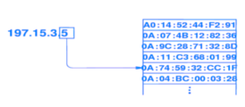

> There need not be malice, incompetence alone is enough.

# 1. Overview

## 1.1 Information Security Objectives (Definitions):

- **Confidentiality**
    - Assurance that (read) access to an information is allowed only to authorized users.
- **Integrity**
    - Assurance that an information resource has not been tampered with by non-authorized users.
- **Availability**
    - Assurance (within reason) that an information resource is accessible when needed.
- **Authentication**
    - Assurance that an entity is the one it claims to be.
- **Access Control**
    - Assurance that there exist precise mechanisms that allow granting and revoking access to information or ability to perform actions.
- **Authorization**
    - The act of conveying rights for access to particular information resources or to take particular actions.
- **Signature**
    - A means to bind information to an entity.
- **Non-Repudiation**
    - Assurance that a commitment or action cannot be subsequently denied.
- **Receipt**
    - Acknowledgment that information has been received.
- **Confirmation**
    - Acknowledgment that services has been provided.
- **Some threats**
    - spoofing, fabrication (to Authentication)
    - eavesdropping, interception (to Confidentiality)
    - modification, replays (to Integrity)
    - fraud (to Non-Repudiation)
    - denial of service (DoS) (to Availability)
    - unauthorized use (to Access Control)

## 1.2 Classification of Attacks in Networked Systems:

- **Passive attacks**
    - An attacker cannot change the data, but can intercept it and use it to
    determine the content, either exactly or to draw inferences about the
    content, e.g. via traffic analysis.
- **Active attacks**
    - An attacker can impersonate at least one element of the system (e.g., a
    communication endpoint), or can replay previous messages, or can
    modify messages, or can actively generate messages that will interfere
    with, delay, etc. other (legitimate) messages [denial of service]. In
    general, these are attacks where the attacker can alter any particular
    aspect of the communication.

## 1.3 Design Principles:

- **Least Privilege**
    - Provide just the privileges necessary for the task.
- **Fail-Safe Defaults**
    - Deny access unless specifically allowed.
- **Economy of Mechanism**
    - Make security mechanisms as simple as possible.
- **Complete Mediation**
    - Every access should be checked if allowed.
- **Open Design**
    - Assume that the security mechanism is known to all.
- **Separation of Privilege**
    - Do not grant access based on only one condition.
- **Least Common Mechanism**
    - Do not share mechanisms used to access resources.
- **Psychological Acceptability**
    - Make secure access acceptably complex.
    

## 1.4 The Voice of Experience

- **Some Truisms:**
    - There is no such thing as absolute security.
    - Security is always a question of economics.
    - Defenses should be of the same “height.”
    - Attackers go around security, not through it.
    - Programming is hard.
    - Security should be included in the original design.
    - If you don't run a program, it's not a danger.
    - A chain is only as strong as its weakest link.
    - Do not underestimate the value of your assets.

## 1.5 “Tools” of Information Security

- Secret (private / symmetric) key cryptography
- Public key (asymmetric) crypto., certificates
- Cryptographic hashes, message digests
- (Pseudo-)random number generators
- Tamper-proof/resistant hardware
- Some of the most potent attacks are those against the tools. Usually many of the security objectives in a system rely on the same set of tools, hence compromising the tools could
result in violation of any number of the intended security objectives.

# 2. Cryptography

- Uses:
    - Transmission over insecure channel
    - Storage on insecure medium
    - Authentication (Challenge-Response)
    - Integrity Check - for Secret Key
    - Digital Signatures - for Public Key

## 2.2 Symmetric Cryptography (Secret Key)

- E → encryption function, with parameters (m=message, k=key) and output c=cipher

### 2.2.1 Block Padding

- Since message *m* is of fixed size, and our output is of 64 bit size (for this example), we utilize padding in the last block to fill the remaining space. This padding is typically the number of padding bits repeated (the 4 last bits are padding in the above example).
- During decryption, in the last block the final bit is read to figure out how much padding there is.
- In the edge case, where message *m* fits exactly in 64 bit blocks, we include one more entire block of padding to avoid treating actual message as padding.

### 2.2.2 ECB & Duplicate Ciphers

- In the above ECB method, each block is encrypted independently using our encryption function.
- Since the encryption function is deterministic, blocks of similar plain-text will be encrypted into the same cipher-text. Leading to a vulnerability that can be exploited.

### 2.2.3 Initialization Vector

- A better strategy than ECB, would be to make each encryption of a message block dependent on the encryption of the previous block.
    
    
    
- But, this does not handle the edge case in which to different chains start with the same blocks (in other words, same sets of message blocks).
- Instead, we can utilize a preset Initialization Vector (IV) of 64 bits (in our example) that is used to start off the dependency chain. This known as Cipher Block Chaining (CBC)
    
    
    
    This IV is communicated between A and B in the public
    
    
    
- As such, even if we send the same exact message, by using different IVs we generate different cipher-texts.

## 2.3 Hash Functions

- A (non-injective) function H(m) from a message m (of arbitrary length) to a fixed length value (the hash) such that
    - It is easy to compute H(m) for any m.
    - Pre-image resistance: Given a hash value x, we cannot determine an m such that H(m)=x significantly easier than exhaustively trying all possible values of m.
    - Strong collision resistance: it is computationally infeasible to find an m1 and an m2 such that H(m1)=H(m2).
    - Weak collision resistance: (2nd pre-image resistance): given m, it is computationally infeasible to find m' such that H(m)=H(m').
    
- One-Way-Hash-Function (OWFH): A hash function that is completely pre-image resistant.
- Collision-Resistant-Hash-Function (CRHF): A hash function that is completely collision resistant.

### 2.3.1 Integrity & Keyed Hash Functions

- Uses
    1. Password Hashing
    2. Message Integrity/Footprint
    3. Downline/bootstrap Loading
    4. Signature Efficiency
    5. Proof of Work
- By utilizing a shared secret key, Alice and Bob can use a keyed hash function such an eavesdropping Eve cannot tamper with *m* while producing the same hashed value as they do not have access to the secret key *k*.
- Modern OS utilize Salt (a generated prefix for hashed value similar to Initialization Vector) to create more dynamic hashed values.
- **Authentication (Challenge-Response):** communication between A and B can start with a challenge that demands a response using keyed has function. This challenge authenticates one-way.

## 2.4 Asymmetric Cryptography (Public Key)

- A (private, public) key pair is generated by each user/entity. The public key is openly advertised, while the private part remains secret.
- The transformation performed by using one of the keys can only be inverted by using a transformation using the other key.

---

# 3. Host Security: Authentication

## 3.1 The Limitations of Passwords

- Use by humans means:
    - Limited in length and poorly chosen.
- Usual password cracking approach:
    - Use dictionaries (in many languages).
    - Use versions of proper words (e.g. leetspeak).
    - Use user context (work, family, etc.) words.
    - Word-like constructs (pronounceable random words).

## 3.2 On-line vs. Off-line Password Cracking

### 3.2.1 On-line (interactive)

- Systems subjected to attacks can at least log attempts.
- Possibly deny access after a number of failed attempts.
    - There is a catch: DoS
- Slow down attempts (not noticeable to normal users).
    - Slowed down (on purpose) crypto implementations.
    - CAPTCHAs (but requires proper UI).
    - Delayed rejection of invalid username until password is entered as well (do not tell which is wrong).
    - Moreover, one should be unable to infer anything from the timing between username and password prompt.

### 3.2.2 Off-line

- There is no limit on how many resources can be allocated to crack passwords off-line. [But one has to obtain the password hashes via another vulnerability.]
- Not restricted to using slow implementations of the cryptographic primitives.
- It is possible to also exploit some weaknesses of the underlying cryptographic algorithm. [We need cryptography because the password should not be stored in plaintext.]

## 3.3 Standard Saved-Hash Password Verification

- The system stores for each user u, $c_u =H(p_u)$, where $p_u$ is the user password. Essentially a giant lookup table and as such is grossly inadequate due to space limitation.
- A user claiming to be u enters a password, x.
- The host applies *H* on x and checks if $c_u == H(x)$
- Basic idea:
    - Preimage resistance ensures that someone gaining access to the database of hashes cannot find the (a!) corresponing password.

## 3.4 Salt

### 3.4.1 Refinement: Salt

- A dictionary-based attack computes in advance the mapping from A to H(A) for a large dictionary of “words” and stores the mappings on a table. Then, “reversing” H(A) to A would have been a simple table lookup.
- Solution: add “salt” i.e., introduce a short random string to influence the H(A) calculation. This random string is called the “salt”.
    - Important: each user's salt is different
    - Denote the new function as $c_u = H_{su}(p_u)$
- Salt's Properties
    - Chosen (pseudo-)randomly.
    - Salt chosen by users on different hosts, will map to different stored hashes.
    - For salt size $|s|$ there are $2^{|s|}$ hashes for a given message.
    - By adding salt, our hash $c_u$ becomes dependent on both $s_u$ and $p_u$
- Adding Salt are done through two way:
    1. Provide to the hash function the $p_u||s_u$ from the combinations of $s_u$ and $p_u$ in a specific way e.g. concatenate, interleave, etc.
    2. Use $s_u$ to "tweak" the internal workings of the hash algorithm. Used by classic DES-based Unix Password Hashes.
- By retaining the salt for the same user, if we store their old hashed passwords, if they enter a password and using our salted hash function produces an old stored hash, we can safely say the user entered an expired password.

### 3.4.2 Randomness & Random Password

- Example: a truly random 64 bit integer:
    - Translates to about 20 decimal digits, or
    - 11 characters from [a-z,A-Z,0-9]+punctuation, or 16 characters for pronounceable password.
    - All are difficult for a human to remember. (Usability.)
- Crucially dependent on (Pseudo)RNG
    - Poorly designed PRNGs quickly cycle.
    - In 1979 a random password generator for producing 8 character long lower case alpha + numeric values was producing only $2^{15}$ distinct outputs.
    - Good PRNGs are notoriously hard to design. PRNGs eventually repeat their “random” sequence.
- Testing for Randomness of a Binary Sequence
    - Probability of 1s and 0s
    - Distribution of runs of contiguous 1s and 0s
    - Auto-correlation across an infinite range of lags (effect of one bit on future bits)
- Random generators can be used to encrypt plaintext by utilizing XOR operation

- Random one time passwords can be useful in the instance of unsecured channel communication. We utilize a random key generated using a source of entropy (mouse movement, PC fan rotation, etc).
    
    
    

### 3.4.3 Lamport Hash (One-Time Passwords)

- Setup: the user pre-computes a sequence of hashes, from an initial value, p, as follows:
    - $h_1=H(p), h_2=H(h_1), h_3=H(h_2), ..., h_k=H(h_{k-1})$
    - The user has now access to a "list" of the produced $h_i$
        - It can be seen in “reverse” order, as “tuples” e.g. $(2, h_{1})$
    - The user stores at the server $h=h_k$ and $j=k-1$
- On login attempt the server asks for j-th hash.
    - The user enters $h_j$
    - The server checks and if $H(h_j)$ equals the stored hash, it accepts the user; the server decrements and sets $h=h_j$
        
        
        
- Salted
    - Only difference is as the hash chain becomes $h_0 = H(salt, p); h_1=H(h_0), h_2=H(h_1), h_3=H(h_2), ..., h_k=H(h_{k-1})$
    - By using these seeded (salted) hash, we can consistently generate the same sequence.
- Major failures
    - Easily exhaustible, only k-times of logins.
    - Losing the sequence of hashes.

## 3.5 Digressions

- Why PRNGs are a bad idea?
    - The linear congruential PRNG and its problems
- Making hash functions out of block ciphers
    - The early-era Unix passwords
- The question of an initial password
    - Strategies for off-the-shelf devices
- Programming a new authentication process
    - Some standard pitfalls
- Programming effort to include new authentication
    - The example of PAMs

### 3.5.1 Problem with Pseudo-RNGs

- Linear Congruential Generator:
    
    
    
- Usual workings of a linear congruential PRNG:
    
    
    
    - An “internal” state S is maintained.
    - S is changed in each invocation of the PRNG.
    - The output U is a function of the state S.
    - The initial S is derived from the “seed” of the PRNG.
    - By resetting S to the initial “seeded” value one can restart the PRNG, i.e., it can repeat the same sequence of (“random”) numbers.
    - In summary: (init: S = g(seed); it could be S=seed; !)

### 3.5.2 Fossils: DES-based Unix Password Hash

- Implemented a “poor man's” hash function by using a symmetric block cipher algorithm (here, DES) to perform the task of a hash function:
    - Suppose encryption $c=E_A(p)$ where A is the key and p is some plaintext.
    - There also exists a corresponding decryption $p=D_A(c)$
    - To convert it to a hash function: use a known p (could be NULL) & use the password as the key. So we are essentially defining a hash function $H(A) = E_{pu}(NULL)$. For user, u, we store $c_u= E_{pu}(NULL)$ instead of p.
    - Authenticating a user claiming to be u providing a password x is answering: $D_x(C_u) == NULL$
- The keys in DES are 8 characters long but only 7 of the 8 bits are used from each byte, hence 56 bits long. Longer passwords were truncated to fit the DES key length requirement.
- A two byte (but only 6 bits of each used) salt is used to perturb the DES stages.
- After 25 repetitions of the DES stage, we get 64 bits + 12 (salt) bits = 76 bits → 13 characters

### 3.5.3 Lessons Unlearned

- “ad hoc” web application authentication schemes tend to repeat the mistakes of the past:
    - Separate messages for identification (username) failure and authentication (password) failure.
    - Allow dubious approaches to authentication.
        - Allow users to create accounts without intervention. The assumption is that user accounts are casual and hence not valuable. However, a new user account allows access to more software functionality, and more possibly exploitable weaknesses.
        - Philosophical question: What good is the enforcement of strong password selection when literally anyone can obtain an account just for the asking?
- Initial trivial passwords are a fact of life for almost all commodity networking and consumer grade equipment:
    - Best practice: unique per-unit default password.
- “Physical Security is the Only/Best Security”
    - (Implicit) authentication based on the fact that there is only one way (path, port, cable, etc.) from which the user could possibly communicate, imposed by the physical design of the system.
    - Today, claims of physical security (unless you see it with your own eyes) should be approached with a grain of salt. You do not know what is happening “at the other end of the wire.”

### 3.5.4 Reducing Programming Effort

- Authentication is needed by many applications.
- Developers that are not experts in security usually re-invent the wheel, unaware of what are the best practices.
- The challenge is to write “libraries” that are usable by any program where authentication services are needed, reducing the burden on application programmers.

### 3.5.5 Limited Success: PAMs (Pluggable Authentication Modules)

- An architecture integrating various authentication schemes under a uniform API.
- Applications do not directly invoke specific authentication mechanisms, they just indicate that require authentication.
- Multiple authentication techniques can be combined/composed (“stackability”).
- PAMs are loaded on-demand, meaning that they require the underlying OS to support dynamically loaded libraries.

## 3.6 Merkle Trees & Blockhain

- Merkle Tree: a tree of hashes that are used to describe blocks of a message/file, which are all combine into a root hash
    
    
    
- Blockhain in essence utilizes MTs where the message is the transaction.
- Proof of Work: force worker to find *m* to satisfy specified pattern by utilizing long 256 bit hash value.
    
    
    
    
    
- To make this more difficult, a random bit string can be utilized to make it furthermore difficult to find *m*.
- Essentially blockchain relies on pre-image resistance of the hash function.

---

# 4. Networked Environments

- Until now we have assumed that users trust the links connecting them with hosts.
- Today, authentication protocols are executed over a network. As such there are plenty of opportunities for attacks at various points of the protocol stack.
    
    
    
- The lower in the protocol stack the attack, the potentially more powerful its impact.
    
    
    
- TCP/IP Protocol Suite
    
    
    

## 4.1 "Identity" MAC Addresses

- Conventions:
    - Hyphenated Hex Convention: aa-bb-cc-dd-ee-ff.
    - Locally Unique Addresses (administrator).
    - Globally Unique Addresses (manufacturer).
    - Multicast Addresses
        - Destination is all hosts within particular set (group). The host controls which groups it's interested to be listening to.
    - Broadcast Address (All 1s: ff-ff-ff-ff-ff-ff)
    - Multiple Interfaces → Multiple Addresses

### 4.1.1 Typical Link Layer Vulnerabilities

- On a network that is by nature broadcast (anybody can receive the signals emitted) eavesdropping is trivial.
- The identity of nodes that transmit cannot be tied to their MAC addresses. MAC addresses can be changed, allowing spoofing (impersonation) attacks.
- Ease of access the the common broadcast medium allows anyone with proper interface cards to transmit. Thus injecting messages, replaying them etc. including DDoS attacks.

## 4.2 Routing & Bridges

- Routing: since each bridge is unaware of other bridges, once it receives a frame, it is obligated to dispatch it forward. This allows for straightforward method for DDoS attack.
    
    
    
- Backward Learning Bridges: to learn where MAC addresses and generate a lookup table, once a message is delivered to a segment (port), it's location is sent backwards to preceding bridges.
    - Two problems
        1. Still liable to simple DDoS attack using bogus entries
        2. Can be forced to forget its table, remaining with only the bogus & attacker addresses. 
    
    
    

### 4.2.1 Attacks Against Bridges

- Attack Strategy
    - The objective of the attack is to force the bridge to broadcast traffic instead of sending it to a single segment. Force it to “forget” its table by flooding it with bogus entries.
    - The attacker introduces bogus entries (at a high rate) into the forwarding table by sending out frames from spoofed MAC addresses.
    - The table eviction policy will eventually drop entries to make space for the new ones.
    - Some of the evicted entries are of legitimate nodes. The bridge will be forced to broadcast traffic heading to them (due to lacking a corresponding forwarding entry).
- Bridging does not scale well to large networks.
    - Large forwarding tables
    - Lots of updates
- IP introduces routing as a separate, but complementary to, technique to bridging. Thus IP is used for interconnecting LANs.
- The usual approach: route in large networks, and bridge in small LANs.

### 4.2.2 Addresses for Routing

- The bit representation of an address must be short but also long enough to accommodate the
expected maximum number of hosts.
- In hierarchical addressing (e.g. IPv4) the prefix identifies the network (network id) and the suffix identifies the host (host id).
    - Short network id field: means a small number of networks can be supported.  but each network can have many hosts.
    - Long prefix:  the opposite problem, many networks, but few hosts per network.
    - Today the prefix is indicated by a variable length “netmask.” (delineates network from host part)
    - An all 1s host address is a broadcast address

### 4.2.3 IP Addresses

- IP Routing:
    - Host
        - Check if the destination address, D, is for a host belonging to any subnet to which the host is directly attached.
        - If yes, determine the hosts MAC address; encapsulate the packet in the MAC frame; send
        - If not, determine which gateway (router) the packet should be forwarded to.
    - Router
        - Check whether the destination address, D, belongs in the range of addresses of any of the subnets we know how to route to.
        - If it belongs to two or more subnets route to the link that connects to the subnet that corresponds to the longest prefix match to D.
- IP routing is completely disinterested in the sender, and only checks for the destination with disregard for source.
- Address Resolution: The IP address scheme comes with its own implications. How do the IP addresses map to the MAC addresses?
    - Who/what decides this mapping?
    - Is the mapping fixed or dynamic?
    - Can this mapping be automated?
    - Do these mappings have lifetimes?
    - Can the mapping be used even if you move?
- Assume two hosts on the same Ethernet LAN wish to communicate with each other. Even if they know their corresponding IP addresses, they must also know their Ethernet addresses. (Anything they send to each other has to be encapsulated in Ethernet frames in order to be transmitted on the shared medium.)
    
    
    

## 4.3 Address Resolution Protocol (ARP)

- We need a “binding” between MAC and IP address.
- Broadcast a special control frame, ARP Request. (“Who has X.Y.Z.W as its IP address?”). Only the host configured to “own” the IP address “X.Y.Z.W” is supposed to send an ARP Reply message.
- The requesting node can now associate the “X.Y.Z.W” with the proper MAC address.
    
    
    
    Orange → ARP request/check
    
    Purple → ARP reply
    
    Yellow → IP message transmitted through retrieved IP
    

### 4.3.1 ARP Features

- The request is sent to a broadcast address. A host is obliged to listen to all the requests even if it cannot answer them.
- Any host receiving the request can cache the requester's MAC to IP address mapping to its own cache.
- The host with the IP address being inquired about will respond with ARP reply using a unicast frame, meaning that request is completely unidirectional as source → requester.
- ARP messages are unreliable and in addition they are an open security liability (any host on the same medium can respond to the request even if it is not the legitimate owner of the IP address being inquired about).

### 5.3.2 Implementing ARP

- If the network is small enough (a dozen or so hosts), then even
sequential search of a table could be acceptable.
- In larger networks a hash table can be built to map IP to a hash bucket
where the hardware address is stored.
    
    
    
- The structure of the IP addresses is sometimes exploited: all hosts in a
network share the same prefix. Hence, use the suffix to index a table.

### 4.3.3 Proxy ARP

- The host replying to the ARP may be a different host from the one actually owning the IP address for which the ARP Request was issued.
- Why allow it?
    - Routers routinely use Proxy ARP to convince nodes in the shared network that a host is present in a LAN of a large network, while in reality forwarding the traffic to a remote
    location where the host is really located.
    - Helpful in some corporate LANs where one subnet is split physically across two or more locations e.g. Using 1 shared licensed subnet across multiple locations

### 4.3.4 Gratuitous ARP

- Gratuitous ARP: an ARP request sent by a host where the address being inquired about is its own
- Other hosts treat this as a legitimate request, the hosts observe the binding of the sender's Ethernet address and the sender's IP address. This is what the sender wanted to accomplish, essentially to self-advertise. On this new binding, hosts are obliged to update their ARP cache entry
- Why allow it?
    - A host, say B, can, upon detecting the absence of another host, say A, (e.g. a failed server) send a “Gratuitous ARP” that presents B’s MAC address as the legitimate MAC associated with A’s IP. All the traffic intended for A will be intercepted by B. Conceivably B is a standby backup for A.

## 4.4 DHCP (BOOTP)

- DHCP provides a means to obtain an IP address upon boot, as well as additional info, e.g.,default gateway, DNS servers etc.
- Queries are unauthenticated and responses can be subjected to MitM attacks as well as DoS attacks, by setting up a bogus DHCP server.
- DHCP is a “weak spot,” and many networks will provide a DHCP response, but subsequently require authentication for any further access.

## 4.5 The Internet “Control” Protocol: ICMP

- A misnomer, it does not “control” much at all. But it is a powerful error reporting tool.
- It reports:
    - Reachability of host/network/protocol.
    - Fragmentation requirements (packets too large).
    - Redirection (faulty route).
    - Errors pertaining to IP packets (e.g. header errors).
    - “Echo”
    - “Timestamp”

### 4.5.1 ICMP Redirects

- Under normal circumstances ICMP redirects are sent to hosts that have forwarded a packet to the “wrong” router. These redirects are meant to be honored by hosts.
- Injecting bogus ICMP Redirects forces a host to send traffic via the gateway indicated in the Redirect. Thus allow the facilitation Man-in-the-Middle (MitM) attacks.

### 4.5.2 ICMP & Remote Broadcasts

- Smurf attack (for ICMP echo) or fraggle attack (for UDP echo):
    - Suppose we send a large amount of ICMP echo pings to an IP broadcast addresses, while spoofing the source address to be that of a victim.
    - If the router implements the IP broadcast as a layer 2 (Ethernet) broadcast, all hosts in the subnet 192.5.48.0/24 will receive the ICMP echo request and all reply, sending traffic to the victim.

## 4.6 Transfer Layer Protocol: TCP

- A TCP “connection” is defined by the 4-tuple: <localhost, localport, remotehost, remoteport>
- A server “listens” to localport, i.e., a server waits on <localhost, localport, *, *> until a remote client sends a TCP SYN.
- In essence, TCP adds a guarantee of ordered delivery to the IP layer.
- On the beginning of a TCP connection, a random start offset - where incoming data sequence will start from - is picked to avoid confusion between fresh data & old data that is still in the network.

### 4.6.1 TCP Attacks

- **TCP SYN floods**: Send SYN but do not follow up with the rest of the handshake. A DoS attack.
- Send SYN to probe whether a service is available. (Then use a service-specific attack.)
- **ISN Guessing:** The Initial Sequence Number (ISN) is predictable in certain cases, allowing a host that impersonates another to send traffic to a target host (without necessarily getting traffic back from the target) exploiting other weaknesses through the traffic it gets to send.
    - Attack
        
        
        
        
        
        
        
        
        
    - A “truly random” ISN solves the problem.
- TCP's is of Full Duplex
    
    
    

### 4.6.2 SYN Cookies

- A practical solution to SYN Flooding and ISN Guessing.
- The cookie is generated by (simple view)                                                                           $SSEQ = EKs(IP_{server}
,PORT_{server}
,IP_{client},PORT_{client},timestamp)$
    
    (Ks is a key known only to the server)
    
- The handshake response of the (legitimate) client includes SSEQ+1, hence the server can trivially check if this value is consistent with the SSEQ computer by the server.
- The SYN Cookie is used to save resources since the server is not required to save state and instead uses the sequence based SYN Cookie.
    
    
    
- Server must handle:
    - Generating random looking cookies
    - Ensuring integrity of cookies
    - Ensuring freshness of cookies (thus avoiding replay attacks)

## 4.7 Domain Name System (DNS)

- DNS is a distributed database that maps human-readable hostnames to IP addresses. Responses are cached for efficiency.
- Hierarchical arrangement of (sub)domains, and likewise hierarchical nameserver arrangement.
    
    
    

### 4.7.1 DNS Vulnerabilities

- **DNS cache poisoning:**  the attacker provides mapping information before the queried name server does.
    - The attack involves prediction of PRNG (again!) values, i.e., predicting the sent “nonce” and preparation of many response messages (one being successful is enough).
- The lifetime record of an entry might have long-term effects (faulty resolutions can remain alive for a long period of time after implanted).
- Homographs are easy to miss for human users (0 for an O, or S for 5), a technique exploited mainly by phishing.
- Attempts for authentication of DNS responses have started relatively recently. Scalability is an issue.
- Attacks are more potent when the attackers have taken control of a name server.

## 4.8 Higher Layer Protocols: File Transfer Protocols

- Trivial File Transfer Protocol (TFTP)
    - No authentication whatsoever. Still used for acquiring boot images for
    diskless devices.
- File Transfer Protocol (FTP)
    - FTP specs call for passwords to be sent in the clear!
    - Separation of data and control connections.
        - Data connection port indicated either via PORT command sent from client to
        server or requested by the PASV command to the server (the server complies).
        - PORT command requires the firewall's attention and the addition of an inbound
        rule exception (for the duration of the transfer). Thus, a compromised applet
        can indirectly trigger the firewall to open a hole for attack to another port/host!
    - Anonymous FTP (privileges issues, incoming files)

---

# 5. Authentication Protocols

- Objectives of Authentication Protocols:
    - Mutual authentication (if required)
    - Immunity to replay and other attacks
    - Minimization of exchanged messages
    - (Desirable side effect) establish “session key”

## 5.1 Challenge-Response Scheme (w/ Symmetric Crypto)

- Challenge-Response Authentication:
    - B sends (random/unpredictable) challenge R and A has to reply $E_{Kab(R)}$ to demonstrate it possesses key *Kab*, the shared secret.
        
        
        
- Weaknesses:
    - Authentication is not mutual (anybody can send an R pretending they are B, and ignore the $E_{Kab(R)}$.
    - If the subsequent communication is not protected (e.g., encrypted) the subsequent message exchanges are vulnerable.
    - An eavesdropper can record R and $E_{Kab(R)}$ for an off-line attack and/or gradually collect a large number of R and $E_{Kab(R)}$ associations.
        - Particularly true if *Kab* is derived from a password.
    - If B's database of keys (and assuming they are derived from passwords) is released then whoever got the keys might be able to impersonate A (impersonating B is already a given, right?)
- Variations:
    - **Inverse:** send $E_{Kab(R)}$ and expect R in the response.
        - one could enforce structure on R, to “convince” Alice (once decrypted) that R that this is a legitimate request – but that can also facilitate dictionary attacks if *Kab* derived from password
    - **Lifetime:** use R with limited lifetime, e.g., timestamp
        - can reduce authentication to one message (!)
        - limited window of opportunity for replay attacks
    

### 5.1.1 Mutual Authentication

- Allows for both users to authenticate with respect to each other.
- The order of authentication is now reversed, Bob in 2nd message authenticates first to Alice as he is able to produce $E_k\{R2\}$. This order of authentication in the condensed version (3 messages) allows for reflection attack to occur.
- **Reflection Attack:**
    - Literally a "no you", Uno reverse, attack. Trudy just starts a new connection with Bob and responds with the challenge-response R1 it got back from Bob.
        
        
        
    - This is possible due to the statelessness of Bob, as Bob does not keep track of its connections cross-processes.
    - Solution:
        - A simple padding to the challenge-response messages that differ depending on whether the message originated from a client or a server i.e server ⇒ len(message) is even, client ⇒ len(message) is odd.
        - Asymmetric messages are less prone to attacks than symmetric messages.

### 5.1.2 Timestamp-Based Mutual Authentication

- Two issues:
    - Globally synchronized clocks are (impossible?) difficult to achieve.
    - Encrypted responses from Alice & Bob should not be allowed to be equal (exact same timestamp). As that would allow for anyone to just respond to Alice with her own encrypted message and fake being Bob.
- Solution:
    - Bob uses incremented timestamp from Alice's timestamp.

### 5.1.3 Public Key Crypto Challenge-Response

- If R is unstructured, one can trick Alice into signing anything, or (in an inverse attack) possibly decrypting something that was encrypted with A's public key (which the attacker had copied from an earlier communication).

### 5.1.4 One-Way Public Key Authentication

- Notation:
    - Encrypt with K's public key: $\{ \}_K$
    - Sign with K's private key: $[ ]_K$
- Recall that p = $[\{p\}_K]_K$ (or equivalently p = $\{[p]_K\}_K$)

## 5.2 Session Keys (in Symmetric Crypto)

- Generate subsequent keys for authenticated sessions.
- For limited duration (until session terminates).
- We could use the initial shared key K all the times.
- Suppose authentication already took place, then
    - Cannot use $E_K\{R\}$ as session key. Could potentially use $E_{K+1}\{R\}$
    - What about $E_K\{R+1\}$?
        - Vulnerable to impersonation attacks (server-side impersonation)
            
            
            
        - Similar to reflection attack, the impersonator simply sends a challenge-response using the known response (R+1), to force the client to "spill the beans" on the actual encryption.
- **Better scheme:**
    - Both sides contribute to the session key “material”
    - Avoids replay
    - Good PRNG

### 5.2.1 One-Way Public Key Authenticated Session

- Objective: convince client it's talking to the legitimate server.
- Applies to cases, e.g., SSL, where the clients are “unknown” (can be anybody) but the server is “well known” (distinct and known to the clients).
- Client:
    - Generate R and send ${R}_{Bob}$
- Server:
    - Decrypt message and use R as session key
    - Subsequently, use symmetric cryptography (cheaper) with the client

## 5.3 Keys and Third Party Authentication

- Need for $n(n-1)/2$ keys for *n* participants
- A possible solution: introduce a third party that stores one secret key with each participant (say secret key for participant A), for a total of n keys.
- Here's one scenario (for A to communicate with B):
    - A sends a request to the intermediary.
    - The intermediary verifies A's identity and generates a unique session key (Kab) that is sent to A & B securely.
    - A & B communicate using the session key.
- The intermediary:
    - Must be always on-line
    - Is a single point of failure
    - Highly sensitive system.

### 5.3.1 KDC Intermediary

- Some notes:
    - Notice that anybody impersonating Alice can send the first message that kick starts the protocol. But the result of starting it is useless to the attacker.
    - The client (or anybody else for that matter) cannot tamper with the Ticket because it is encrypted with a key, Kb, known only to KDC and the server.
    - The server (“Bob”) is convinced because it can check the decryptedvalue of the ticket to check that the ID is of the one with which it communicates (“Alice”).
    - Problem: what happens if the client's key is compromised? Even if the key is changed, a previous ticket can still be “alive” and accepted by the server.

### 5.3.2 Needham-Schroeder Scheme

- Also referred to as Ticket system, where A gets ticket from KDC to start authenticated session with B
- Original:
    - The last 3 messages are essentially the typical challenge response.
    - Main difference is the use of the intermediary for Alice to get *Kb* to start the challenge response.
    - **Issue:** Bob does not know how long ago Alice got hold of *Kb* thus she could have been compromised in the meanwhile.
    
    
    
- Extended:
    
    
    

### 5.3.3 Otway-Rees Scheme

- Otway-Rees unlike requires that both Alice's and Bob's connection are alive and active, as it authenticates Alice and Bob to the KDC and then authenticates Alice to Bob at the last step.

## 5.4 Kerberos

### 5.4.1 The Architecture of Kerberos

- Kerberos: an application of the Needham-Schroeder Scheme, albeit in a somewhat more tightly coupled fashion. For example, it is assumes
    - All nodes are synchronized (within reason)
    - Any credentials have limited lifetime.
- Credentials: the session key shared between A and B, and the ticket (used to access B's service).
- Users and services are called *principals*.
- The trusted intermediary, KDC, is seen as two logically separated entities:
    - Authentication Server (AS)
    - Ticket Granting Server (TGS).
- Basic Kerberos Authentication
    
    
    
- **Problems:**
    - Ka is derived from the the user's password. (Of course it will have to be also known to the KDC.)
    - A good compromise: upon successful authentication the user is in possession of a (limited lifetime) session key, Sa, and a “special” ticket (a Ticket Granting Ticket (TGT)) that can be used to demonstrate it has successfully authenticated with the KDC. Sa & TGT are stored at the workstation.

### 5.4.2 Ticket Granting

- **Why Ticket Granting Tickets?**
    - Shown as $E_{kkdc}\{“Alice”,S_A\}$ it is a ticket providing the (temporary) “right” to have tickets to access servers/services issued by the KDC.
    - The KDC does not retain any session state information, i.e., the Sa. The KDC can be replicated. Failure recovery is also easier.
    - TGT is a self-contained description of Alice's identity and of the session key, Sa, used to communicate with Alice.
    - Tickets includes expiration information.

### 5.4.3 Replicated KDC

- KDC is a single point of failure and a potential bottleneck. It becomes necessary to replicate a KDC.
- **Issues with replication:**
    - All replicated KDCs share the same master Kkdc.
    - All copies synchronized to a master copy KDC.
    - All updates are made to the master KDC.
        - Updates: $<principal, name, E{Kkdc}\{principals\ key\}>$
    - Periodic copying of master KDC to all other KDCs.
    - Copying must preserve integrity (confidentiality?).

### 5.4.4 Kerberos Realms

- Large organizations are unlikely to trust all accounts to a single (replicated) KDC, and hence to a single master password. Trust is usually limited and compartmentalized.
- **Solution:**
    - Split into multiple realms.
    - A realm appears as a principal to the other realms.
    - Each realm's (possibly replicated) KDC:
        - Has a different master key
        - Covers a different sets of principals
    - Each principal identified as: <name, instance, realm>
    
- **Inter-Realm Authentication:**
    
    
    
- There is no chaining of realms (i.e., a recursive version of inter-realm authentication) for at least two good reasons
    - **No transitive trust:** realm X trusts realm Y, and Y trusts Z, does not necessarily imply that X trusts Z.
    - Chaining introduces the possibility that a compromised KDC could essentially impersonate every other principal.

### 5.4.5 More Technicalities of Kerberos v4

- Post-authentication data exchange can be:
    - In the clear
    - Privacy & integrity protected (using a DES variation)
    - Integrity protected only (Jueneman's scheme)
        - Uses its own variations of cryptographic techniques.
- Version numbers
    - Change of a key influences existing tickets
    - Add a version number field to each key
    - Until they expire, old keys may need to be kept
    - Except humans are not good with version numbers!
- Disallows delegation (ticket bound to IP address)

## 5.5 Diffie-Hellman Key Agreement

- Allows the establishment of a common key (e.g., a session key) between two parties even though all communication takes place in public, and without relying on any prior shared secret.
- **Process:**
    - Each party chooses a (random) private number and calculates a corresponding public number.
    - Each party uses the other's public number and its own private number to compute the (same) secret.
    - Even if eavesdropping, one cannot reproduce (via a polynomial time computation) the generated secret.

### 5.5.1 DH Algorithm

- The two parties agree to use a (large) prime p and a base
- Conceivably, one could take the first step and ask (publicly) the other to use a particular p and g
- After that, steps:
    1. A generates (random, large) secret Sa & sends to B: $g^{Sa}\ mod\ p$
    2. B generates (random, large) secret Sb & sends to A: $g^{Sb}\ mod\ p$
    3. A raises the received number to the Sa-th power: $(g^{Sb}\ mod\ p\ )^{Sa} = g^{Sa \times Sb}\ mod\ p$
    4. B raises the received number to the Sb-th power: $(g^{Sa}\ mod\ p\ )^{Sb} = g^{Sa \times Sb}\ mod\ p$
- Why it works
    - **Discrete Logarithm Problem:**  there is no polynomial time algorithm that would allow us to determine Sa (or Sb).
    - *p* must be
        - large, so that any remainders are not trivially small. We want $g^{Sa \times Sb}\ mod\ p$ to be long in terms of bits.
        - a safe prime, meaning (p-1)/2 must also be a prime.
        - *g* must be able to generate a large subgroup of the *mod-p* multiplicative group.

### 5.5.2 A Digression: Primitive Roots & Primes

- Primitive Roots
    - Informally, if g is a primitive root “as n goes from 1 to p-1, then $g^n$ mod p 'visits' all the numbers 1 ... (p-1) in some order.”
    - *g* could be a primitive root *mod-p.* This will allow it to define the largest possible subgroup of the multiplicative group mod-p, i.e., the multiplicative group mod-p itself.
- Primes
    - There exists an infinite set of primes. However their density decreases the larger the numbers get.
    - A usual practice is to generate a large random number (with some mild precautions, e.g., that it is an odd number) and then check (algorithmically) if it is a prime.
    - If not, you follow a strategy (e.g., decrease by 2) to generate the next candidate.
    - Technically, we can “run out” of primes representable by up to N bits. Nevertheless, they are a huge set.

### 5.5.3 Authenticated DH Key Agreement

- A shortcoming of DH: allows for a new type of attack in which the attacker controls the communication channel, this is known as the Man-in-the-Middle attack.
    
    
    
- Solutions
    - If you assume pre-shared keys exist
        - Use pre-shared key to encrypt DH exchange,
        - OR after the DH exchange, send hash of agreed upon key & pre-shared secret
    - Alternatively, if you assume existing public keys for each entity, then matters are simpler since each entity
        - Can sign the value it transmits with its private key,
        - OR can encrypt the value it transmits (gy mod p) with the other side's public
        key,

### 5.5.4 Perfect Forward Secrecy (PFS)

- Why generate a new key even if you already have a pre-shared key? PFS!
- PFS is the property that disallows an attacker from decrypting sessions that have been completed (i.e., they happened in the past) even if both parties of the communication are compromised at a later time.
- Example of Non-PFS: A chooses random key S, encrypts it with B's public key and sends it to B, to be used as session key.

### 5.5.5 From DH to Public Keys

- Shortcoming of DH: we end up with a “session” key with the active participation of both parties. Is there a non-interactive version?
- Solution:
    - Each entity advertises $<p,g,T>$ where T = $g^S\ mod\ p$. *S* is a number generated by the entity which will remain secret.
    - To send a message to Bob (Bob is represented by $<p_B,g_B,T_B>$) Alice generates an Sa, and computes:
        - K' = $(g_B)^{Sa}\ mod\ p_B$
        - Kab = $(T_B)^{Sa}\ mod\ p_B$
        - Sends only K' and $E_{Kab}\{plaintext\}$
- We are now very close to the concept of public key cryptography. RSA followed on the footsteps of these ideas.
