# Planetary Surface Dating & Mercury:

### Learning Outcomes:

1. How was the lunar crating record used to date surface of Mercury?
2. Describe Mercury's
    - Orbit
    - Length of day
    - Length of year
3. Compare Mercury with the Moon in regards of
    - Size
    - Density
    - Surface temperature
    - Cratering
    - Volcanic features
4. What makes Mercury's tectonic features unique?
5. Why is Mercury's core so large?
6. Outline Mercury's main geological periods, including approximate age boundaries
7. How is water ice possible on Mercury's surface?

## Planetary Surface Dating

- The number of craters on part of a planetary surface can be used to estimate its age. The **greater the number of craters, the older the age**

## Mercury

- Periods:
    - Period of rotation (length of day) is 59 days
    - Period of revolution (length of year) is 88 days
    - 2:3 ratio; 2 Mercurian years to 3 Mercurian days; called spin-orbit coupling
- Planetary details vs Moon:
    - Diameter ⇒ 4,880km   vs  3,476km
    - Mass ⇒ 0.055 Earth's   vs  0.0123
    - Volume ⇒ 0.06 Earth's vs  0.02
    - Density ⇒ 5.44 g/cm³  vs  3.34 g/cm³
    - Atmosphere ⇒ ~0
    - Surface Gravity ⇒ 0.37 Earth's  vs  0.165
    - Surface Temperature ⇒ **90 - 740K**  vs 100-400K **
- Heavily cratered terrain. with inter-crater plains and smooth plains.
- Large impact basins like **Caloris Basin**

### Cratering on Mercury

- Compared to the Moon
    - Ejecta is discontinuous and not as extensive, thanks to 2.5x gravity
    - Fewer craters smaller than 50km diameter than expected
    - Large basins are more degraded due to (gravity, volcanic, composition of surface)
    - Space weathering is more severe

### Inter-crater Plains

- **Inter-crater plains are the most extensive terrain on Mercury by area**. They look different than the heavily-cratered surfaces of the Moon.
- They level to gently rolling, densely cratered surfaces between craters.
- Densely cratered with many secondary craters ( < 10km), resulting in a highly textured surface
    - Many craters are degraded and partially filled with smooth material
- Most likely formed by combination of volcanism and impact cratering happened concurrently. And/or the surface remained hot/plastic at the time of impact.

### Smooth Plains

- Some areas are smooth, sparsely cratered plains that are similar to lunar maria
- Covers ~1/3 of the surface, and is the youngest major terrain.
    - More concentrated in the North, as well around Caloris Basin
- Features:
    - Flow fronts ⇒ likely volcanic
    - Fewer craters ⇒ younger
    - Some have similar composition to Inter-crater plains

### Volcanic Features

- Pit craters
- Pyroclastic vents and deposits
    - Most common volcanic feature
- Lava flows
    - Including flow fronts and evidence of erosion (channels)

### Hollows

- Many **bright deposits within impact craters are hollows**. Probably a volcanic feature that **has not been seen on any other rocky planetary body**.
- Features:
    - Brighter than surrounding material
    - Irregular, shallow, rimless depressions
    - 10s of meters to km across
- Indicate loss of volatiles
    - From sulphides to graphite?

### Caloris Basin

- Largest known basin on Mercury, and represents a massive collision early in its history
    - Diameter ⇒ 1550km
    - Age ⇒ ~3.7Ga
- Features:
    - Ejecta are lineated
    - Filled by smooth plains that are ridged and fractured in polygonal pattern

### Tectonic Features

- **Mercury has undergone a unique style of tectonic deformation**
- Compressional stresses dominant
- **Scarps:** lobate escarpments; steep, cliff-like slopes
    - Extend over entire surface
    - Began forming near end of heavy bombardment
    - Show that Mercury has contracted by 7km in radius
        
        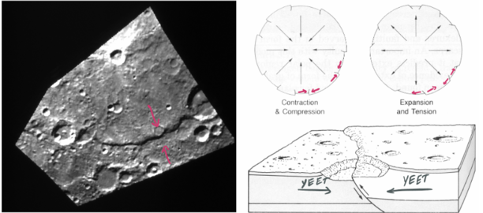
        

### Internal Structure of Mercury

- Observations:
    - Radius and density (5.44 g/cm^3)
    - Magnetic field ⇒ produced by a geodynamo, within a partially molten core
- What it means:
    - Overall composition ⇒ 70% iron, 30% silicates
    - A dense, iron-rich core 3500km in diameter
        - 75% of the radius

### Models for Mercury

- There models for why the core is so large
    1. ✔️Accreted from a mix that included more metal
    2. ❌High temperatures after accretion. 
        - Predicts lower volatiles (K, Na)
    3. ❌Giant impact stripped away crust
        - Predicts lower volatiles and crustal elements (Al, Ca)

### Mercury's composition

- Volatiles
    - K is present at levels like chondrites
    - Na and CI also present
- High in sulphur (up to 4% by weight)
    - Formed by chondrite-like materials
- Crust has high Mg, low Al or Ca
    - Not a lunar-like feldspar-rich crust

### Magnetic Fields

- Active magnetic field generated by Geomagnetic Dynamo unlike Earth's convection.
- Molten outer core

### Geologic History of Mercury

- Mercury’s geologic history involved a combination of impacts and volcanic activity; volcanism may have continued for most of its history
- **Pre-Tolstojan (4.56 to ~3.9Ga) and Tolstojan (~3.9 to 3.7Ga)**
    - Magma ocean:
        - Graphite rich flotation crust
        - Continued growth by emplacement of magma and eruption of lava
    - Heavy bombardment
    - Resurfacing by volcanism or impact ejecta
    - Formation of inter-crater plains
- **Calorian (~3.7 to 1.7Ga) and Mansurian (1.7 to 0.3Ga)**
    - Formation of Caloris Basin, Mansur crater
    - Smooth plains volcanism. Ends by ~3.5Ga
    - Explosive volcanism (pyroclastic flows) throughout this time frame
- **Kuiperian (~280 Ma to *present*)**
    - Formation of Kuiper crater
    - Tectonic deformation (contraction) continued
    - Some explosive volcanism
    - Formation of hollows
        - At least the youngest ones

### Volatiles on Mercury

- The **interiors of craters at the poles are permanently shadowed**
    - Temperature ⇒ -212°C (61 K)
- Radar observations show bright substance
    - Water ice?
    - Comets? or native

---

# Venus

### Learning Outcomes:

1. Compare the Earth and Venus in terms of 
    - Size
    - Density
    - Atmosphere
2. Describe the surface of Venus as seen from landers
3. Explain how the Magellan mission could see beneath the clouds to the surface. And what factors affect how the surface looks using radar
4. Differences between lowlands, uplands and highlands
5. Evidence for Venus having a differentiated interior
6. Main tectonic features on Venus, and do they respresent compression or extension?
7. Main volcanic features on Venus
8. Three main stages of evolution of coronae
9. Describe the effects that the thick atmosphere of Venus has on the geology of the planet
10. Explain greenhouse effect and how it applies to Venus
11. Explain Venus' lack of water
12. Compare impact craters on Venus with those on other planetary bodies
13. The geologic history of Venus, including possible changes in tectonic style
14. Outline evidence for recent volcanism

### Planetary Details vs Earth

- Diameter ⇒ 12,103km  vs 12,756km
- Mass ⇒ 0.815 Earth
- Volume ⇒ 0.88 Earth
- Density ⇒ 5.24 g/cm^3  vs  5.52 g/cm^3
- Atmosphere ⇒ 92 bars CO2  vs 1 bar
- Surface Gravity ⇒ 0.88 Earth
- Surface Temperature ⇒ 650 - 760K  vs 240 - 320K

### Exploration of Venus - Magellan

- **Radar**
    - Long wavelengths, see beneath clouds
- **Synthetic Aperture Radar (SAR)**
    - Large dish, looks to the side
- **Radar altimeter**
    - Smaller, gets detailed topography

### Major Geologic Provinces

- **Lowlands**
    - Below 0km elevation
    - Relatively flat, smooth, probably basaltic
    - *Tectonic:* Ridge belts
    - *Volcanic:* Lava flow fronts, long sinuous rilles
    - "Planitia" (plain) e.g. Atalanta, Lavinia, Sedna Planitia
- **Uplands**
    - 0 to 2km elevation
    - Isolated domes and broad swells
    - *Tectonic:* Fracture belts, troughs, rifts
    - *Volcanic:* Calderas, lava flows, coronae
    - "Regio" (region) e.g. Beta, Atla, Eistla Regio
- **Highlands**
    - >2km elevation
    - Plateaus, similar to Earth's continents
    - *Tectonic:* Mountain chains, tesserae, troughs
    - *Volcanic:* Calderas
    - "Terra" (land) e.g. Ishtar, Aphrodite Terra

### Internal Structure of Venus

- Differentiated internal layer
    - Similar to Earth
    - Density ⇒ 5.24 g/cm^3
    - Indirect evidence ⇒ volcanic and tectonic activity
    - CO2 atmosphere from magmatic degassing
- No measurable magnetic field
- Unknown:
    - How thick are the layers?
    - Is there an asthenosphere

### Tectonic Features

- The surface of Venus is highly deformed, as evidence by extension, compression, doming and depression
- Single plate
- **Extensional Features:**
    - Fracture Belts
        - Narrow (<1km) grabens ( German for grave) with modest extensions
        - Common in lowlands and uplands
    - Domes and Rift Valleys
        - E.g. Beta Regio & Eistla Regio ⇒ domed uplands, 2500km & 3000km across
        - Domes and Plume upwelling
            - Plume ⇒ Convection in mantle not magma bodies
- **Compressional Features:**
    - Ridge Belts
        - 100 to 200km wide, thousands km long, ~1km high
        - Common in lowlands
        - Mantle downwelling
    - Mountain Belts
        - More extensive deformation
        - Up to 6km high
        - Border terrae
        - Mantle downwelling
- **Highland Tesserae**
    - Crisscrossing ridges and grooves
        - Pattern of polygonal blocks
    - 1-2km above surroundings
    - A combination of Extension and Compression
- **Tesserae and Plume Downwelling**
    
    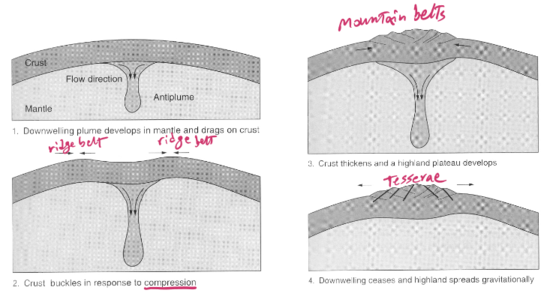
    

### Volcanic Features

- Volcanism dominates on Venus, with up to 80% of surface covered by volcanic deposits and thousands of large and small volcanoes
- Features:
    - **Shield volcanoes**
        - Radial lava flows on flanks
        - Summit calderas
            
            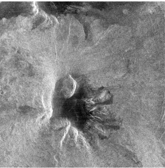
            
    - **Calderas**
        - Created by withdrawal of magma from huge chambers by eruption or drainage
            
            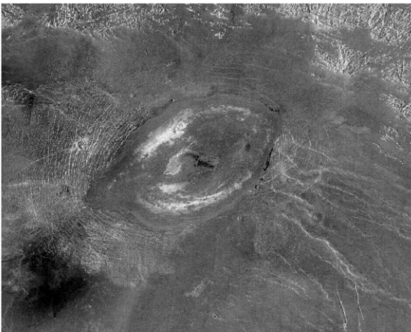
            
        
    - **Pancake domes**
        - Extrusion of viscous lava from central fent
            
            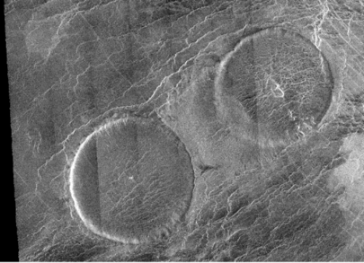
            
    - Lava flows and sinuous lava channels
        - **Flood lavas** ⇒ Extrusion of fluid lava from fissures
            - Major role in resurfacing
        - **Lava channels** ⇒ Carved by basaltic lava flows
    - **Coronae**
        - They are volcanic-tectonic features that are apparently unique to Venus
        - Corona:
            - System of concentric fractures and ridges surrounding a central plain
            - Deformed terrain in a circular area
            - Common in uplands and highlands
                
                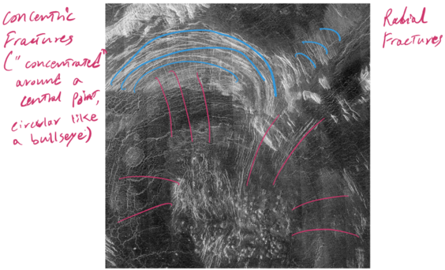
                
        - Stages of evolution:
            - Novae → Arachnoid → Corona
                
                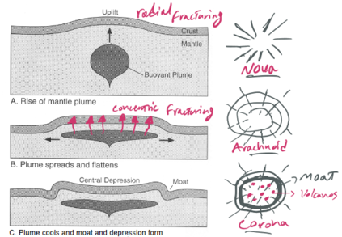
                
    
    ### Atmosphere of Venus
    
    - The thick atmosphere for many features unique to Venus
    - Made of CO2 (96.4%), N2 (3.5%), H2O (0.01%), and droplets of H2SO4
    - Effects:
        - **High surface temperatures (the Greenhouse effect)**
            - Thick atmosphere trap more heat from reflected light
        - **Lack of water**
            - If Venus and Earth started with same amount of H2O, whu does Venus have so much less?
                1. Water vapour outgassed from interior
                    
                    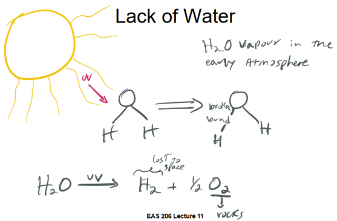
                    
                2. Too hot for liquid water to condense
                3. Water vapour was lost to space
        - **Wind erosion and deposition**
            - The dense atmosphere is able to move materials across the surface
            - Dense atmosphere can transfer kinetic energy to particles more easily than on Earth
        - **Weathering**
            - Evidence for weathering on Venus exists from radar reflective bright and dark zones which correlate with elevation
            - No water, but thick atmosphere
                
                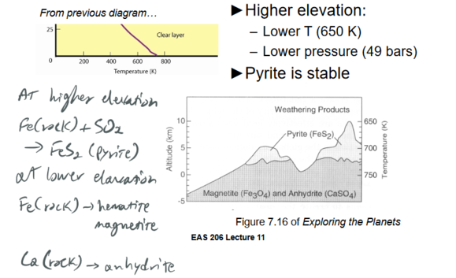
                
    
    ### Impact Craters on Venus
    
    - Impact craters on Venus are not as numerous as craters on other planets and have different characteristics
    - No heavily-cratered terrains like Mercury or the Moon
    - Abouut 1000 craters identified
        - Diameter ⇒ 1.5 - 280km (Meade Crater)
        - Evenly distributed, not very degraded
    - Suggests average age of **0.5Ga** (±0.3)
    - Major differences from the Moon and Mercury:
        - No craters less than 1.5km in diameter
        - Diffuse splotches attest to "near hits"
        - Ejecta deposits
            - Petal-shaped, not as extensive
            - Flow long distances
            - Arc-shaped due to blowing wind
        - Attributable to thick atmosphere

### Geologic History of Venus

- Average surface age of **0.75Ga**
    - Is this resurfacing due catastrophic events or gradual?
- **Catastrophic:**
    - Periodic resurfacing events on a global scale
    - Changes from **recycling (Earth like plate tectonic) to hot-spot volcanism (mantle plume with single plate)**
- **Gradual:**
    - Resurfacing of areas ~150,000km^2 at a time
    - Allows for even distribution of craters
- The transition from recycling to hot-spot volcanism occured within the past ~1Ga and is still in transition today. Triggered by loss of surface/crustal water

### Recent Volcanic Activity

- **Venus Express:**
    - Detected high emissivity regions using an infrared image around volcanoes.
        - High emissivity probably from unweathered basalt
        - Evidence of recent (250,000 year) lava flows?
    - Detected high sulfur dioxide in atmosphere in 2006, followed by a sharp decrease
        - Evidence of active eurption?
- Recent experiments on olivine under Venus atmosphere conditions
    - Altered to hematite within days to months
    - Supports lava flows forming within the past few years

---

# Mars

### Learning Outcomes

1. Compare the Earth and Mars in terms of size, density, atmosphere, and other characteristics
2. Describe the topography of Mars and explain the hemispheric dichotomy
3. List the main geologic processes active on Mars, visible in its overall surface features
4. Describe the interior of Mars, and the nature of its magnetic field
5. Provide an overview of the NASA InSight Mission, including the main objectives and how it plans to achieve them
6. Outline the main periods in Mars’ geologic history, including approximate age boundaries and what happened during each period
7. Explain how minerals detected at the surface of Mars provide insights into global-scale changes that took place over Mars’ history
8. Explain what “L-sub-S” means
9. Describe the current climate of Mars in terms of the surface and air temperature, and the stability of water and carbon dioxide surface
10. Summarize evidence for ground ice on Mars
11. Describe Mars’ hydrologic cycle over the scale of days, years and longer
12. List the eolian features observed on Mars today
13. Define mass movement and describe what mass movement has occurred on Mars on the large and small scale
14. Identify the characteristics of slope streaks and list the two main types of explanations for their formation
15. Explain what the HiRISE, CRISM and SHARAD instruments do (Mars Reconnaissance Orbiter mission)
16. Outline the three main lines of evidence that the SNC meteorites are from Mars
17. Describe the process by which martian meteorites are delivered from Mars to Earth
18. Identify the main age groupings of martian meteorites and explain what geologic process they tell us about
19. Compare the Mars Pathfinder/Sojourner and MER rover missions in terms of their capabilities as “robotic field geologists”
20. List some of the main discoveries made by the Curiosity mission (so far)
21. Explain why martian meteorites are not representative of the majority of the crust of Mars

### Planetary Details

- Diameter ⇒ 6787 km
- Mass ⇒ 0.108
- Volume ⇒ 0.15
- Density ⇒ 3.93 g/cm^3
- Surface Gravity ⇒ 0.38
- Magnetic Field ⇒ <3x10^-5
- Orbit Distance ⇒ 1.52 Earth's
- Period of Revolution ⇒ 687 days
- Period of Rotation ⇒ 24h37m
- Inclination of Axis ⇒ 23.5º
- Satellites ⇒ 2 (Phobos, Deimos)
- Atmosphere ⇒ 0.01 bars, CO2
- Surface Temperature ⇒ 190 - 240K

### The Hemispheric Dichotomy

- Formed early in Mar's history
- Relief along the escarpment = 2 -3 km
- Fundamental problem in Mars geology
- Difference in relief = difference in elevation

### Internal Structure of Mars

- Less dense than Earth, but surface looks less dense.
- Core is made of Iron(Fe) and 14% Sulfur(S)
    - 1700km radius
- Weak magnetic field.
    - Remanent magnetization
    - Geo-dynamo no longer active
- Silicate mantle

### Mars InSight

- InSight = Interior exploration using Seismic Investigations, Geodesy, and Heat Transport
- **Main objectives and goals:**
    - Understand formation and evolution of Mars
        - To understand how rocky planets formed and evolved, InSight will study the interior structure and processes of Mars by determining:
        - The size of the core, what it is made of, and whether it is liquid or solid
        - The thickness and structure of the crust
        - The structure of mantle and what it is made of
        - How warm the interior is and how much heat is still flowing
    - Determine the level tectonic activity on Mars
        - InSight will figure out just how tectonically active Mars is today, and how often meteorites impact it.
        - How powerful and frequent internal seismic activity is on Mars, and where it is located within the structure of the planet
        - How often meteorites impact the surface of Mars
- **Instruments:**
    - Seismic Experiment for Interior Structure
        - Measure the "pulse" of Mars by listening to marsquakes, meteorite impacts, even vibrations from dust storms
    - HP^3, Heat Flow and Physical Properties Probe
        - Takes Mars’ temperature, measures how much heat is still flowing out of the interior
    - RISE, Rotation and Interior Structure Experiment
        - Tracks the wobble of Mars’ North Pole, helps determine the size and nature of Mars' core
    - APSS, Auxiliary Payload Subsystem
        - Package of sensors, provides daily weather data

### Geologic History of Mars

- The martian timescale is divided into epochs (similar to other planetary bodies):
- **Pre-Noachian (4.56 - 4.15Ga):**
    - **Within the first 40Ma**
        - Accretion and differentiation
        - Magma ocean formation
        - Degassing to make primordial atmosphere and hydrosphere
    - Intense impact bombardment
        - Formation of hemispheric dichotomy
        - Formation of large basins (Hellas, Argyre, etc.)
- **Noachian (4.15 to ~3.6 Ga):**
    - Intense impact bomardment continues
    - Northern lowland fills with lava and sediment
    - Early volcanism
        - Flood basalts
        - Patera and other volcanoes
    - Tharsis rise tectonism begins
        - Radial garbens
    - Valley networks
        - Hydrologic cycle?
- **Hesperian (~3.6 to 3.2 Ga):**
    - Time of significant transition
    - Heavy bombardment ceases
    - Magnetic field (geodynamo) shuts down
    - Continued uplift of Tharsis. With associated tectonism and volcanism
    - Valles Marineris forms
    - Elysium volcanoes start to form
    - Catastrophic outflow channels into Chryse Planitia
        - Formation of Northern Ocean?
    - Thinning of atmosphere, cooling
- **Amazonian (~3.2 Ga to present):**
    - Polar icy deposits form and are modified over time
    - Ongoing Elysium and Tharsis volcanism
    - Mass movement
    - Wind erosion and deposition

### Cratering on Mars

- Expected morphology vs size relationship
- Rampart craters are unique to Mars
    - Formed by fluidized ejecta
    - Splashes of mud
    - Sudden melting of ice in regolith

### Early Volcanism

- Patera (“saucer”):
    - A volcano of broad areal extent with little vertical relief
    - Example: Apollinaris Mons
        - Active from Late Noachian to Late Hesperian
        - Built up by both pyroclastic and effusive eruptions

### Dendritic Valley Networks

- Dendritic valleys in the ancient highlands, 4.0 –3.6 Ga, support the idea of an ancient hydrologic cycle
- Origin is debated:
    - Denser atmosphere →rainfall →streams
    - Groundwater seepage (spring)

### Outflow channels

- Long deep channels concentrated along the dichotomy boundary are the result of catastrophic outflow
- Associated chaotic terrain

### Mineralogic History of Mars

- Recent mapping of minerals from orbit suggests that the environment at the surface of Mars has changed over time; coupled with other observations, this indicates global-scale change
    
    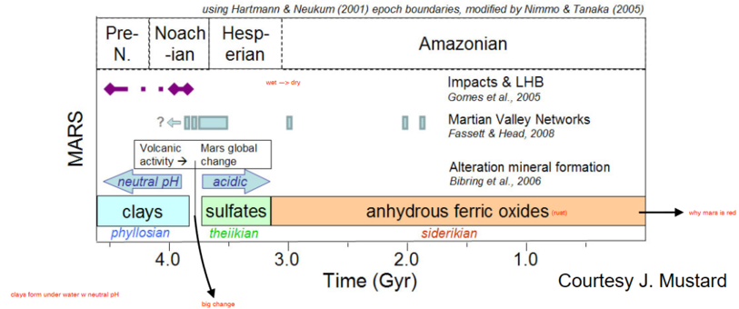
    

### The Martian Year

- Expressed as “solar longitude”, Ls
- Mars travels 360° around the Sun in 1 Mars year = 687 Earth days
- Mars year starts at Ls=0°
    - "Vernal equinox”: start of northern spring/southern autumn

### Current Climate

- **Atmosphere:**
    - Has variable temps
    - Low pressure
    - Is mostly CO2 (96%)
- **Water:**
    - Liquid water is NOT stable at the surface level
    - Water vapour in atmosphere in tiny amounts
    - Water ice in ground, polar caps
    - Varies with season and latitude

### Hydrologic Cycle

- The cycle
    
    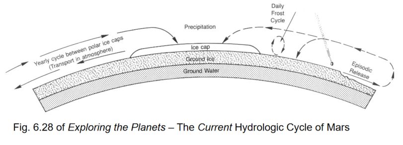
    
- **Ground Ice:**
    - Patterned ground
        - Distinctive geometric patterns caused by freeze-thaw processes
        - Found in high latitudes of Earth and Mars
- Subsurface Ice
- **Polar Caps:**
    - The polar caps are significant reservoirs of frozen water and carbon dioxide
    - Seasonal cap of CO2 ice
    - Residual cap of H2O ice
    - Ice caps undergo transfer between the different poles
        - Seasonal variation
- **South Pole:**
    - ESA Mars Express
        - The residual south polar cap is made of mostly water ice

### Mars Climate Change

- Variations in "tilt", *obliquity*
    - Now: 23.5°
    - Past: 15° - 60°
- Explanation of layered terrain, alternating:
    - Ice-rich during low obiliquity
    - Dust-rich during high obliquity
- Implications
    - High obliquity ⇒ Poles warmed, atmosphere thicker
    - Lower obliquity ⇒ Colder poles (more ice at poles)
        
        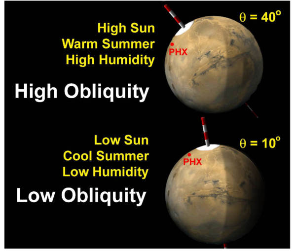
        

### Eolian Processes

- Wind is the dominant agent of erosion on Mars today
- Dust storms (sometimes global)
- **Yardangs:**
    - linear ridges formed by eolian erosion of intervening valleys

### Mass Movement

- Gravity-driven downhill movement of unconsolidated material
- Basically landslides

### Slope Streaks

- Observations:
    - A few meters to several km long
    - Start in a point upslope, widen downslope
- The origin of these features continues to be debated
- Most supported origin being liquid water brines or brine precipitates
- Could indicate subsurface conditions conducive to life

### The Mars Reconnaissance Orbiter

- **Objectives:**
    1. Characterize the present climate of Mars and its physical mechanisms of seasonal and interannual climate change
    2. Determine the nature of complex layered terrain on Mars and identify water-related landforms
    3. Search for sites showing evidence of aqueous and/or hydrothermal activity
    4. Identify and characterize sites with the highest potential for landed science and sample return by future Mars missions
    5. Return scientific data from Mars landed craft during a relay phase
- **Instruments:**
    1. Context Imager (CTX)
    2. **High Resolution Imaging Science Experiment (HiRISE)**
        - Highest-resolution camera at Mars
        - Examine gullies, layering and identify future landing sites
    3. **Compact Reconnaissance Imaging Spectrometers for Mars (CRISM)**
        - Visible and Infrared spectrometers
        - Look for minerals from hot springs, lakes, ponds, etc.
    4. **Shallow Subsurface Radar (SHARAD)**
        - Looks for liquid or frozen water in the top 1 km of the crust
    5. Mars Climate Sounder (MCS)
    6. Mars Color Imager (MARCI)

### Martian meteorites

- SNCs (Shergotty, Nakhla, Chassigny)
    - How do we know they’re from Mars?
    - The presence of trapped Martian atmosphere is the strongest evidence
        - Trapped atmospheric gases
        - Young crystallization ages (>175 Ma)
        - Oxygen Isotopes
- Mafic igneous rocks
    - Crystallized from basaltic magmas
- Generally:
    - Higher iron (Fe), lower aluminum (Al)
    - More enriched in volatile elements (Na, Mn)
- **Tissint shergottite**
    - Crystallized 574 Ma, Ejected from Mars 0.7 Ma
    - Larger olivine grains in a matrix of pyroxene and plagioclase
- **Orthopyroxenites Minerals**
    - Some carbonates (from alteration by water
    - 4.1 Ga old, 3.9Ga for carbonates
- **Breccia**
    - First “crustal” rock
    - Assembled at ~1.5 Ga, from components as old as 4.4 Ga
- **Augite-rich shergottites**
    - Early olivine crystals have undergone an oxidation reaction
    - Age ~2400 Ma
- Some have "rust", and alteration by water on Mars
- **Significance:**
    - Martian meteorites are the only samples of Mars that we have until rocks are brought back by missions
- **Processes:**
    1. **Igenous processes**
        - Crystalization, cooling
    2. **Mantle sources**
        - Martian interior
    3. **Surface processes**
        - Alteration, weathering

### Mars Pathfinder Mission

- **Objectives:**
    1. Demonstrate NASA's commitment to low-cost planetary exploration by completing the mission
    2. Demonstrate the mobility and usefulness of a microrover on the surface of Mars
    3. Surface morphology and geology at the metre scale (Instrument: IMP)
    4. Petrology and geochemistry of surface materials (Instrument: APXS
- **Instruments:**
    1. **Lander:**
        - **Imager for Mars Pathfinder (IMP)**
    2. **Rover**
        - **Alpha Proton X-Ray Spectrometer (APXS)**
- **Results**
    - **APXS:**
        - Rock compositions = basaltic andesites or andesites, SiO2 > 52 wt%
        - High uncertainity ⇒ problem: lack of textural information
        

### MER Mission

- **Objectives:**
    1. Search for and characterize clues to past water activity
    2. Determine the distribution and composition of minerals, rocks, and soils
    3. Determine what geologic processes have shaped the local terrain
    4. Calibrate and validate orbital remote-sensing data
    5. Identify and quantify relative amounts of specific mineral types that contain water or hydroxyls
    6. Characterize the mineral assemblages and textures of different types of rocks and soils
    7. Extract clues from the geologic investigation, related to the environmental conditions when liquid water was present and assess whether those environments were conducive for life
- **Instruments:**
    1. Panoramic Camera (Pancam)
    2. Mini-TES
        - Sees Infrared Radiation from rocks and soil
    3. APXS
        - Characteristic of elements (all except H)
    4. Microscopic Imager
        - For rock texture, and soil characteristics
    5. Mössbauer Spectrometer
        - Specialized to study Fe-bearing minerals
    6. Rock Abrasion Tool
        - Get beneath dust/crust to fresh rock and compare fresh with weathered
- **Results:**
    - Results from the Mars Exploration Rover Mission (Opportunity & Spirit) have greatly expanded the range of rock types observed on Mars
    - **Igenous:**
        - Basalt lava flows
        - Explosive volcanic eurptions
        - Impact ejecta materials
        - Some are extensively altered by water
    - **Sedimentary:**
        - Sulfate-rich sandstone with hematite concretions, deposited by wind and water
            - Diagenesis (interaction with groundwater)

### Mars Curiosity Mission

- **Major Results:**
    - **Sedimentary rocks:**
        - Deposited in delta within lake
        - **Major discovery as there have been no sedimentary rocks from meteorites**
    - Igneous rocks
        - Not just basalts; a diversity of types
    - Organic molecules, nitrates
    - Methane in atmosphere
    - The soil is hydrous

---

## Missing

1. Lecture 10 pg. 9
2. Lecture 11 pg. 6

# Mercury

### Learning Outcomes:

1. How was the lunar crating record used to date surface of Mercury?
2. Describe Mercury's
    - Orbit
    - Length of day
    - Length of year
3. Compare Mercury with the Moon in regards of
    - Size
    - Density
    - Surface temperature
    - Cratering
    - Volcanic features
4. What makes Mercury's tectonic features unique?
5. Why is Mercury's core so large?
6. Outline Mercury's main geological periods, including approximate age boundaries
7. How is water ice possible on Mercury's surface?

# Venus

### Learning Outcomes:

1. Compare the Earth and Venus in terms of 
    - Size
    - Density
    - Atmosphere
2. Describe the surface of Venus as seen from landers
3. Explain how the Magellan mission could see beneath the clouds to the surface. And what factors affect how the surface looks using radar
4. Differences between lowlands, uplands and highlands
5. Evidence for Venus having a differentiated interior
6. Main tectonic features on Venus, and do they respresent compression or extension?
7. Main volcanic features on Venus
8. Three main stages of evolution of coronae
9. Describe the effects that the thick atmosphere of Venus has on the geology of the planet
10. Explain greenhouse effect and how it applies to Venus
11. Explain Venus' lack of water
12. Compare impact craters on Venus with those on other planetary bodies
13. The geologic history of Venus, including possible changes in tectonic style
14. Outline evidence for recent volcanism

# Mars

### Learning Outcomes

1. Compare the Earth and Mars in terms of size, density, atmosphere, and other characteristics
2. Describe the topography of Mars and explain the hemispheric dichotomy
3. List the main geologic processes active on Mars, visible in its overall surface features
4. Describe the interior of Mars, and the nature of its magnetic field
5. Provide an overview of the NASA InSight Mission, including the main objectives and how it plans to achieve them
6. Outline the main periods in Mars’ geologic history, including approximate age boundaries and what happened during each period
7. Explain how minerals detected at the surface of Mars provide insights into global-scale changes that took place over Mars’ history
8. Explain what “L-sub-S” means
9. Describe the current climate of Mars in terms of the surface and air temperature, and the stability of water and carbon dioxide surface
10. Summarize evidence for ground ice on Mars
11. Describe Mars’ hydrologic cycle over the scale of days, years and longer
12. List the eolian features observed on Mars today
13. Define mass movement and describe what mass movement has occurred on Mars on the large and small scale
14. Identify the characteristics of slope streaks and list the two main types of explanations for their formation
15. Explain what the HiRISE, CRISM and SHARAD instruments do (Mars Reconnaissance Orbiter mission)
16. Outline the three main lines of evidence that the SNC meteorites are from Mars
17. Describe the process by which martian meteorites are delivered from Mars to Earth
18. Identify the main age groupings of martian meteorites and explain what geologic process they tell us about
19. Compare the Mars Pathfinder/Sojourner and MER rover missions in terms of their capabilities as “robotic field geologists”
20. List some of the main discoveries made by the Curiosity mission (so far)
21. Explain why martian meteorites are not representative of the majority of the crust of Mars
