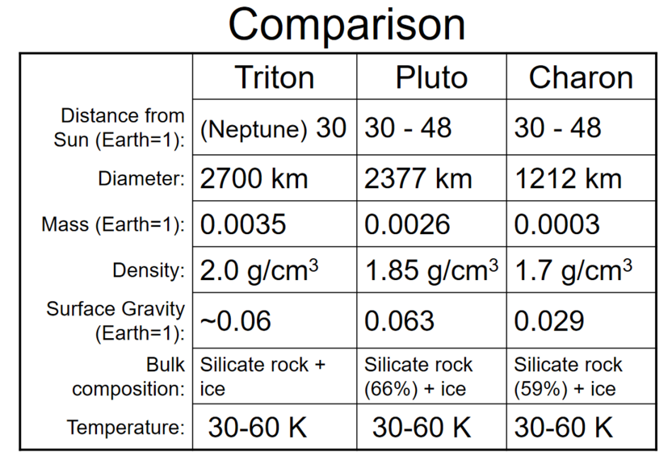
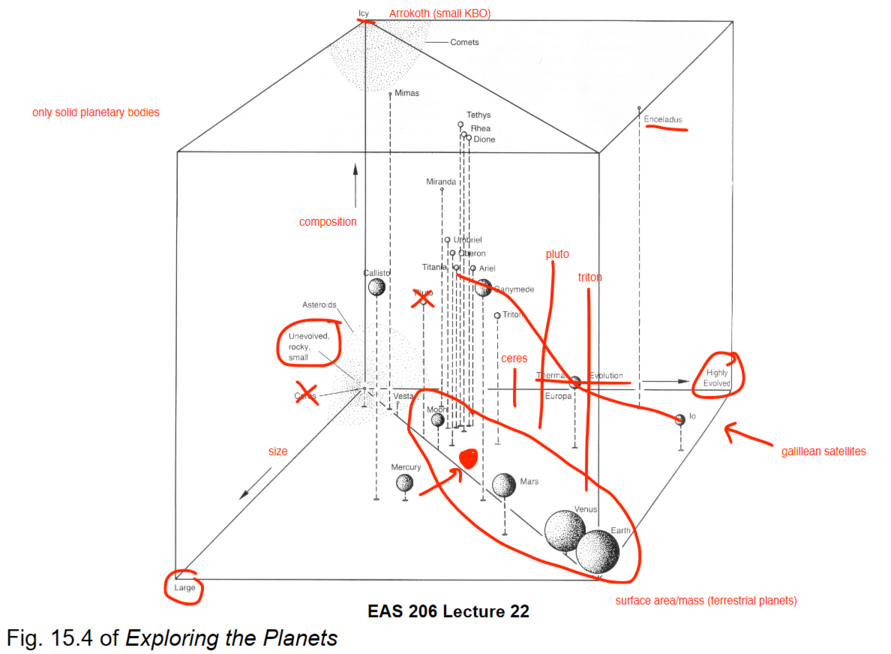

# New Horizon, Kuiper Belt and Pluto-Charon:

**Learning Outcomes:** 

- List the main objects that the New Horizons mission has explored so far
    - Pluto & Charon
- Describe how Pluto is different from the other planets in our solar system in terms of its orbit, composition and the characteristics of its largest satellite (Charon)
- Compare and contrast Pluto and Charon in terms of geologic processes, atmospheres, and interior structure
    - **Pluto:**
        - Nitrogen ice glaciers
        - Convection cells in nitrogen ice
        - Dunes
        - Water-ice rich crust
        - Cryovolcanism
        - Thin nitrogen atmosphere, ~ 1000x thinner than Mars'. Composed mostly of nitrogen, some methane and carbon monoxide.
    - **Charon:**
        - Water-ice rich, but lacks N2, CH4, and CO
        - Large chasms
            - Indicates extensional tectonics
            - Formed early in its formation, as a result of freezing of a primordial ocean
        - Reddish north pole
            - Formed by methane from Pluto being irradiated and forming hydrocarbons
    - **Interiors of both:**
        - Radius:
            - Pluto: 1,150-1,200km
            - Charon: 600-610km
        - Density:
            - Pluto: 1.7-2.15 g/cm3
            - Charon: 1.3-1.8 g/cm3
        - Surface Ices:
            - Pluto: N2, CH4, CO, H2O, and presumably organics
            - Charon: NH3, H2O
        - Both are differentiated
            - Charon is geologically dead
            - Pluto is still active, with radiogenic heat as primary source
- Compare Neptune’s moon Triton to Pluto and Charon
    - Shares similarities with both Pluto and Charon
    - Most likely a captured KBO
        
        
        
- Describe comets in terms of their characteristics, their relationships to the Kuiper Belt/KBOs and Oort Cloud, and their significance
    - Comets are small, ice-rich bodies that formed in the outer Solar System
    - Characteristics:
        - Orbital:
            - Highly elliptical
            - Either short-period (years) or long period (>1000 years)
        - Composition:
            - CHON: Carbon-Hydrogen-Oxygen-Nitrogen
            - Silicates and other minerals, similar to what is found in chondrites
    - Visible due to interaction with the Sun
    - Comet sources today include two main reservoirs: the Kuiper Belt and the Oort Cloud
        - Kuiper Belt:
            - Source of short-period comets; influenced by Jupiter’s gravity, aka “Jupiter Family Comets” (JFCs)
            - In the plane of the solar system; 30-50 AU
        - Oort Cloud:
            - Source of long-period comets
            - Spherical, loose cloud of icy bodies; 10,000 to 100,000 AU
    - Significance:
        - Comets preserve the best, most accessible record of the temperature, pressure and molecular composition of the solar nebular disk
        - Formed in the outer Solar System at 4.57Ga
        - Have existed at cryogenic temperatures since formation (preserve volatile compunds)
- List the main discoveries about comets from the Rosetta mission to comet 67P
    - Comets have geology
        - Overall shape
        - Complex topography
        - Water stored in the interior
    - Comets contain organic molecules
        - glycine, hydrogen sulfide, ammonia, hydrogen cyanide, and many others
- Explain how all the objects discussed in this lecture may be related

---

# Extra-solar Planets:

**Learning Outcomes:**

- Consider and apply different definitions for “planet”
    - Any body in the solar system that is more massive than the total mass of all of the other bodies in a similar orbit– Ceres?–Pluto?
        - Ceres, Pluto are still not planets
    - Geophysical Definition: “a sub-stellar mass body that has never undergone nuclear fusion and that has sufficient self-gravitation to assume a spheroidal shape...regardless of its orbital parameters” (Runyon et al. 2017*)– Ceres?–Pluto?– Large KBOs?
        - Too many planets?
- Define exoplanet(or ‘extrasolar planet’) and explain why it is difficult to find them
    - Planets orbiting other Stars.
    - Difficulties:
        - Planets don’t produce light of their own
        - They are very far away
        - They are lost in the blinding glare of the star
- Describe some of the ways exoplanets are discovered
    - Radial velocity (Swaying of star due to planet)
    - Astrometric measurement (Wobble of star)
    - Transit (planet crosses in front of star)
    - Direct imaging
    - Gravitational lensing
- List three missions that have contributed to finding exoplanets
    - The MOST mission
    - The Kepler mission
    - The TESS mission
- Describe some of the diversity of exoplanets, as they compare to our own solar system
    - 

---

# The Big Picture: Comparative Planetology

**Learning Outcomes:**

- Explain the diversity of planetary bodies in our solar system through the interaction of planetary matter and planetary energy
    - Planetary Matter:
        - Chemical composition (refractory vs. volatile)
        - Size/mass (how much accreted)
    - Planetary Energy:
        - Amount (how much originally, and since)
        - Type (accretion, radiogenic, core formation, tidal, solar, impacts and local energy during crater formation)
    - Thermal Evolution (Geologic Evolution)
        - Loss of heat depends on:
            - Size (surface area/mass)
            - Composition
            - Energy content (how much it had began with, continues to have)
            - Heat transfer
- Place various planetary bodies in our solar system on a “cube” whose axes are composition, size and thermal evolution
    
    
    
- Consider how the Earth is ‘just right’ for life, and where else in the solar system you would prioritize to look for life (as we know it)
    - Size and composition
        - Plate tectonics (recycles crust, regulates carbon cycle)
        - Silicates + water
        - Differentiation from atmosphere through degassing
        - Gravity to hold gases
    - Distance from Sun
        - Hydrologic cycle
    - Life as we know it requires water, energy, access to organic materials, and time
    - Consider earth not just in terms of a hydrologic cycle
    - Moon formed by giant impact
        - stabilized earth’s tilt (obliquity)
        - created ocean tides
    - Plate tectonics
        - regulation of carbon cycle (CO2 in atmosphere)
    - Presence of gas giants
        - protection against disruption/impacts?

---

# The Search for Life on Mars

**Learning Outcomes:**

- Summarize the results from the biology experiment on the Viking mission to Mars, and explain why it did not show evidence for life
    - Incubated samples of surface under different conditions
        - Results were positive, but heat sterilized control sample was also positive
    - Soil is highly chemically reactive, containing an oxidant.
    - No organic molecules detected
    - Conclusion: no evidence of life
- State the main implication for the exploration of Mars of the supposed evidence for fossil life in the ALH 84001 martian meteorite
    - The evidence presented by McKay et al. (1996) is not widely accepted as firm evidence for past life by the scientific community
    - The identification of life in a martian meteorite requires multiple lines of positive evidence
    - Must not rely on morphology (of bacteria-like structures, mineral grains) alone
    - NASA’s “Follow the Water”
- Explain the importance of sample return in the exploration of Mars
    - Analyses on Earth are much more advanced, providing information that cannot be obtained from rovers or orbiters
        - Detection of life/biomarkers, geochronology, etc.
        - Samples remain available for future generations, as technology advances
    - Samples from locations where context is known are much more valuable than random samples
